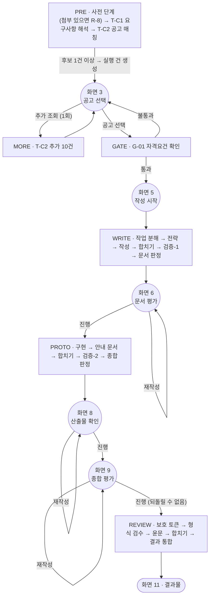
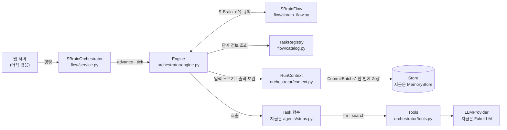

# S-Brain Agent Orchestration

S-Brain의 AI Agent 7개를 정해진 순서대로 부르고, 실패하거나 다시 만들어야 할 때의 처리를 맡는 **Orchestrator(실행 뼈대)** 코드입니다.

| 항목 | 내용 |
|---|---|
| 언어 · 버전 | Python 3.12 |
| 의존성 | `pydantic` (타입 검증 · JSON 변환), `SQLAlchemy` · `PyMySQL` (웹 DB 읽기), `openai` (조율 Agent 호출처), `pytest` (테스트) |
| 구현 근거 | S-Brain Agent 기능정의서 v1.9 (기준 문서). 보조 참고: 프로젝트 기획서 v1.10 |
| 현재 상태 | 뼈대 완성. 조율 **T-C1은 실제 구현**, 나머지 Agent는 **스텁(가짜 구현)**, 저장소는 **메모리** 구현. 사전 정보는 웹 DB에서 읽을 수 있음. 테스트 75건 통과 |

> 이 문서의 파일 경로는 저장소 폴더 기준입니다. 기능정의서 · 기획서는 저장소에 포함되지 않습니다.

---

## 목차

1. [이 코드가 하는 일](#1-이-코드가-하는-일)
2. [먼저 알아둘 용어](#2-먼저-알아둘-용어)
3. [설치와 테스트](#3-설치와-테스트)
4. [한 번 돌려 보기](#4-한-번-돌려-보기)
5. [전체 흐름](#5-전체-흐름)
6. [폴더 구조](#6-폴더-구조)
7. [내부 동작](#7-내부-동작)
8. [Agent 구현을 끼워 넣는 방법](#8-agent-구현을-끼워-넣는-방법)
9. [명령 창구 (웹 서버 연동)](#9-명령-창구-웹-서버-연동)
10. [설정값](#10-설정값)
11. [테스트](#11-테스트)
12. [아직 하지 않은 것 · 확인이 필요한 것](#12-아직-하지-않은-것--확인이-필요한-것)
13. [더 읽을 문서](#13-더-읽을-문서)

---

## 1. 이 코드가 하는 일

### 1.1 S-Brain은 어떤 서비스인가

S-Brain은 **정부지원사업 사업계획서와 프로토타입을 함께 만들어 주는 AI 서비스**입니다. 사용자가 창업 아이템 정보를 입력하면 다음 순서로 진행됩니다.

1. 지금 신청할 수 있는 정부지원사업 공고를 찾아 추천하고, 자격요건을 미리 확인합니다.
2. 선택한 공고에 맞춰 사업계획서(본문 · 표 · 그래프)를 씁니다.
3. 계획서를 바탕으로 프로토타입(HTML 실행 파일 또는 SVG 원페이지)과 인포그래픽을 만듭니다.
4. 계획서와 프로토타입을 채점하고, 문장을 다듬은 뒤 결과물을 내려받게 합니다.

이 작업은 역할이 나뉜 **Agent 7개**가 나눠 맡습니다.

| Agent | 맡는 일 |
|---|---|
| 조율 | 요구사항 해석, 공고 매칭, 자격 확인, 작업 분해, 결과 통합 |
| 전략 | 요구사항 분석, 목표 시장 분석 |
| 작성 | 사업계획서 본문 · 그래프 · 표 작성 |
| 구현 | 프로토타입(HTML 실행 파일) · 인포그래픽 제작 |
| 검증-1 | 사업계획서 채점 (문서층) |
| 검증-2 | 프로토타입 채점 (산출물층) |
| 검수 | 문장 형식 검수 · 한국어 윤문 |

### 1.2 Orchestrator는 무엇을 하는가

Orchestrator는 **7개 Agent를 같은 방식으로 등록하고 호출하는 뼈대**입니다. 오케스트라의 지휘자처럼 연주(각 Task의 내용)는 하지 않고, 누가 언제 연주할지와 문제가 생겼을 때의 처리를 맡습니다.

| Orchestrator가 하는 일 | Orchestrator가 하지 않는 일 (각 Agent 몫) |
|---|---|
| 단계를 정해진 순서대로 실행, 사용자 선택을 기다리는 지점에서 멈춤 | 계획서 · 프로토타입 등 실제 내용 생성 |
| 각 단계의 입력을 모아 넘기고 출력을 버전으로 보관 | 점수 계산, 재작성 대상 판정 |
| 호출 실패 시 재시도 · 재개 · 실패 처리 | 결과 검사(check) 자체 |
| 사용자가 고른 항목만 다시 만들기, 점수가 떨어지면 되돌리기 | |
| 실행 상태 · 알림 · 추적 기록 저장 | |

> **조율 Agent와 Orchestrator는 다릅니다.** 조율은 7개 Agent 중 하나이고, 다른 Agent와 똑같이 Orchestrator에 등록되어 호출됩니다. Orchestrator는 Agent 수에 들어가지 않습니다.

### 1.3 지금 어디까지 되어 있는가

- 20단계 전체 흐름, 사용자 대기 지점, 재수행 · 재개 · 재작성 · 되돌리기, 추적 기록이 동작합니다.
- **조율 T-C1(요구사항 해석)은 실제 구현**입니다(`agents/supervisor/tc1.py`). 나머지 Agent · 조율 Task는 스텁이며, 규격에 맞는 더미 결과를 돌려줍니다. 스텁 조립(`build_stub_app`)은 T-C1도 스텁을 쓰고, `bind_supervisor(app.registry)`로 바꿔 끼웁니다. 실제 OpenAI(`gpt-6-luna`)로 1회 호출에 성공했습니다(2026-09-30).
- 사전 정보 입력은 웹 백엔드가 DB에 저장한 값을 **프로젝트 ID로 읽어** T-C1에 넣습니다(`intake/`, `start_run_for_project`). 테이블 · 컬럼은 웹 스키마(`app_schema.sql`, 저장소 미포함)와 맞췄습니다. 기준 문서에 자리가 없는 웹 입력값(수익모델 항목 전체, 기업명, 산출물 목표 등)은 확장 필드로 싣습니다. 첨부 문서 텍스트 추출(R-8)은 아직입니다.
- OpenAI 호출처 어댑터가 있습니다(`orchestrator/openai_provider.py`). 조율 Agent는 `gpt-6-luna`, 추론 강도 low가 기본값입니다(온도는 보내지 않음).
- **저장소는 메모리 구현**이라 프로그램을 끄면 데이터가 사라집니다. MySQL 구현은 같은 인터페이스로 나중에 교체합니다.
- 웹 서버는 없습니다. 웹 서버가 부를 함수(명령 창구)까지만 있습니다.

---

## 2. 먼저 알아둘 용어

코드와 주석은 기준 문서의 용어를 그대로 씁니다.

| 용어 | 뜻 |
|---|---|
| **Task** | Agent가 수행하는 작업 하나. `T-S1`(요구사항 분석)처럼 ID로 부릅니다. LLM · 검색을 호출합니다 |
| **규칙 단계** | LLM을 쓰지 않고 코드로 계산하는 단계 (`G-01` 자격요건 게이트, `G-02a` 문서 평가 판정 등) |
| **합치기** | 앞 단계 결과들을 하나로 묶는 규칙 단계 (`M-1` ~ `M-4`). 기준 문서에 ID가 없어 구현용 ID를 붙였습니다 |
| **산출물** | 단계가 만든 결과. `planDoc@3`처럼 **이름@버전**으로 가리킵니다 |
| **실행 건 (Run)** | 사용자 한 명이 공고 하나로 진행하는 작업 한 건. 계정당 동시에 1건만 진행할 수 있습니다 |
| **대기 지점** | 사용자 선택을 기다리며 멈추는 화면 (공고 선택, 작성 시작, 문서 평가, 산출물 확인, 종합 평가) |
| **재시도** | 호출이 실패하거나 늦거나 응답 형식이 깨져서 **같은 호출을 바로 다시 보내는 것** (최대 5회) |
| **재개** | 재시도를 다 써서 멈춘 실행을 **시간을 두고 실패한 지점부터 다시 하는 것** (15분 → 30분 → … 최대 5번) |
| **재수행** | 결과가 **검사를 통과하지 못해 시스템이 다시 만드는 것** (최대 2회) |
| **재작성** | 사용자가 화면에서 **항목(묶음)을 골라 다시 만들게 하는 것** (묶음마다 1회) |
| **확정 동작** | 재수행을 다 해도 통과하지 못할 때 적용하는 정해진 처리 (예: 출처 없는 수치 제거) |
| **스텁** | 실제 구현 대신 끼워 둔 가짜 구현. 뼈대를 검증하려고 둡니다 |
| **잠정** | 기준 문서가 값을 정하지 않아 임시로 둔 값. 코드 주석과 문서에 `(잠정)`으로 표시합니다 |
| **확장** | 기준 문서에 없는 필드. 코드에서 `ext()`로 선언합니다 |

**단계 ID 읽는 법:** `T-C*` 조율 · `T-S*` 전략 · `T-W*` 작성 · `T-B*` 구현 · `T-V1` 검증-1 · `T-V2` 검증-2 · `T-P*` 검수 · `G-*` 규칙 단계 · `M-*` 합치기 · `R-8` 첨부 문서 텍스트 추출(규칙 모듈)

**주석의 출처 표기:** 코드 주석의 "시트 N"은 기준 문서(기능정의서)의 시트 번호, "기획서 N-M"은 기획서의 절 번호입니다.

| 기준 문서 시트 | 내용 | 해당 코드 |
|---|---|---|
| 1 개요 | 횟수 · 간격 설정값 | `sbrain/orchestrator/settings.py` |
| 2 Agent기능정의 | Task 실행 순서 · 호출 규칙 | `sbrain/flow/catalog.py`, `sbrain/flow/sbrain_flow.py` |
| 3 입출력변수명세 | Task별 입력 · 출력 | `sbrain/contracts/tasks.py` |
| 4 타입정의 | Agent 간 주고받는 공통 타입 | `sbrain/models/` |
| 5 규칙모듈 | LLM 없이 구현하는 규칙 (R-6 재작성, R-9 실행 상태, R-11 호출 실패 등) | `sbrain/orchestrator/engine.py`, `sbrain/flow/` |
| 6 오류코드 | 오류 코드와 사용자 안내 문구 | `sbrain/orchestrator/errors.py` |
| 7 재작성·재수행매핑 | 무엇을 다시 돌릴지의 대응표 | `sbrain/flow/rework_map.py` |

---

## 3. 설치와 테스트

모든 명령은 저장소 폴더에서 실행합니다. 패키지는 가상환경(`.venv`)에만 설치합니다.

**Windows (PowerShell)**

```powershell
py -3.12 -m venv .venv
.venv\Scripts\activate
python --version                          # Python 3.12.x 인지 확인
python -m pip install -r requirements.txt
python -m pytest
```

**macOS / Linux**

```bash
python3.12 -m venv .venv
source .venv/bin/activate
python --version                          # Python 3.12.x 인지 확인
python -m pip install -r requirements.txt
python -m pytest
```

정상이면 다음과 같이 나옵니다.

```text
........................................................................ [ 96%]
...                                                                      [100%]
75 passed in 2.19s
```

---

## 4. 한 번 돌려 보기

가상환경을 켠 상태로 이 폴더에서 `python`을 실행하고, 아래 코드를 대화형 셸에 붙여 넣습니다. 스텁 Agent로 사전 정보 입력부터 결과물까지 한 바퀴를 돕니다.

```python
from datetime import date
from sbrain.bootstrap import build_stub_app
from sbrain.models import PreInput

app = build_stub_app()                     # 스텁 Agent + 메모리 저장소로 조립
orch = app.orchestrator                    # 웹 서버가 부를 명령 창구

form = PreInput(
    idea_text="동네 헬스장 회원 관리 서비스", applicant_type="법인",
    representative_name="홍길동", representative_career=["헬스장 운영 5년"],
    revenue_unit_price=35000, development_period="6개월", team_careers=["개발자 1명"],
    birth_date=date(1990, 1, 1), gender="남", region="서울", industry_code="J62",
    hiring_plan="없음", facilities="없음", partners="없음",
)

res = orch.start_run("acc-1", form)        # 화면 2: 사전 정보 제출 → 공고 후보 조회
run_id = res.run_id

orch.select_announcement(run_id, "A01")    # 화면 3: 공고 선택
orch.advance(run_id)                       #   → 자격요건 확인(G-01)
orch.start_writing(run_id)                 # 화면 5: 작성 시작
orch.advance(run_id)                       #   → 계획서 작성 ~ 문서 평가
orch.decide(run_id, 6, "진행")             # 화면 6: 문서 평가 → 진행
orch.advance(run_id)                       #   → 프로토타입 제작 ~ 검증
orch.decide(run_id, 8, "진행")             # 화면 8: 산출물 확인 → 진행
orch.decide(run_id, 9, "진행")             # 화면 9: 종합 평가 → 진행
orch.advance(run_id)                       #   → 표현 검수 ~ 결과물

v = orch.view(run_id)
print(v.step, v.progress, v.screen_status)
print([r.task_id for r in app.store.executions(run_id)])
```

출력:

```text
결과물 완료 완료
['T-C1', 'T-C2', 'G-01', 'T-C3', 'T-S1', 'T-S2', 'T-W1', 'T-W2', 'T-W3', 'M-1', 'T-V1', 'G-02a', 'T-B1', 'T-B2', 'G-04', 'M-3', 'T-V2', 'G-02b', 'G-03', 'T-P1', 'T-P2', 'M-4', 'T-C4']
```

**보는 법:** 명령(`select_announcement`, `start_writing`, `decide` 등)은 상태를 확인하고 **할 일을 대기열에 넣기만** 합니다. 실제 실행은 `advance`가 다음 대기 지점까지 합니다. 단, `start_run`은 사전 단계를 바로 실행하고, 화면 8의 '진행'은 실행할 단계 없이 화면 9로 넘어가므로 `advance`가 필요 없습니다.

**웹 DB에서 읽어 실제 T-C1로 시작하기:** 웹 DB 공급처(`SqlProjectInputSource`)를 `build_stub_app(project_inputs=...)`로 넘기고, `bind_supervisor(app.registry)`로 T-C1을 바꿔 끼운 뒤 `start_run_for_project(account_id, project_id)`를 부릅니다. 조립 예시는 `docs/T-C1_요구사항해석_구현.md` 7절에 있습니다.

---

## 5. 전체 흐름

동그라미는 사용자 선택을 기다리는 **대기 지점**, 네모는 Orchestrator가 연속으로 실행하는 **구간**입니다.



| 구간 | 실행하는 단계 (순서대로) | 끝나면 |
|---|---|---|
| PRE | `R-8`(첨부가 있을 때) → `T-C1` → `T-C2` | 후보가 있으면 실행 건을 만들고 화면 3 |
| MORE | `T-C2` (추가 10건, 1회, 최대 20건) | 화면 3 |
| GATE | `G-01` | 통과면 화면 5, 불통과면 화면 3 |
| WRITE | `T-C3` → `T-S1` → `T-S2` → `T-W1` → `T-W2` → `T-W3` → `M-1` → `T-V1` → `G-02a` | 화면 6 |
| PROTO | `T-B1`\* → `T-B2` → `M-2`\*\* → `G-04` → `M-3` → `T-V2` → `G-02b` | 화면 8 |
| REVIEW | `G-03` → `T-P1` → `T-P2` → `M-4` → `T-C4` | 화면 11 (완료) |
| REWORK6 · 8 · 9 | 사용자가 고른 묶음에 따라 다시 돌릴 단계 | 요청한 화면 |

\* 카테고리가 '원페이지'면 생략 &nbsp; \*\* '원페이지'일 때만

전체 단계 목록:

| ID | 이름 | 담당 Agent | 종류 |
|---|---|---|---|
| R-8 | 첨부 문서 텍스트 추출 | 조율 | 규칙 |
| T-C1 | 요구사항 해석 | 조율 | Task |
| T-C2 | 공고 매칭 | 조율 | Task (검색) |
| G-01 | 자격요건 게이트 | 조율 | 규칙 |
| T-C3 | 작업 분해 | 조율 | Task |
| T-S1 | 요구사항 분석 | 전략 | Task |
| T-S2 | 목표 시장 분석 | 전략 | Task |
| T-W1 | 사업계획서 본문 작성 | 작성 | Task |
| T-W2 | 그래프 생성 | 작성 | Task |
| T-W3 | 표 생성 | 작성 | Task |
| M-1 | 합치기① 차트 · 표를 계획서에 합침 | 조율 | 합치기 |
| T-V1 | 사업계획서 검증 | 검증-1 | Task |
| G-02a | 문서 평가 판정 | 조율 | 규칙 |
| T-B1 | 실행 파일(HTML) 제작 | 구현 | Task |
| T-B2 | 인포그래픽 제작 | 구현 | Task |
| M-2 | 합치기② 원페이지 산출물을 Prototype으로 감쌈 | 조율 | 합치기 |
| G-04 | 실행 안내 문서 생성 | 조율 | 규칙 |
| M-3 | 합치기③ readmePath를 Prototype에 기입 | 조율 | 합치기 |
| T-V2 | 프로토타입 검증 | 검증-2 | Task |
| G-02b | 종합 평가 판정 | 조율 | 규칙 |
| G-03 | 보호 토큰 추출 | 검수 | 규칙 |
| T-P1 | 사업계획서 문장 형식 검수 | 검수 | Task |
| T-P2 | 한국어 문장 윤문 | 검수 | Task |
| M-4 | 합치기④ 검수 결과 반영 · 검수 로그 집계 | 조율 | 합치기 |
| T-C4 | 결과 통합 · 전달 | 조율 | Task |

단계별 입력 · 출력, 제한 시간, 실패 정책은 `docs/Agent_연동_규격_초안.md` 6 · 7절에 표로 정리되어 있습니다.

---

## 6. 폴더 구조

```text
agent-orchestration/
├── README.md                  # 이 문서
├── .gitignore                 # Git 제외 목록 (.venv, __pycache__, .pytest_cache, .env)
├── requirements.txt           # 의존성 (pydantic, SQLAlchemy, PyMySQL, openai, pytest)
├── pytest.ini                 # 테스트 설정 (tests 폴더, -q)
├── docs/                      # 설계 문서 (13절 참고)
├── sbrain/
│   ├── bootstrap.py           # 전체 구성 조립 (build_stub_app)
│   ├── models/                # 공통 타입 (기준 문서 시트 4)
│   │   ├── base.py            #   공통 기반 SBModel, 확장 표시 ext(), 열거형
│   │   ├── domain.py          #   입력 · 공고 · 계획서 · 프로토타입 등 업무 타입
│   │   ├── rework.py          #   CheckResult · ReworkOrder · ReworkInput 등 다시 만들기 관련
│   │   ├── run.py             #   실행 건(Run), 실행 상태, 알림
│   │   └── scoring.py         #   점수 · 채점 결과
│   ├── contracts/
│   │   └── tasks.py           # Task별 입력 · 출력 규격 (기준 문서 시트 3)
│   ├── intake/                # 사전 정보 입력 연동 — 웹 DB → PreInput
│   │   ├── record.py          #   웹 DB 행 그릇 (잠정 규격)
│   │   ├── mapping.py         #   행 → PreInput 변환, 필수 항목 재확인 (E-C1-REQUIRED)
│   │   ├── source.py          #   공급처 인터페이스 · 메모리 구현
│   │   └── sql_source.py      #   공유 MySQL 구현 (SQLAlchemy)
│   ├── orchestrator/          # 범용 뼈대 — S-Brain 고유 규칙이 없음
│   │   ├── engine.py          #   실행 엔진: 대기열 실행, 재수행 · 재개 · 실패, 재작성 사이클
│   │   ├── registry.py        #   Agent 등록부 · Task 등록부(TaskSpec), 입력 연결(Bind)
│   │   ├── tools.py           #   Task에 넘기는 호출 도구: 재시도 · 제한 시간 · 오류 분류 · 호출 기록
│   │   ├── openai_provider.py #   OpenAI 호출처 어댑터 (LLMProvider 구현)
│   │   ├── context.py         #   실행 중 산출물 버전 관리, 한 번에 저장할 기록 모음
│   │   ├── store.py           #   저장소 인터페이스 (Store, CommitBatch)
│   │   ├── memory_store.py    #   저장소의 메모리 구현
│   │   ├── settings.py        #   설정값과 기본값, 잠정 항목 목록(PROVISIONAL)
│   │   ├── trace.py           #   추적 기록 타입 (실행 기록 · 호출 로그 · 피드백 연결 등)
│   │   └── errors.py          #   오류 코드(시트 6)와 예외
│   ├── flow/                  # S-Brain 고유 규칙
│   │   ├── catalog.py         #   S-Brain의 Task 등록부 (25개 단계)
│   │   ├── sbrain_flow.py     #   구간 · 대기 지점 · 재작성 경로 · 알림, T-P2 병렬 실행
│   │   ├── rework_map.py      #   재작성 · 재수행 대응표 (시트 7)
│   │   └── service.py         #   명령 창구 SBrainOrchestrator (웹 서버가 부름)
│   └── agents/
│       ├── supervisor/        # 조율 Agent 구현 — 지금은 T-C1 (tc1.py), bind_supervisor()
│       └── stubs.py           # 스텁 Agent, 가짜 LLM(FakeLLM), 시나리오(StubScenario)
└── tests/                     # pytest 테스트 (75건)
```

**설계 원칙:** `orchestrator/`에는 어떤 서비스에도 쓸 수 있는 범용 장치만 두고, 화면 번호 · 알림 대상 · 재작성 경로 같은 S-Brain 고유 규칙은 `flow/`에만 둡니다. 엔진은 `Flow` 인터페이스(`engine.py`)를 통해서만 S-Brain 규칙을 부릅니다.

---

## 7. 내부 동작

### 7.1 구성 요소의 관계



`bootstrap.py`의 `build_stub_app()`이 이 구성 요소들을 만들어 서로 연결하고 `App` 객체로 돌려줍니다. `App`에는 `orchestrator`(명령 창구), `engine`, `store`, `registry`, `llm`(가짜 호출처), `scenario`, `settings`가 들어 있습니다.

### 7.2 단계 하나가 실행되는 과정

`Engine.run_step()`이 대기열 맨 앞 단계를 다음 순서로 처리합니다.

1. Task 등록부에서 그 단계의 정보(`TaskSpec`)를 꺼냅니다. 담당 Agent, 입출력 타입, 실행 함수, 실패 정책 등이 들어 있습니다.
2. **입력을 모읍니다.** `TaskSpec.inputs`의 연결 정보(`Bind`)를 보고 산출물 · 설정값 · 사용자 명령 · 작업 지시문 등에서 값을 가져옵니다. Task는 저장소에 직접 접근하지 않습니다.
3. 입력을 규격 타입(`contracts/tasks.py`)으로 검사합니다.
4. Task라면 담당 Agent 설정(모델 · 호출처 · 온도 · 제한 시간)을 입힌 `Tools`를 만들어 함께 넘깁니다. 규칙 단계 · 합치기는 `Tools`를 받지 않습니다.
5. 출력을 규격 타입으로 검사하고, 각 필드를 **새 산출물 버전**으로 보관합니다.
6. 출력의 `check.passed`가 `false`이고 재수행 대상이면, 문제 내용을 담은 `ReworkInput`을 만들어 같은 Task를 다시 부릅니다(재수행).
7. 산출물 버전 · 현재 버전 포인터 · 실행 상태 · 추적 기록을 `CommitBatch` **하나로 한 번에 저장**합니다. 중간에 멈춰도 어디까지 했는지 어긋나지 않게 하기 위해서입니다.

### 7.3 산출물 버전과 되돌리기

- 산출물은 이름별로 버전이 쌓이고(`planDoc@1`, `planDoc@2`, …), **현재 버전 포인터**가 지금 쓰는 버전을 가리킵니다.
- 되돌리기는 **포인터만 옮깁니다.** 이전 버전과 기록은 지우지 않습니다.
- `featureList`는 한 번 정해지면 바뀌지 않습니다. 다른 값이 들어오면 변경분은 무시하고 기록만 남깁니다.

### 7.4 문제가 생겼을 때

| 상황 | 누가 | 처리 |
|---|---|---|
| LLM · 검색 호출 실패, 응답 지연, 형식 오류 | `Tools` | 같은 호출을 최대 5회 **재시도** |
| 재시도를 다 썼고 일시 오류 | `Engine` | 실행을 `재개대기`로 두고 15 → 30 → 60 → 120 → 240분 뒤 실패한 단계부터 **재개** (최대 5번, 총 12시간) |
| 재개 상한 초과, 또는 영구 오류(입력 · 운영) | `Engine` | 실행 **실패**. 단, 재작성 중이었다면 실행은 계속하고 재작성 전 결과로 되돌린 뒤 재작성 기회를 돌려줌 |
| 규칙 단계 · 합치기에서 코드 오류 | `Engine` | 위와 같이 실패 처리 (잠정). `G-04`만 기준 문서대로 오류가 나도 계속 진행 |
| 결과가 검사 불통과 | `Engine` | 문제 내용을 실어 최대 2회 **재수행**. 그래도 불통과면 그대로 다음 단계로 (여섯 Task는 확정 동작 적용) |
| 사용자가 점수 미달 항목을 고름 | `Engine` + `Flow` | 고른 묶음만 **재작성** → 다시 채점 → 전후 점수를 비교해 높은 쪽을 남김 |

일부 Task는 재시도를 다 쓴 예외를 Task 안에서 받아 대체 경로로 갑니다. 예: `T-C2`는 임베딩 검색이 실패하면 BM25 단독 순위로, `T-V2`는 보조 LLM이 실패하면 문자열 대조만으로 점수를 냅니다.

### 7.5 추적 기록

실행 흐름을 나중에 되짚을 수 있도록 다음을 남깁니다. **산출물 내용은 복사하지 않고 `이름@버전` 참조와 메타 정보만** 남깁니다.

| 기록 | 담는 것 |
|---|---|
| `ExecutionRecord` | 어떤 단계를, 어떤 모델로, 어떤 입력 버전으로 실행해 어떤 출력 버전을 만들었는지 |
| `CallLog` | 호출 한 건과 시도별 결과 (프롬프트 · 응답 내용은 남기지 않음) |
| `FeedbackLink` | 검사 결과 · 사용자 선택이 어느 실행으로 전달되었는지 |
| `ReworkComparison` | 재작성 전후 점수와 남긴 쪽 |
| `PointerEvent` | 되돌리기로 현재 버전 포인터가 옮겨진 기록 |
| `TraceEvent` | 규격 위반, 재개 예약, 재작성 시작 · 종료 등 |

기록 조회는 `app.store.executions(run_id)`, `app.store.call_logs(run_id)` 등 `Store`의 조회 함수로 합니다.

---

## 8. Agent 구현을 끼워 넣는 방법

각 Agent 담당자는 Task 함수를 만들어 **`registry.bind(task_id, fn)` 한 줄로 스텁과 바꿔 끼웁니다.** 엔진 코드는 고칠 필요가 없습니다.

### 8.1 지켜야 할 규칙

- **함수 모양:** Task는 `def run(inp: XxxIn, tools: Tools) -> XxxOut`, 규칙 단계 · 합치기는 `def run(inp: XxxIn) -> XxxOut`입니다. 입력 · 출력 타입은 `contracts/tasks.py`에 Task마다 있습니다.
- **동기 함수**로 만듭니다. 병렬 처리가 필요한 곳(`T-P2`)은 Orchestrator가 합니다.
- **LLM · 검색 호출은 반드시 `tools`로 합니다.** HTTP 클라이언트나 SDK를 Task 안에서 직접 부르지 않습니다. `tools`를 거치지 않으면 재시도 · 제한 시간 · 호출 기록 · 재개가 동작하지 않습니다.
  - `tools.llm(messages, schema=..., parse=..., purpose="...")` — LLM 호출. `schema`(pydantic 모델)를 주면 응답 JSON을 검사해 그 타입으로 돌려줍니다.
  - `tools.search(purpose, fn)` — 임베딩 검색 · BM25처럼 LLM이 아닌 호출. `fn(timeout_sec)` 형태로 부릅니다.
- 모델 · 온도 · 제한 시간은 `tools`가 설정값에서 입힙니다. Task가 정하지 않습니다.
- 재시도를 다 쓴 예외(`ToolCallExhausted`)는 대체 경로가 정해진 Task(`T-C2`, `T-V2`)가 아니면 **받지 말고 그대로 올려 보냅니다.** Orchestrator가 재개를 처리합니다.
- 재수행 대상 Task(`T-S1` · `T-S2` · `T-W1` · `T-W2` · `T-W3` · `T-B1` · `T-B2`)는 출력의 `check`에 자체 검사 결과를 채웁니다. 입력의 `rework_input.is_final_attempt`가 `true`인데도 통과하지 못하면, 확정 동작 대상 Task는 확정 동작을 적용하고 `check.final_action`에 그 내용을 적습니다.

### 8.2 예시

```python
from pydantic import BaseModel
from sbrain.bootstrap import build_stub_app
from sbrain.contracts import TS1In, TS1Out
from sbrain.models import CheckResult, RequirementAnalysis
from sbrain.orchestrator import Tools


class Answer(BaseModel):           # LLM이 돌려줄 JSON의 형태 (예시)
    ok: bool


def my_ts1(inp: TS1In, tools: Tools) -> TS1Out:
    # LLM 호출은 반드시 tools로 한다 (재시도 · 제한 시간 · 호출 기록이 자동으로 붙는다)
    tools.llm([{"role": "user", "content": inp.instruction}], schema=Answer, purpose="요구사항 분석")
    feats = list(inp.item_spec.core_features)
    ra = RequirementAnalysis(problem_statement="…", target_customer="…", feature_list=feats,
                             differentiator="…", use_cases=["…"])
    return TS1Out(requirement_analysis=ra, feature_list=feats,
                  check=CheckResult(passed=True, failures=[]))


app = build_stub_app()
app.registry.bind("T-S1", my_ts1)  # T-S1만 실제 구현으로, 나머지는 스텁 그대로
```

### 8.3 실제 LLM 호출처 연결

LLM 호출처는 `LLMProvider` 인터페이스(`orchestrator/tools.py`)를 구현해 `Engine`의 `providers`에 이름별로 넣습니다. 호출처 이름(`openai`, `gpu-server` 등)은 Agent 설정값에 있습니다. OpenAI는 `OpenAIProvider`(`orchestrator/openai_provider.py`)가 있습니다. API 키는 환경 변수 `OPENAI_API_KEY`에서 읽습니다.

```python
from sbrain.orchestrator.openai_provider import OpenAIProvider

app.engine.providers["openai"] = OpenAIProvider()   # 조율 Agent 모델은 Settings.agents["조율"] (기본 gpt-6-luna · 추론 강도 low)
```

```python
class LLMProvider(Protocol):
    def complete(self, request: LLMRequest) -> str: ...
```

- `request.timeout_sec`를 HTTP 클라이언트의 timeout으로 겁니다.
- 시간 초과는 `TimeoutError`, 응답 코드 오류는 `ProviderError(status=...)`로 올립니다. 응답 코드로 오류 종류(일시 · 입력 · 운영)가 갈립니다.

### 8.4 코드 규칙

- 모든 타입은 `SBModel`(`models/base.py`)을 상속합니다. 파이썬 필드는 `snake_case`, JSON으로 내보낼 때(`.dump()`)는 기준 문서의 `camelCase` 이름을 씁니다.
- 기준 문서에 없는 필드를 추가할 때는 `ext()`로 선언합니다. JSON 스키마에 `x-extension` 표시가 붙어 원래 규격과 구분됩니다.
- 기준 문서가 정하지 않은 값을 임시로 정할 때는 주석에 `(잠정)`을 적습니다.

---

## 9. 명령 창구 (웹 서버 연동)

웹 서버는 `SBrainOrchestrator`(`flow/service.py`)의 함수만 부릅니다.

| 함수 | 화면 | 하는 일 |
|---|---|---|
| `start_run_for_project(account_id, project_id)` | 2 | 웹 DB에 저장된 사전 정보(`create_project`)를 읽어 PreInput으로 옮긴 뒤 `start_run`. 필수 항목이 비면 T-C1을 실행하지 않고 `E-C1-REQUIRED`. 프로젝트가 없거나 다른 계정 것이면 `CommandError("PROJECT_NOT_FOUND")` |
| `start_run(account_id, form, project_id=None)` | 2 | 프로필 · 동시 실행 확인 → 사전 단계 실행 → 후보가 있으면 실행 건 생성. 결과는 `StartResult` |
| `more_candidates(run_id)` | 3 | 공고 추가 조회 (1회, 최대 20건) |
| `select_announcement(run_id, announcement_id)` | 3 | 공고 선택 → 자격요건 확인 대기열 |
| `start_writing(run_id)` | 5 | 계획서 작성 대기열 |
| `decide(run_id, screen, action, selected_orders, confirmed)` | 6 · 8 · 9 | `"진행"` 또는 `"재작성"`. 화면 9에서 점수 미달 상태로 진행하면 먼저 확인 요청(`ConfirmationNeeded`)을 돌려줌 |
| `abort(run_id, confirmed)` | — | 확인을 받은 뒤 실행 중단 |
| `advance(run_id)` | — | 다음 대기 지점까지 실행 |
| `tick(now)` | — | 재개 시각이 된 실행을 깨움 |
| `view(run_id)` | — | 화면 표시용 상태: 단계 · 진행 상태 · 화면 상태 · 복귀 화면 · 진행률(%) · 현재 작업 한 줄 · 안내 · 알림 |

- 현재 상태에서 받을 수 없는 명령이면 `CommandError`가 납니다 (예: 대기 지점이 아닐 때, 이미 쓴 재작성 기회를 고를 때).
- 실행 상태는 `step`(공고선택 … 결과물)과 `progress`(실행 · 재개대기 · 사용자대기 · 실패 · 완료 · 중단) 두 축으로 관리합니다. 화면 상태(진행 중 · 확인 필요 · 문제 발생 · 완료 · 중단됨)는 `progress`에서 계산합니다.
- **누가 `advance` · `tick`을 부를지**는 별도 워커 프로세스가 공유 MySQL을 조회해 처리하기로 웹팀과 합의했습니다(`워커_구동_방식_제안.md`, 저장소 미포함, 확정). 웹은 명령 · 조회 함수만 부릅니다. 구현 전입니다.

---

## 10. 설정값

`orchestrator/settings.py`의 `Settings`에 기본값이 있습니다. 실행을 시작할 때 전체를 실행 건에 복사(`settings_snapshot`)해 끝까지 같은 값을 씁니다. 도중에 관리자가 설정을 바꿔도 진행 중인 실행에는 영향이 없습니다.

| 설정 | 기본값 | 비고 |
|---|---|---|
| 재시도 횟수 · 간격 | 5회 · 2초 | 간격은 잠정 |
| 재개 | 첫 간격 15분, 2배씩, 최대 5번, 총 12시간 | |
| 재수행 횟수 | 2회 | |
| 재작성 횟수 | 묶음마다 1회 | 세 화면(6 · 8 · 9)이 같은 횟수를 씀 |
| 기준 점수 · 층별 배점 | 80점 · 문서층 70 · 산출물층 30 | |
| 검수 동시 처리 수 | 4 | 잠정 |
| 검수 실패 비율 기준 | 30% (모든 문장을 본 뒤 판단) | 잠정 |
| Task별 제한 시간 | 대부분 120초, `T-W1` · `T-B1` · `T-B2` 300초, `T-C2` 30초, `T-P2` 60초 | 잠정 |
| Agent별 모델 · 호출처 · 온도 · 추론 강도 | 조율은 `openai` · `gpt-6-luna` · 추론 강도 low · 온도 없음(사용자 지정). 나머지 Agent 모델은 '미정', 검수 `gpu-server` 등 | 조율 외 잠정 |

잠정 항목 목록은 `settings.py`의 `PROVISIONAL`에 있습니다. 다른 값으로 돌려 보려면 `build_stub_app(settings=Settings(...))`로 넘깁니다.

---

## 11. 테스트

```bash
python -m pytest                              # 전체
python -m pytest tests/test_rework.py         # 파일 하나
python -m pytest -k onepage                   # 이름에 onepage가 들어간 테스트만
```

| 파일 | 건수 | 확인하는 것 |
|---|---|---|
| `test_flow_basic.py` | 13 | 20단계 실행 순서, 원페이지 분기, 대기 지점 상태, 자격요건 불통과 후 재선택, 추가 조회, 사전 단계 오류, 동시 실행 · 프로필 차단, 중단 |
| `test_rework.py` | 11 | 화면 6 · 8 · 9 재작성 경로, 점수 하락 시 되돌리기, 재작성 실패 시 기회 반환, 잘못된 선택 거절 |
| `test_redo_resume.py` | 8 | 재수행 횟수 · 확정 동작, 재개 후 성공, 재개 상한 초과 실패, 영구 오류, `featureList` 불변 |
| `test_tools.py` | 6 | 호출 단위 재시도, 오류 분류, 형식 오류, 스레드 안전, 로그에 내용 없음 |
| `test_proofread_trace.py` | 6 | `T-P2` 문장 병렬 처리 · 재수행, 추적 기록 원칙, 설정값 고정 |
| `test_intake.py` | 12 | 웹 DB 행 → PreInput 변환, 확장 필드 · 수익모델 여러 건 · 팀원 없음, 필수 항목 결측 목록, SQL 공급처(SQLite로 웹 스키마 흉내) |
| `test_tc1.py` | 12 | T-C1 아이템 사양 · 회사 정보(확장 필드 포함) 그대로 옮김, 조율 모델 · 추론 강도, 카테고리 기본값 · 추적 기록, 형식 오류 재시도, DB에서 읽어 시작, 참조 자료 발췌 확인 |
| `test_openai_provider.py` | 7 | OpenAI 요청 모양(추론 강도 · 온도 생략 포함) · 오류 변환 (가짜 클라이언트, 네트워크 없음) |

### 상황을 흉내 내는 법

스텁은 `StubScenario`와 `FakeLLM`으로 원하는 상황을 만들 수 있습니다. 새 테스트를 쓸 때 참고하세요. 공통 도움 함수는 `tests/conftest.py`에 있습니다.

```python
from datetime import datetime, timedelta
from sbrain.agents.stubs import StubScenario
from sbrain.bootstrap import build_stub_app

app = build_stub_app(StubScenario(category="원페이지"))   # 원페이지 카테고리 (T-B1 생략)
app.llm.plan("T-S1", ["timeout"] * 6)   # T-S1의 LLM 호출이 6번(첫 시도 + 재시도 5회) 모두 시간 초과
# … 작성 시작 후 advance → view().progress == "재개대기"
app.orchestrator.tick(datetime.now() + timedelta(minutes=15))   # 재개 시각에 깨우면 이어서 진행
```

| 조절 수단 | 예 |
|---|---|
| `StubScenario(category=...)` | `"원페이지"` · `"웹개발"` · `"AI_API"` |
| `StubScenario(doc_scores=[...], art_scores=[...])` | 채점 결과를 차례대로 지정 (재작성 후 점수 변화 등) |
| `StubScenario(check_fail_times={"T-W1": 2})` | 특정 Task의 검사 불통과 횟수 |
| `StubScenario(gate_fail_ids={"A01"})` | 특정 공고의 자격요건 불통과 |
| `StubScenario(raise_in={"M-1"})` | 특정 단계에서 코드 오류 발생 |
| `app.llm.plan(task_id, [...])` | 호출 결과를 차례대로 지정: `"ok"` · `"timeout"` · `"rate_limit"`(429) · `"bad_request"`(400) · `"auth"`(401) · `"bad_json"` |

`build_stub_app()`은 테스트 · 시연용이라 재시도 간격만큼 실제로 기다리지 않습니다.

---

## 12. 아직 하지 않은 것 · 확인이 필요한 것

**아직 구현하지 않은 것**

- 실제 Agent 구현 (조율 T-C1 말고는 스텁)
- R-8 첨부 문서 텍스트 추출과 웹 DB 첨부(`project_attachments`) 읽기
- MySQL 저장소 (지금은 메모리. `Store` 인터페이스에 맞춰 교체 예정)
- 자체 GPU 서버 호출처 어댑터 (OpenAI는 있음)
- 워커 프로세스 · MySQL 저장 · 조회 함수 · 토큰 사용량 기록 · project_id 중단 — 웹팀 합의로 방식 확정, 구현 지시는 `작업지시_조율코드반영_워커_웹연동.md`(다른 세션에서 진행, 저장소 미포함)
- 실행 로그 보관 기간 이후의 식별자 분리 · 통계 전환

**타 팀과 합의가 필요한 것** — 자세한 내용은 `docs/Agent_연동_규격_초안.md` 10절

- `tools` 인터페이스(`llm` · `search`)와 "Task 안의 호출은 반드시 `tools`로" 규칙 (전 Agent 팀)
- `G-02a` · `G-02b` 입력 확장(`cycleInfo` 등), `T-P2` 재수행 루프 소유, rubric 공급처 등

**기준 문서에 값이나 규칙이 없어 임시로 정한 것** — 목록은 `docs/Orchestrator_구조와_흐름.md` 11절

**T-C1 · 웹 DB 연동** — 웹팀 확인(단위 · 첫 창업 여부 · 팀원 없음)은 끝났다. 잠정값과 남은 사항은 `docs/T-C1_요구사항해석_구현.md` 8 · 9절

**기준 문서(기능정의서 · 기획서)에 반영할 변경** — 수익모델 여러 건, 확장 필드, 팀원 없음, 첫 창업 여부 미수집 등. `기준문서_개정필요사항_T-C1_사전정보입력.md` (저장소 미포함)

---

## 13. 더 읽을 문서

| 문서 | 내용 | 대상 |
|---|---|---|
| `docs/Orchestrator_구조와_흐름.md` | 실행 흐름도, 재작성 경로, 실행 상태, 저장 · 추적 기록, 잠정값 · 해석 목록 | Orchestrator · 조율 담당, 웹팀 |
| `docs/Agent_연동_규격_초안.md` | Task 함수 · `tools` 규격, Task별 입출력 · 실행 설정 표, 확장 필드, 합의 필요 사항 | 각 Agent 구현 담당 |
| `docs/T-C1_요구사항해석_구현.md` | 웹 DB → PreInput 매핑 · 확장 필드, 필수 항목 재확인, T-C1 처리, 조율 모델 · OpenAI 어댑터, 잠정 · 확인 필요 목록 | 조율 담당, 웹팀 |
| `기준문서_개정필요사항_T-C1_사전정보입력.md` (저장소 미포함) | 기능정의서 · 기획서에 반영할 변경 목록 (T-C1 · 사전 정보 입력) | 기준 문서 관리자 |
| `워커_구동_방식_제안.md` (저장소 미포함) | 누가 언제 Orchestrator를 돌릴지 — 워커 방식 (웹팀 합의로 확정) | 사용자, 웹팀 |
| `웹스키마_교체목록_웹팀전달.md` (저장소 미포함) | 웹 스키마의 오케스트레이션 관련 테이블 · 컬럼 교체 · 삭제 · 유지 목록 (기준 문서 근거 포함) | 웹팀 |
| `작업지시_조율코드반영_워커_웹연동.md` (저장소 미포함) | 워커 · MySQL 저장 · 조회 함수 · 토큰 · 중단 구현 지시 (단계 S0~S9) | 구현 세션 |
| `작업지시_기준문서개정_T-C1_웹연동.md` (저장소 미포함) | 기능정의서 · 기획서 개정 지시 (T-C1 사전 정보 입력 · 웹 연동) | 기준 문서 관리 세션 |
| S-Brain Agent 기능정의서 v1.9 (저장소 미포함) | 구현 기준 문서 (Source of Truth) | 전원 |
| 프로젝트 기획서 v1.10 (저장소 미포함) | 서비스 기획 (보조 참고) | 전원 |
