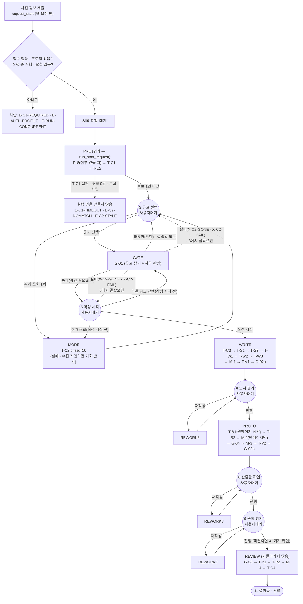
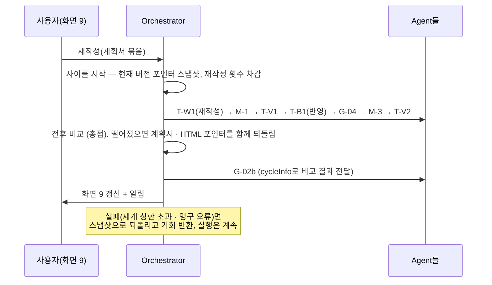

# Orchestrator 구조와 흐름

| 항목 | 내용 |
|---|---|
| 작성일 | 2026-09-26 (2026-10-01 갱신: MySQL 저장소 · 워커 · 웹 연동 함수 · 토큰 기록. 2026-10-02 갱신: 웹 `projects` 쓰기 제거 · 재작성 묶음 요청과 모으기 · T-P2 시도 기록과 `proofread_logs` · 웹 조회 함수 — 바뀐 곳은 4 · 8.1 · 10 · 11 · 12절. 2026-10-03 갱신: 공고 서버 연결(T-C2 · G-01) — 바뀐 곳은 2 · 3 · 5 · 11 · 12절. 2026-10-04 갱신: 조율 T-C3 작업 분해 · 지시문 다시 쓰기 — 바뀐 곳은 2 · 11절. 2026-10-05 갱신: 시각 UTC · 실행 로그 12개월 처리 · 탈퇴 함수 · 시작 요청 입력 사본 비우기 — 바뀐 곳은 2 · 8 · 10 · 11 · 12절) |
| 기준 문서 | S-Brain Agent 기능정의서 v1.9 (참고: 프로젝트 기획서 v1.10) |
| 코드 | `sbrain/` |
| 테스트 | `tests/` — 1131건 (MySQL 테스트 DB 없이 1084건 통과 · 47건 건너뜀(MySQL 전용), MySQL 8.0 테스트 DB를 켜면 1131건 모두 통과. 흐름 테스트는 메모리 · SQLite 두 저장소로, 저장소 계약 · 통합은 MySQL 8.0으로도. 조율 T-C1 · T-C3(작업 분해)와 재작성 · 재수행 지시문 다시 쓰기, 공고 서버 연결 T-C2 · G-01만 실제 구현, 나머지 Agent는 스텁. 공고 서버는 가짜 전송 · 127.0.0.1 임시 서버로만 시험) |
| 독자 | Orchestrator · 조율 Agent 구현 담당, 웹팀(명령 창구 연동) |

이 문서는 코드에서 도출했다. Task 표는 코드의 Task 등록부에서 뽑았다. Agent 연동 규격은 [Agent_연동_규격_초안.md](Agent_연동_규격_초안.md)에 따로 있다.

---

## 1. 범위

Orchestrator는 조율을 포함한 7개 Agent를 같은 방식으로 등록하고 호출하는 뼈대다. **조율은 Agent이며 Orchestrator가 아니다.**

| Orchestrator가 하는 일 | 하지 않는 일 (Agent 몫) |
|---|---|
| Agent · Task 등록부, 담당 Agent 설정을 입힌 호출 도구(tools) 제공 | 각 Task의 내용 생성 · 검사 · 확정 동작 |
| 워크플로 구동 (순서 · 카테고리 분기 · 조건 분기 · 사용자 대기) | 재작성 판정(점수 환산 · 다음 동작 · 재작성 목록) — G-02a · G-02b |
| Context: 산출물 버전 보관 · 입력 조립 · 되돌리기 | 합치기 4종의 내용(계획서 조립 등) — 조율 Agent |
| 실행 상태(R-9), 호출 실패 처리(R-11 중 재개), 재수행 루프 | 재시도 — tools가 호출 단위로 처리 |
| 저장(메모리 · 공유 MySQL), 워커 프로세스, 웹 연동 함수(시작 요청 · 명령 · 조회 · 중단 · 완전 삭제 · 탈퇴), 실행 로그 12개월 처리(통계 줄로 옮기기) | |
| 재작성 사이클 구동 (다시 돌릴 단계 실행 · 전후 비교 · 되돌리기 · 기회 반환) | |
| 설정값 스냅샷, 알림 발행, 저장, 추적 기록 | |

## 2. 모듈 구성

| 경로 | 내용 |
|---|---|
| `sbrain/models/` | 시트 4 공통 타입. 확장 필드는 `ext()`로 표시. 시각 필드는 모두 시간대 있는 UTC로 맞춘다(2026-10-05) |
| `sbrain/models/clock.py` | 시각 — 프로세스 안의 "지금"은 `utc_now()` 하나(시간대 있는 UTC). 시간대 없는 값은 UTC로 봄(`as_utc`), DB 칸 값(`naive_utc`), 한국 날짜(`kst_today` · `kst_month`, UTC+9 고정) (2026-10-05) |
| `sbrain/contracts/tasks.py` | 시트 3 Task 입출력 규격 (합치기 · R-8 포함) |
| `sbrain/orchestrator/registry.py` | Agent 등록부 · Task 등록부 (`TaskSpec`: 담당 Agent, 입출력, 실행 함수, 온도 덮어쓰기, 실패 정책, 재수행 · 확정 동작 예외, LLM 사용 여부, 입력 연결) |
| `sbrain/orchestrator/tools.py` | 호출 도구 (잠정 규격): 호출 단위 재시도 · 제한 시간 · 오류 분류 · 스키마 검사 · 호출 로그 |
| `sbrain/orchestrator/settings.py` | 시트 1 설정값 · 층별 배점 · Threshold · Agent 설정. 잠정 항목 목록(`PROVISIONAL`) |
| `sbrain/orchestrator/context.py` | 산출물 버전 · 현재 버전 포인터 · 한 번에 저장할 기록 모음 |
| `sbrain/orchestrator/engine.py` | 대기열 실행, 재수행 루프, 재개 · 실패, 재작성 사이클 장치 |
| `sbrain/orchestrator/store.py` · `memory_store.py` | 저장 인터페이스(실행 건 · 점유 · 한 번에 저장 · 시작 요청 · 워커 가져가기 · 관리자 조회)와 메모리 구현 |
| `sbrain/orchestrator/trace.py` | 추적 기록 타입 |
| `sbrain/orchestrator/errors.py` | 시트 6 오류 코드, 예외 |
| `sbrain/flow/catalog.py` | S-Brain Task 등록부 (시트 2 · 3) |
| `sbrain/flow/sbrain_flow.py` | 구간 · 대기 지점 · 재작성 경로 · 알림, T-P2 병렬 실행기, 전후 비교 단계 |
| `sbrain/flow/rework_map.py` | 시트 7 재작성 매핑 (데이터) |
| `sbrain/flow/service.py` | 명령 창구 `SBrainOrchestrator` — 시작 요청 · 명령 · 중단 · 완전 삭제 · 탈퇴 (웹 서버가 부름, 10절) |
| `sbrain/flow/reads.py` | 화면 조회(모양 초안) · 관리자 실행 기록 조회(실행 건 목록 · 운영 요약은 최근 12개월) |
| `sbrain/flow/retention.py` | 실행 로그 12개월 처리 — 기준 시각(`retention_cutoff`), 작업 점유 시작(`start_retention`), 처리(`run_retention`). 워커만 돈다 (2026-10-05) |
| `sbrain/flow/log_stats.py` | 식별자 없는 통계 줄 만들기 — 실행 줄(`run_stats_row`) · 시작요청 줄(`start_request_rows`), 현재 점수(`current_scores`, 관리자 조회와 같은 계산) (2026-10-05) |
| `sbrain/intake/` | 사전 정보 입력 연동: 웹 DB 행 → PreInput, 필수 항목 재확인(E-C1-REQUIRED), SQL 공급처 |
| `sbrain/orchestrator/openai_provider.py` | OpenAI 호출처 어댑터 (LLMProvider 구현) |
| `sbrain/agents/supervisor/` | 조율 Agent 구현 — T-C1(`tc1`), T-C3 작업 분해(`tc3`, 2026-10-04), 작업 계획 부품(`plan` — 확인 · Task 목록 · 틀 · 참조 조각 배정 · 맥락, 스텁 T-C3와 함께 씀), 재작성 · 재수행 안내 다시 쓰기(`rewrite` — 워커 조립이 흐름에 끼운다) |
| `sbrain/flow/instruction.py` | 지시문 공용 부품 — 틀 · 안내 · 참조 자료 세 부분 잇기 · 나누기, 안내 부분만 바꾸기, 문제 내용 덧붙임 형식 (2026-10-04) |
| `sbrain/agents/notice/` | 공고 서버 연결 — HTTP 클라이언트(`client`), 실제 T-C2(`tc2`) · G-01(`g01`), 응답 검사(`convert`). 워커 조립이 `SBRAIN_NOTICE_API_URL`이 있을 때 스텁 대신 끼운다 (2026-10-03) |
| `sbrain/agents/form_defaults.py` | 신청자 유형별 양식 · 평가 항목 · 채점 기준표 표(`FORM_TABLE`, 잠정)와 고르기 · 불변식 확인 — 작업 분해(T-C3)가 쓴다(2026-10-04). 선택 공고의 기본 양식(자리 표시 값) — 스텁 공고와 공고 서버 연결이 함께 쓴다 |
| `sbrain/agents/stubs.py` | 스텁 Agent · 가짜 LLM 호출처 |
| `sbrain/bootstrap.py` | 구성 조립 — `build_stub_app`(테스트 · 시연) · `build_app`(워커) · `build_web`(웹 서버) |
| `sbrain/store_sql/` | SQL 저장소: `schema.py`(테이블 정의 — DDL의 단일 원본) · `ddl.py`(MySQL DDL 파일 생성) · `db.py`(접속) · `store.py`(`SqlStore`) · `web_tables.py`(Orchestrator가 쓰는 웹 테이블) · `settings_source.py`(`DbSettingsProvider`) |
| `sbrain/worker.py` | 워커 프로세스 (`python -m sbrain.worker`) |
| `sbrain/env.py` | 환경 변수 읽기 (환경 변수 → `.env`) |
| `sql/orchestrator_schema.sql` | Orchestrator 테이블 DDL (생성 파일, 공유 DB 적용은 사용자) |
| `docker/mysql-test.yml` | MySQL 8 통합 테스트용 로컬 DB — 이미지 `mysql:8.0`(공유 DB와 같은 계열, 2026-10-05 `8.4`에서 바꿈) |

범용 장치(`orchestrator/`)와 S-Brain 고유 규칙(`flow/`)을 나눴다. 복귀 화면 번호 · 알림 대상 · 재작성 경로 같은 서비스 고유 규칙은 `flow/`에만 있다.

## 3. 실행 흐름

- **사전 단계(PRE)는 실행 건이 없다.** T-C1 · T-C2는 재개하지 않으며, 후보가 1건 이상 나와야 실행 건(Run)을 만든다. 이때 사전 단계의 산출물 · 추적 기록을 동시 실행 제한 확인 · 시작 요청 '완료'와 함께 한 번에 저장한다.
- **사전 단계 시작은 두 조각이다.** 웹 요청 안에서 `request_start`가 확인만 하고 '대기' 요청을 넣는다. 워커가 요청을 가져가 사전 단계를 돈다(`run_start_request`). 실패하면 요청에 코드(E-C1-TIMEOUT · X-C2-FAIL · E-C2-STALE · E-C2-NOMATCH · E-RUN-CONCURRENT)를 남긴다.
- **G-02b는 T-V2 직후 계산한다**(시트 2 "T-V2 종료 직후"). 화면 8은 T-V2 점검 결과를 보여주고, 사용자가 진행하면 이미 계산된 G-02b 결과로 화면 9에 들어간다.
- 각 구간이 끝나면 알림을 만든다: WRITE → '문서평가'(6), PROTO → '산출물확인'(8), REVIEW → '표현검수'(10).

## 4. 재작성 경로

사용자가 묶음을 고르면 다시 돌릴 단계를 실행 순서대로 대기열에 넣는다. **합치기는 모든 경로에 들어간다** (테스트로 확인).

**요청 방식 (2026-10-02):** 웹은 묶음마다 `request_rework_for_project(project_id, 묶음 이름)`를 부른다. 묶음 이름은 문서층 `문제인식` · `실현가능성` · `성장전략` · `팀 구성`(임시 구성, 잠정), 산출물층 `실행 파일` · `인포그래픽`이다. 같은 화면에서 첫 요청부터 2초(잠정) 안의 요청은 재작성 한 번으로 합치고(합집합, 기준 문서 순서), 그동안 워커는 그 실행 건을 가져가지 않는다. 미달이 아닌 묶음도 받는다(확장). 문서층은 묶음 구성이 정해질 때까지 어느 이름이든 계획서 전체(T-W1 → T-W2 → T-W3)를 다시 만든다(잠정). 아래 표의 '고른 T-W*'는 지금 이 임시 처리에서 세 Task 모두다.

| 화면 | 고른 묶음 | 다시 도는 단계 | 비교 기준 |
|---|---|---|---|
| 6 문서 평가 | 계획서 항목 | 고른 T-W1 · T-W2 · T-W3 → M-1 → T-V1 → 전후 비교 → G-02a | 문서층 |
| 8 산출물 확인 | 실행 파일 | T-B1 → G-04 → M-3 → T-V2 → 전후 비교 → G-02b | 산출물층 |
| 8 산출물 확인 | 인포그래픽 | T-B2 → (원페이지면 M-2) → G-04 → M-3 → T-V2 → 전후 비교 → G-02b | 산출물층 |
| 9 종합 평가 | 계획서 항목 포함 | 고른 T-W* → M-1 → T-V1 → T-B1(HTML 반영, 원페이지 제외) → (고른 T-B2 → M-2) → G-04 → M-3 → T-V2 → 전후 비교 → G-02b | 총점 |
| 9 종합 평가 | 프로토타입만 | 화면 8과 같음. 문서층 승계(carriedOverLayer='document') | 산출물층 |

- 재작성 횟수는 고른 묶음만 센다. 화면 9에서 계획서 재작성을 HTML에 반영하는 T-B1은 횟수를 쓰지 않는다.
- 같은 Task에 묶음 여러 개가 걸리면 한 번의 호출로 합친다.
- 다른 화면에서 이미 쓴 묶음은 고를 수 없다(E-G2-LIMIT). 원페이지에서 T-B1을 고르면 거절한다.

## 5. 실행 상태

| 항목 | 구현 |
|---|---|
| 두 축 | `step`(공고선택 … 결과물) × `progress`(실행 · 재개대기 · 사용자대기 · 실패 · 완료 · 중단) |
| 화면 상태 | `progress`에서 계산: 실행 · 재개대기 → 진행 중, 사용자대기 → 확인 필요, 실패 → 문제 발생, 완료 → 완료, 중단 → 중단됨 |
| 복귀 화면 | 단계별 번호(3 · 5 · 6 · 7 · 8 · 9 · 10 · 11). 재작성 중이면 요청한 화면 |
| 동시 실행 | 계정당 1건. 실행 · 재개대기 · 사용자대기 실행 건과 대기 · 처리중 시작 요청을 센다. 계정 잠금(MySQL `GET_LOCK`) 안에서 확인한다 |
| 프로젝트와 실행 건 | 프로젝트 1건에 실행 건은 최대 1건(`orch_runs.project_id` UNIQUE). 새로 시작은 새 프로젝트로 |
| 설정값 | 실행 시작 때 전체를 `settingsSnapshot`에 고정. Agent별 모델도 포함(잠정) |
| 중단 | 사용자 '중단'은 확인을 받은 뒤 반영. 진행 중이면 Task 사이에서 반영 |
| 알림 | 문서평가(6) · 산출물확인(8) · 표현검수(10) · 실패(실행: 대상 없음 / 재작성: 요청 화면) |
| 공고 마감 | 진행 상태 보기 때 선택 공고의 마감일이 지났거나(비어 있으면 보지 않음) G-01이 받은 모집 상태가 '마감'이면 E-RUN-CLOSED 안내만 붙인다(2026-10-03) |
| 막힌 공고 | 자격 불통과 공고는 실행 건의 막힌 공고 목록(`blockedAnnouncementIds`)에 넣어 다시 고를 수 없게 하고(`ANNOUNCEMENT_BLOCKED`), 추가 조회에서 내용이 바뀌면 푼다(2026-10-03) |

## 6. 호출 실패 처리

| 단계 | 누가 | 동작 |
|---|---|---|
| 재시도 | tools | 호출 한 건마다 최대 5회 다시 보낸다. 기록은 호출 로그에만 남고 새 버전을 만들지 않는다 |
| 재개 | Orchestrator | 재시도를 다 쓴 일시 오류면 `재개대기`로 두고 실패한 Task(currentTask)부터 다시 한다. 간격 15 → 30 → 60 → 120 → 240분, 최대 5번, 총 12시간. 재개할 때마다 재시도 횟수를 다시 채운다 |
| 실패 | Orchestrator | 재개 상한 초과 · 영구 오류(입력 · 운영)면 실행 실패(E-RUN-FAIL). 영구 오류는 관리자 알림 대상(`adminAlert`). 재작성 중이면 재작성 실패(E-RUN-ROLLBACK) |

- 재개하면 같은 실행 기록을 이어 쓴다(`resumeCount` 증가). 재시도는 시도를 새로 만들지 않는다는 기준 문서 원칙과 같은 방향이다.
- 재개 시각이 되면 워커가 그 실행 건을 하나씩 가져가 `resume(run_id)`로 깨운다. `tick(now)`은 재개 대상을 모두 도는 테스트 · 시연용이다.
- 실행이 실패하면 실패 사유(`failureReason`, 확장)를 `"<Task>: <사유> — <오류 요약>"`으로 남긴다(500자까지, 잠정).

## 7. 재수행 루프

1. Task가 `check.passed=false`를 돌려주면, `ReworkInput(mode='재수행', issues=check.failures, previousResultRef, isFinalAttempt)`을 산출물로 저장하고 같은 Task를 다시 부른다.
2. 재수행 횟수(2회)까지 한다. 마지막 시도에는 `isFinalAttempt=true`를 싣는다.
3. 예외 여섯 곳에서 마지막 시도가 불통과인데 `finalAction`이 비어 있으면 규격 위반을 기록한다.
4. 재수행 하나하나는 새 실행 기록 · 새 산출물 버전이다. 피드백 전달(check@n → 다음 실행)로 연결한다.
5. 매 시도가 끝날 때마다 저장하므로, 중간에 멈춰도 몇 번째 재수행이었는지를 잃지 않는다.

## 8. 저장

| 원칙 | 구현 |
|---|---|
| 한 번에 저장 | 단계(또는 재수행 시도) 하나가 끝나면 산출물 버전 · 현재 버전 포인터 · 실행 상태 · 추적 기록을 `CommitBatch` 하나로 저장한다 |
| 실행 점유 | 같은 실행을 두 곳에서 동시에 진행하지 않도록 점유한다(점유자 · 만료 시각). 저장은 점유한 쪽만 할 수 있다(`StoreConflict`) |
| 제한 시간 | tools가 호출처의 HTTP timeout으로 건다 |
| 사용자 중단 | 점유 중이면 중단 요청만 남기고, 엔진이 Task 사이에서 확인한다 |
| 구현 | `MemoryStore`(테스트 · 시연)와 `SqlStore`(공유 MySQL 8 · SQLite). 같은 동작이며, 흐름 테스트 전체를 두 저장소로 돌려 확인한다 |

### 8.1 MySQL 구현 (`store_sql/`)

| 항목 | 구현 |
|---|---|
| 테이블 | `orch_` 12개 — 실행 건 · 시작 요청 · 산출물 버전 · 현재 버전 포인터 · 포인터 이동 · 실행 기록 · 호출 기록 · 피드백 연결 · 재작성 전후 비교 · 추적 사건, 그리고 2026-10-05에 늘어난 실행 로그 통계 줄(`orch_log_stats`) · 주기 작업 상태(`orch_jobs`). 같은 날 기존 표에 인덱스 `ix_orch_runs_updated (updated_at)` · `ix_orch_start_requests_status_updated (status, updated_at)`가 늘었다(이미 만든 표에는 `CREATE INDEX`로 따로 더한다). 정의는 `schema.py` 하나, DDL 파일은 `python -m sbrain.store_sql.ddl`로 만든다(`CREATE TABLE IF NOT EXISTS`만, 인덱스는 `KEY`로 표 안에) |
| 컬럼 | 조회 · 정렬에 쓰는 값은 컬럼, 나머지는 모델 전체를 JSON 문자열(`run_json` · `record_json` · `value`)로. **MySQL JSON 형식 대신 `LONGTEXT`** — MySQL JSON은 객체 키 순서를 바꿔 저장해 순서가 뜻을 갖는 값(`checkRefs` · `ordersByTask`)이 달라지기 때문이다. 기록 테이블은 자동 증가 `seq`로 기록 순서를 지킨다 |
| `commit` 트랜잭션 | 점유 확인(`SELECT … FOR UPDATE`) → 실행 건 행 갱신 + 점유 연장 → 산출물 버전 · 포인터 → 실행 기록(같은 ID는 덮어씀) → 호출 기록 · 피드백 · 비교 · 포인터 이동 · 추적 사건 → 웹 `notifications` → (학습 동의 계정의 반려된 T-P2 시도) 웹 `proofread_logs` → 실패로 바뀌었으면 `generation_failure_alerts`. 웹 `projects`는 쓰지 않는다 |
| `create_run` 트랜잭션 | 계정 잠금(`GET_LOCK`) 안에서 진행 중 실행 건을 세고, 실행 건 · 사전 단계 기록(+ 시작 요청 '완료')을 함께 저장 |
| 점유 | 조건부 UPDATE(점유자가 없거나 같거나 만료된 경우만)로 잡고 영향 행 수로 판정. 워커는 하트비트로 연장하고, 저장할 때도 연장한다 |
| 워커 가져가기 | `SELECT … FOR UPDATE SKIP LOCKED`로 후보 한 건을 고르고 같은 트랜잭션에서 점유 — 시작 요청 · '실행' 실행 건(재작성 요청을 모으는 중 — `collect_until`이 지나지 않음 — 이면 건너뜀) · 재개 시각이 된 실행 건 |
| 웹 테이블 | `notifications` · `generation_failure_alerts` · `proofread_logs` INSERT만 쓴다(웹 `projects`는 쓰지 않음). `verification_policies` 읽기(설정 입력), 학습 동의 읽기(`projects.company_id` → `companies.user_id` → `users.ai_training_agreed`). 처음 쓸 때 구조를 읽고 컬럼이 없으면 `SchemaMismatch` — `proofread_logs`만 옛 구조면 쓰기를 건너뛰고 추적 사건 '검수회수기록생략'을 실행 건마다 한 번 남긴다 |
| 알림 | 기준 문서 Notification의 `runId` 자리에 `project_id`를 쓴다. project_id가 없는 실행 건(테스트 · 시연용 직접 시작)은 웹 테이블에 쓰지 않는다 |
| 완전 삭제 | 산출물 버전 · 포인터와 시작 요청의 입력 사본만 지운다. 실행 로그는 남는다. 웹이 프로젝트 행을 지우면 `orch_runs.project_id`는 NULL이 된다(외래 키 `ON DELETE SET NULL`). 남은 실행 건 줄과 로그는 마지막 활동 12개월 뒤 "완전 삭제된 실행 건"(포인터 0개)으로 통계 줄로 옮기고 모두 지운다(2026-10-05) |
| 시작 요청 입력 사본 | `form_json`은 요청이 끝나는 모든 경로(완료 · 실패 · 취소)에서 상태를 바꾸는 같은 UPDATE에서 비운다. 대기 · 처리중만 남는다(2026-10-05) |
| 12개월 처리 · 탈퇴 (`retire_run` · `retire_start_requests`) | 실행 건 하나 = 점유 확인 → 통계 줄 쓰기 → 여섯 기록 표(실행 기록 · 호출 기록 · 추적 사건 · 피드백 연결 · 재작성 전후 비교 · 포인터 이동) 지우기 → (완전 삭제된 실행 건 · 탈퇴면) 산출물 · 포인터 · 실행 건 줄까지 지우기를 한 트랜잭션으로. 살아 있는 실행 건은 실행 건 줄 · 산출물 · 마지막 활동 시각을 그대로 두고 `statsParts`만 올린다. 시작 요청은 (달 · 상태 · 코드)별 개수 줄과 삭제를 한 트랜잭션으로(2026-10-05) |
| 시각 | `DATETIME` 칸에는 시간대 없는 UTC를 넣고 읽을 때 UTC를 붙인다(`schema.py` `UtcDateTime`). 웹 표는 구조를 DB에서 읽어 오므로 `web_tables.py`가 직접 바꾼다. `proofread_logs.created_at`은 단계 저장 시각을 직접 넣는다(2026-10-05) |
| 접속 | MySQL은 격리 수준 READ COMMITTED(잠정). SQLite(테스트)는 모든 트랜잭션을 `BEGIN IMMEDIATE`로 시작하고 계정 잠금은 프로세스 잠금으로 대신한다(2026-10-05부터 무한 대기 대신 계정 잠금 대기 10초까지 — 넘기면 `StoreConflict`) |

### 8.2 워커 (`worker.py`)

스레드마다 한 바퀴에 ① 시작 요청 ② '실행' 실행 건(`advance`) ③ 재개 시각이 된 실행 건(`resume`)을 하나씩 가져간다. 점유자는 스레드마다 다르다(호스트:프로세스:스레드). 종료 신호를 받으면 새 일을 가져가지 않고 하던 단계를 끝낸 뒤(엔진이 단계 사이에서 `stop_requested`를 확인) 점유를 푼다. 남은 단계는 '실행'으로 남아 다른 워커가 이어받는다. 수치는 11.1절.

**④ 실행 로그 12개월 처리 (2026-10-05):** 한 바퀴 끝에 작업 확인 주기(10분, 잠정)가 됐으면 그 프로세스의 한 스레드만 작업 상태 표(`orch_jobs`, 작업 이름 `log_retention`)를 확인한다. 점유가 비었거나 만료됐고 마지막으로 끝까지 마친 지 24시간(잠정)이 지났으면 확인과 점유를 한 트랜잭션으로 잡아 `run_retention`을 돈다 — 여러 워커 중 한 대만, 하루 한 번. 대상은 마지막 활동(`updated_at`)이 기준 시각(지금에서 달력 기준 12개월 전, `retention_cutoff`)보다 오래된 실행 건(실행 · 재개대기 · 점유 중인 것 제외) · 끝난 시작 요청이다. 실행 건마다 점유(작업 점유자 + `/retention`)를 잡고 다시 확인한 뒤 한 트랜잭션으로 옮기고, 못 잡거나 조건이 바뀌었거나 오류면 건너뛴다. 하트비트가 작업 점유를 연장하고(종류 `작업`), 묶음마다 작업 점유를 확인해 잃었으면 멈춘다. 종료 신호면 실행 건 사이에서 멈추고 점유를 푼다(다음에 남은 것부터). 로그는 "보관 작업 시작" · "보관 작업 끝|멈춤 — 개수"와 오류 클래스 이름뿐이다. `--once`도 때가 됐으면 이 작업을 돈다. 웹 조립은 돌리지 않는다. 워커 로그 줄 앞 시각은 UTC다(끝에 `Z`).

## 9. 추적 기록

기준 문서의 AttemptRef · ReworkInput · ReworkComparison을 확장했다. 확장 필드는 코드에서 `ext()`로 표시된다.

| 기록 | 담는 것 |
|---|---|
| ExecutionRecord (AttemptRef 확장) | Task, 담당 Agent, 실제 모델 · 호출처 · 온도 · 추론 강도, 시도 번호, 계기(첫실행 · 재작성 · 재수행), **입력 산출물명@버전**, **출력 산출물명@버전**, 요약 메타(check 통과 · 실패 건수 · 점수), 재작성 사이클 · 역할, 재수행 · 재개 횟수, 들어온 피드백, 토큰 합계(그 실행의 호출 합) |
| CallLog | 호출 한 건과 시도별 결과(재시도) · 시도별 토큰 사용량과 합계. T-P2는 문장별(itemKey) |
| FeedbackLink | 재수행(check → 같은 Task), 재작성(reworkOrders + 사용자 선택 → 대상 Task), 재작성반영(계획서 → T-B1). 출처 실행 · 출처 산출물 · 전달 대상 실행 · 전달 수단(reworkInput@버전) |
| ReworkComparison (확장) | 전후 산출물 참조 · 점수 · 남긴 쪽, 사이클 · 화면 · 비교 기준 |
| PointerEvent | 현재 버전 포인터 이동(되돌리기) |
| TraceEvent | 규격 위반, 확정 동작 누락, 불변 산출물 변경 시도, 사이클 시작 · 종료, 재개 예약 등 |

원칙
- 기록에는 산출물 내용을 복사하지 않고 참조와 메타만 남긴다(기획서 6-7). 산출물은 산출물 저장소에만 있다.
- 규칙 단계 · 합치기도 기록한다. 사용자 명령도 `decision` 산출물로 남겨 참조한다.
- 되돌리기는 포인터만 옮기며 이전 버전과 기록을 지우지 않는다.
- T-P2는 호출 로그는 문장별, 입력 · 출력 이력은 Task 단위(`sentenceResults`)로 남긴다.
- 위 기록(실행 기록 · 호출 기록 · 피드백 연결 · 재작성 전후 비교 · 포인터 이동 · 추적 사건)은 실행 건의 마지막 활동 12개월 뒤 식별자 없는 통계 줄(`orch_log_stats`)로 옮기고 지운다. 탈퇴하면 바로 옮기고 지운다(2026-10-05, 8.1 · 8.2).

확인한 질의 (테스트)
- **화면 9 계획서 재작성 후 점수가 떨어져 되돌릴 때 되돌릴 HTML 버전:** 해당 사이클의 ReworkComparison `beforeRefs`에 `prototype@N`이 있고, PointerEvent가 `prototype`을 N으로 옮긴 기록을 남긴다.
- **최종 점수가 채점한 버전:** 현재 `docScore`를 출력한 T-V1 실행의 입력에 `planDoc@k`(합치기①이 만든 버전)가, 현재 `artifactScore`를 출력한 T-V2 실행의 입력에 `prototype@m`(합치기③이 만든 버전)이 있다.

## 10. 명령 창구 (`flow/service.py` · `flow/reads.py`)

웹 서버와 워커는 별도 프로세스이고 같은 공유 MySQL을 본다(`워커_구동_방식_제안.md`, 저장소 미포함, 확정). 웹이 부르는 함수는 모두 **project_id로** 받는다. 인자 · 돌려주는 모양 · 오류 코드는 웹팀 전달용 [Orchestrator_웹연동_함수명세.md](Orchestrator_웹연동_함수명세.md)에 있다.

**웹이 부르는 함수 (확장)**

| 함수 | 화면 | 동작 |
|---|---|---|
| `request_start(account_id, project_id)` | 2 | 웹 DB 입력 읽기 · 주인 확인 → 필수 항목(E-C1-REQUIRED) → 프로필 → 계정 잠금 안 동시 실행(실행 건 · 대기 요청) → 시작 요청 '대기' |
| `start_status(project_id)` | 2 | 마지막 시작 요청의 상태 · 코드 · 안내 · run_id |
| `view_project(project_id)` | — | `view()` + 실행 건이 없으면 시작 요청 상태 |
| `screen(project_id, n)` | 3 · 4 · 6 · 8 · 9 · 10 · 11 | 화면별 내용 (모양 초안). 대기 지점이 아니면 SCREEN_NOT_READY |
| `more_candidates_for_project` · `select_announcement_for_project` · `start_writing_for_project` · `decide_for_project` | 3 · 5 · 6 · 8 · 9 | 실행 건을 찾아 아래 run_id 명령을 부른다 |
| `abort_project(project_id)` | — | 대기 요청 취소 · 처리 중 요청 취소 요청 · 진행 중 실행 건 중단 |
| `delete_project_data(project_id)` | — | 완전 삭제 — 산출물 · 입력 사본 삭제, 실행 로그 유지(마지막 활동 12개월 뒤 통계로 옮기고 삭제). 워커가 단계를 도는 중이면 BUSY |
| `delete_account_data(account_id)` | — | 탈퇴 (2026-10-05) — 계정 잠금 안에서 대기 요청 취소 · 처리중 요청 취소 요청 · 진행 중 실행 건 중단. 처리중 요청이나 단계 도는 실행 건이 있으면 지우지 않고 BUSY. 아니면 실행 건마다 점유를 잡고 통계 줄(까닭 '탈퇴') + 산출물 · 포인터 · 모든 기록 · 실행 건 줄 삭제, 끝으로 끝난 시작 요청을 통계 줄로 세고 삭제. 여러 번 불러도 안전 |
| `admin_executions(...)` · `admin_calls(execution_id)` | 관리자 | 여러 프로젝트의 실행 기록 · 호출 기록 (메타데이터 · 토큰만) |
| `request_rework_for_project(project_id, bundle)` | 6 · 8 · 9 | 재작성 묶음 요청 — 접수만 하고 돌아온다. 같은 화면의 요청은 2초(잠정) 모아 한 번에 (2026-10-02) |
| `active_work` · `project_views` · `wait_project` · `outputs` · `rework_result` | — | 진행 중 작업 확인 · 여러 건 진행 상태 · 진행이 멈출 때까지 기다리기 · 지금까지 결과 · 마지막 재작성 결과 (2026-10-02) |
| `admin_runs` · `admin_score_history` · `admin_summary` · `admin_agent_tasks` | 관리자 | 실행 건 목록 · 층별 점수 이력 · 운영 요약 · Agent별 Task (메타데이터 · 점수 · 개수만, 2026-10-02). 실행 건 목록 · 운영 요약은 마지막 활동 최근 12개월 안 실행 건만(`reads._admin_since`, 2026-10-05) |

**워커 · 내부 · 테스트용**

| 함수 | 동작 |
|---|---|
| `run_start_request(request_id, owner, lease_sec)` | (워커) 요청 점유 → 사전 단계 → 실행 건 생성과 요청 '완료'를 한 번에. 직전에 취소 요청 확인. 웹 조립(`build_web`)에서 부르면 요청을 건드리지 않고 `WEB_NOT_ALLOWED` |
| `advance(run_id)` · `Engine.resume(run_id)` | (워커) 다음 대기 지점까지 진행 · 재개대기 실행 건 하나 깨우기 |
| `start_run(account_id, form, project_id)` · `start_run_for_project(account_id, project_id)` | 동기 경로 — 위 두 조각(확인 → 사전 단계)을 차례로 부른다 |
| `more_candidates(run_id)` · `select_announcement(run_id, id)` · `start_writing(run_id)` · `decide(run_id, screen, action, selected_orders, confirmed)` | 명령. '진행' · '재작성', 화면 9 미달 진행은 확인 요청(`ConfirmationNeeded`)을 먼저 돌려준다 |
| `abort(run_id, confirmed)` · `view(run_id)` · `tick(now)` | 확인 후 중단 · 화면 상태 · 재개 대상 모두 깨우기(`now`에 시간대가 없으면 UTC로 본다) |

명령은 상태를 확인하고 대기열만 채운다. 실제 진행은 워커가 한다.

## 11. 잠정값 · 해석 (확인 필요)

### 11.1 기준 문서가 값을 정하지 않아 둔 잠정값

| 항목 | 잠정값 |
|---|---|
| 재시도 간격 | 2초 |
| 제한 시간 (Task별) | LLM Task 120초, T-W1 · T-B1 · T-B2 300초, T-C2 · G-01 30초(G-01은 2026-10-03), T-P2 60초 |
| 검수 동시 처리 수 | 4 |
| 검수 실패 비율 기준 · 판단 시점 | 30%, 모든 문장을 본 뒤 판단 |
| Agent별 모델 · 호출처 · 기본 온도 · 추론 강도 | 조율은 openai · gpt-6-luna · 추론 강도 low · 온도 없음(사용자 지정 2026-09-30). 나머지 Agent 모델은 '미정', 검수 gpu-server, 검증-1 · 검증-2 온도 0, 검수 0.2, 그 밖 0.7. 실행 시작 시점 고정 |
| 온도 없는 Agent의 Task 온도 규칙 | 적용하지 않음 (추론 모델은 온도를 보내지 않는다) |
| 형식 오류의 오류 종류 | 일시 (재시도 소진 후 재개 대상) |
| 규칙 단계 · 합치기 오류 | 운영 오류 → 실행 실패, 재작성 중이면 재작성 실패 (G-04만 계속) |
| 재개 횟수를 세는 범위 | 실패한 지점이 성공하면 다시 센다 |
| 전후 비교 동점 | 재작성 결과('후')를 남긴다 |
| T-C2 전체 실패 | 확장 코드 X-C2-FAIL로 다시 시도 안내. 2026-10-03부터 추가 조회 실패 · 자격 확인(G-01) 실패에도 쓴다(11.5) |
| 워커 수치 | 조회 주기 1초 · 스레드 4 · 점유 120초 · 하트비트 30초(점유의 1/4) — 환경 변수로 바꾼다 |
| 시작 요청을 가져간 횟수 상한 | 3 — 넘으면 다시 돌지 않고 E-C1-TIMEOUT |
| 단계 밖 오류 뒤 | 그 실행 건을 점유 시간만큼 다시 가져가지 않는다 |
| 실패 알림 범위 | `generation_failure_alerts`에 모든 실패를 쌓고 `last_error_kind`로 구분(일시 = 재개 상한 초과, 입력 · 운영 = 영구 오류) — 기준 문서는 영구 오류만 관리자 알림. 웹팀 확인 대기 |
| 공고 ID와 `notices.notice_id` | 2026-10-02부터 Orchestrator는 `notices`를 읽지 않고 `projects.notice_id`도 쓰지 않는다('공고ID없음' 사건 없음). 2026-10-03 확인 끝남: 공고 ID(공고 서버의 `notice_id`)는 공고 표 `notices.notice_id`와 같다 — 공고팀 추천이 그 표를 읽는다. Orchestrator는 여전히 공고 표를 읽지 않고 공고 서버 API로만 받는다 |
| 진행률(`progress_percent`) | 진행 중(실행 · 재개대기)만 구간 비율, 완료 100, 그 밖 0. 진행 상태 보기(`RunView.percent`)에만 쓴다(웹 `projects`에는 쓰지 않음) |
| 실패 사유 길이 | 500자 |
| `deviation_cap` | 웹 `verification_policies` 값을 설정에 담아만 둔다(검증-1 연동 전) |
| 설정 입력 | `verification_policies` 첫 행(배점 · Threshold · 재수행 · 재작성 · 검수 재수행 횟수). 나머지(재시도 · 재개 · 제한 시간 · Agent 모델)는 코드 기본값 — 웹팀 답 대기 |
| MySQL 접속 | 격리 수준 READ COMMITTED, 계정 잠금 대기 10초(2026-10-05부터 SQLite · 메모리 저장소도 같은 값, 11.6), 점유 시각은 서버 시계(여러 서버면 시계가 맞아야 한다) |
| 워커의 스텁 Task 호출처 | 구현된 Task(T-C1 · T-C3, 2026-10-04)와 조율의 지시문 다시 쓰기 호출만 실제 OpenAI로, 나머지 스텁은 가짜 호출처로 보낸다(`TaskRoutedProvider`) |
| 완전 삭제 중 단계 진행 | 지우지 않고 BUSY — 웹이 다시 부른다 |

### 11.2 기준 문서에 명시가 없어 해석한 것

1. **실행 건 생성 시점:** 공고 후보가 1건 이상 나온 뒤에 만든다(T-C1 "아직 실행 건이 없다", E2 · E6은 사전 정보 입력으로 복귀).
2. 공고 선택 대기 · 작성 시작 대기의 progress는 '사용자대기'로 둔다.
3. 재수행 횟수는 Task 호출 단위로 센다(CheckResult에 차트 · 표 단위 결과가 없음).
4. 여러 묶음을 한 번에 재작성하면 전후 비교를 요청 전체로 하고, 묶음마다 같은 비교 결과를 기록한다(묶음 · 평가 항목 매핑 미확정).
5. **전후 비교(높은 쪽 선택과 되돌리기)는 Orchestrator가 하고, G-02는 결과를 받아 scoreReport에 담는다.** 앞서 "전후 비교 판단은 G-02 몫"으로 나눴으나, 기준 문서의 G-02 입력에 재작성 전 점수가 없고 되돌리기는 버전 포인터 조작이라 이렇게 조정했다.
6. 재작성으로 검증을 다시 실행한 경우의 알림 대상 화면은 요청한 화면으로 둔다.
7. 원페이지에서 화면 9 계획서 재작성 시 T-B2(원페이지 SVG)에는 반영하지 않는다(기준 문서는 HTML 반영만 적음).
8. 안내 문서(G-04) 미충족은 재작성 목록에 올리지 않는다(미확정).
9. 재작성 기회는 요청을 받는 순간 쓰고, 재작성이 실패할 때만 돌려준다. 모으는 동안 중단하면 돌려주지 않는다(실행이 끝나므로).
10. 실패 · 중단된 실행 건은 지금까지 결과 · 재작성 결과를 보여 주지 않는다(시트 5 R-9 ⑤ "실패 · 중단으로 끝난 실행에는 들어갈 수 없고 결과도 볼 수 없으며").

### 11.3 뼈대 단계에서 하지 않은 것

- ~~실행 로그 12개월 뒤 식별자 분리 · 통계 전환(기획서 6-7)~~ → 2026-10-05 구현(8.2 ④, 11.6). 탈퇴 때 통계 전환 · 삭제도 함께(`delete_account_data`)
- 공유 DB에 Orchestrator 테이블 적용 — DDL 파일(`sql/orchestrator_schema.sql`)로 사용자가 한다
- 공고 서버에 실제로 연결하기 — 연결 코드(`agents/notice/`)는 2026-10-03 완성했다. 공고팀 API(수집 상태 · 공고 상세 · 자격 판정, 추천 결과 키 추가)가 준비되고 확인을 마친 뒤 사용자가 `SBRAIN_NOTICE_API_URL`을 설정해 켠다. 그 전까지 워커는 스텁 공고 · 스텁 판정을 쓴다
- 실제 Agent 구현. 조율 T-C1은 2026-09-29 구현 — `docs/T-C1_요구사항해석_구현.md`, T-C3는 2026-10-04 구현 — `docs/T-C3_작업분해_구현.md`
- R-8 첨부 문서 텍스트 추출 (요청 시 구현)

### 11.4 웹 연동 분리(2026-10-02)에서 생긴 잠정 · 확장

기준 문서와 다르게 구현한 것은 `기준문서_개정필요사항_워커_웹연동.md`(저장소 미포함)에 따로 모았다.

| 항목 | 값 · 내용 | 표시 | 코드 |
|---|---|---|---|
| 재작성 모으는 시간 | 2초 — 같은 화면에서 첫 요청부터 이 시간 안의 요청을 재작성 한 번으로 합친다. 그동안 워커는 가져가지 않는다 | 잠정(조정값) | `flow/service.py` `REWORK_COLLECT_SEC`, `PROVISIONAL["reworkRequest.collectSec"]` |
| 재작성 요청의 점유 재시도 | 최대 5초(0.05초 간격). 못 잡으면 `BUSY` | 잠정(조정값) | `REWORK_LEASE_RETRY_SEC`, `PROVISIONAL["reworkRequest.leaseRetrySec"]` |
| `wait_project` 기본 제한 시간 | 60초, DB를 0.5초마다 다시 읽음. 넘기면 그때 상태를 그대로 준다 | 잠정(조정값) | `WAIT_TIMEOUT_SEC` · `WAIT_POLL_SEC`, `PROVISIONAL["waitProject.*"]` |
| 판정 지시 없는 묶음의 재작성 문구 | `reason` · `instructionDelta` 모두 '사용자가 이 묶음의 재작성을 요청했습니다.'(지시문에는 한 번만) | 잠정 | `flow/sbrain_flow.py` `REWORK_DEFAULT_REASON` |
| 문서층 묶음 4개와 계획서 전체 재생성 | `문제인식` · `실현가능성` · `성장전략` · `팀 구성`. 어느 이름이든 T-W1 · T-W2 · T-W3을 모두 다시 돌리고 판정의 문서층 지시를 합쳐 준다. 기회는 이름마다 센다 | 잠정 | `flow/rework_map.py` `DOCUMENT_BUNDLES`, `sbrain_flow.bundle_orders` |
| 문서층 지시의 `reworkOptions` 기회 표시 | 문서층 묶음 4개 중 가장 많이 남은 값. 그 값이 0보다 크면 고를 수 있음 | 잠정 | `flow/reads.py` `_options`, `rework_map.order_bundles` |
| 미달이 아닌 묶음 재작성 | 판정 지시 · 다음 동작과 관계없이 받고 다시 만들고 다시 채점한다(사용자 결정) | 확장 | `flow/service.py` `request_rework_for_project` |
| 자격 통과 뒤 공고 다시 고르기 | 계획서작성 · 사용자대기(작성 시작 전)에서도 공고 선택 → G-01 다시 | 확장 | `ANNOUNCEMENT_STEPS` |
| 자격 통과 뒤 화면 3 · 추가 조회 | 같은 상태에서 화면 3 조회와 추가 조회를 받는다. 작성 시작 뒤에는 `INVALID_STATE` | 확장 | `reads.SCREEN_STATES`, `more_candidates` |
| T-P2 시도별 기록 | `SentenceResult.attempts: list[ProofreadAttempt]` — 시도 번호 · 문장 · 채택 · 토큰 검사 · 위반 종류. 호출 실패는 시도 아님, 재개해도 번호를 이어 센다 | 확장(`ext()`) | `contracts/tasks.py`, `sbrain_flow.py` T-P2 실행기 |
| 위반 종류 표기 | 웹 표기 `날짜` · `수치·금액` · `고유명사` · `기능명`(시트 4 `수치금액` → `수치·금액`). 빠진 → 바뀐 → 섞인 순서로 보호 토큰과 처음 맞는 종류 하나 | 확장(웹 표기) | `sbrain_flow.VIOLATION_LABEL` · `violation_type` |
| 위반 요약 · 위반 토큰 목록 표기 | `보호 토큰 검사 불통과 (빠짐 1건 · 섞임 2건)`, `빠짐: 1억원 / 섞임: A, B` | 잠정 | `sbrain_flow.violation_reason` · `violation_note` |
| `proofread_logs`에 채우는 컬럼 | `project_id` · `original_text` · `corrected_text` · `reason` · `attempt_no` · `passed` · `violation_type` · `violation_note` · `recovery_status` · `model_version`(웹 스키마 변경 뒤 모양, 웹팀 확인 전). 2026-10-05부터 `created_at`(저장 시각 UTC)도 넣는다(11.6) | 잠정 | `store_sql/web_tables.py` `PROOFREAD_WRITE` |
| `proofread_logs` 옛 구조 판정 | 위 컬럼이 없거나, 채우지 않는 NOT NULL · 기본값 없는 컬럼이 남으면 쓰기만 건너뛴다 | 잠정 | `web_tables._unfilled_required` |
| 새 함수 · 오류 코드 | `active_work` · `project_views` · `wait_project` · `outputs` · `request_rework_for_project` · `rework_result` · `admin_runs` · `admin_score_history` · `admin_summary` · `admin_agent_tasks`, `WEB_NOT_ALLOWED` · `RUN_NOT_VIEWABLE` | 확장 | `flow/service.py` · `flow/reads.py` · `orchestrator/errors.py` `COMMAND_ERROR_CODES` |
| 진행 상태 보기의 새 필드 | `RunView.retry_count` · `resume_count` · `next_resume_at` · `last_error_kind` · `rework_screen` · `collecting` · `announcement_id` | 확장 | `flow/service.py` `RunView` |
| 마지막 재작성 결과 요약 | `Run.last_rework`(`ReworkSummary` — 진행중 · 완료 · 실패) | 확장(`ext()`) | `models/run.py` |
| 재작성 모으기가 끝나는 시각 | `CycleState.collect_until`, 컬럼 `orch_runs.collect_until` | 확장 | `models/run.py` · `store_sql/schema.py` |
| 산출물층 항목별 점수 | 실행 기록 출력 요약 `OutputMeta.code_check_score` · `feature_match_score`(관리자 점수 이력 · 운영 요약용) | 확장 | `orchestrator/trace.py` |

### 11.5 공고 서버 연결(2026-10-03)에서 생긴 잠정 · 확장

기준 문서와 다르게 구현한 것은 `기준문서_개정필요사항_공고연동.md`(저장소 미포함)에, 공고팀에 요청한 API 약속은 [공고서버_API요청_공고팀전달.md](공고서버_API요청_공고팀전달.md)에 따로 모았다.

**잠정** (`orchestrator/settings.py` `PROVISIONAL`)

| 항목 | 값 · 내용 | `PROVISIONAL` 키 | 코드 |
|---|---|---|---|
| G-01 제한 시간 | 30초 — 공고 서버의 공고 상세 · 자격 판정 호출, T-C2와 같음 | `taskTimeouts.G-01` | `settings._default_timeouts` |
| 모집 상태 모름 | 공고 서버 모집 상태가 `open` · `closed` 밖(`unknown` 등)이면 선택 공고 `status`를 '모집중'으로 둔다 — 마감 안내가 붙지 않는다 | `announcement.unknownStatus` | `agents/notice/g01.py` `to_announcement` |
| 기본 양식 | 선택 공고의 `formSpec` · `evaluationItems`는 기본 양식(`1-1` · `2-1` · `3-3`, 스텁 공고 · 공고 서버 연결 공통)인 자리 표시 값 — 2026-10-04부터 뒷 단계는 읽지 않고 작업 분해(T-C3)가 신청자 유형으로 고른 양식 · 평가 항목 · 채점 기준표를 쓴다(값 잠정, `PROVISIONAL["taskPlan.formTable"]` · `docs/T-C3_작업분해_구현.md` 14절) | `announcement.formSpec` | `agents/form_defaults.py` `default_form_spec` |
| X-C2-GONE 문구 | "선택하신 공고를 더 이상 확인할 수 없습니다. 다른 공고를 선택해주세요." | `notice.X-C2-GONE` | `orchestrator/errors.py` `ERROR_CODES` |
| 추천 이유 문장 틀 | 공고 서버의 `band`(매우 적합 · 적합 · 참고, 없으면 대체 경로 '마감임박순'일 때 '마감이 가까운 신청 가능 공고입니다')와 지역(전국 · 희망 지역 일치 · 불일치)으로 정한 문장을 " · "로 잇는다. AI를 부르지 않는다 | `announcement.matchReason` | `agents/notice/tc2.py` `match_reason` |
| 공고 서버 호출 하나씩 · 워커 1대 | 워커 프로세스 안에서 공고 서버 호출을 한 번에 하나씩(네 API 모두, 프로세스 공용 잠금). 프로세스끼리는 막지 않으므로 운영 워커는 1대 — 공고팀이 동시 호출 안전성을 확인하기 전까지 | `noticeServer.serialCalls` | `agents/notice/client.py` `_CALL_LOCK` |

- 시 · 도 바꾸기 표(웹 17개 → 공고팀 16개)는 웹 값을 확인해 잠정이 아니다(`agents/notice/tc2.py` `REGION_MAP`).
- 마감 임박순 덧붙임 " 마감 임박순으로 보여드립니다."(`orchestrator/errors.py` `EMBED_DEADLINE_SUFFIX`)는 기준 문서 시트 6 E-C2-EMBED E열 문구라 잠정 · 확장이 아니다.

**확장** (`ext()` 필드와 Orchestrator 내부 값)

| 항목 | 값 · 내용 | 표시 | 코드 |
|---|---|---|---|
| 모집 형태 | `Announcement.applyPeriodType` · `AnnouncementCard.applyPeriodType` — 기간 있음 · 예산 소진 시까지 · 상시·수시 · 선착순·모집 완료 시까지 · 모름(기본) | 확장(`ext()`) | `models/domain.py`, 표기 `agents/notice/convert.py` `PERIOD_LABELS` |
| 내용 바뀜 · 내용 버전 | `AnnouncementCard.contentChanged`(기본 거짓) · `contentVersion`(기본 `null`) | 확장(`ext()`) | `models/domain.py`, 규칙 `flow/sbrain_flow.py` `card_content_changed` |
| 가산점 | `AnnouncementCard.bonusScore`(`null` = 계산 못 함, `0` = 해당 없음) · `bonusItems`, 새 타입 `BonusItem`(`name` · `points`) | 확장(`ext()`) | `models/domain.py` |
| 확인 필요 조건 | `GateResult.unknownConditions`(`지원대상 유형` · `업력`) — 화면 4에만 E-G1-UNPARSED | 확장(`ext()`) | `models/domain.py`, `flow/reads.py` `screen` |
| G-01 입출력 | `G01In.announcementId`(마지막 공고 선택 명령의 공고 ID), `G01Out.selectedAnnouncement`(선택 공고, 자격 결과 · 업력과 한 번에 저장). `G01In.eligibility` · `eligibilityParsed`는 비울 수 있고 넣지 않는다 | 확장(`ext()`) · 기준 문서와 다름 | `contracts/tasks.py`, 등록 `flow/catalog.py` |
| G-01 등록 | 규칙 단계 → `tools`를 받는 Task(LLM 없음, `uses_llm=False`), 재개 없음, 고정 Task 14개에 세지 않음(`counted=False`) | 기준 문서와 다름 | `flow/catalog.py` |
| 공고 없음 안내 | X-C2-GONE — G-01이 공고 없음을 받으면 고르기 전 대기 지점으로 | 확장 · 잠정 | `orchestrator/errors.py`, `flow/sbrain_flow.py` `on_rescue` |
| 막힌 공고 | `Run.blockedAnnouncementIds`(기본 빈 목록) — G-01 불통과면 넣고(G-01 결과와 같은 저장), 추가 조회에서 내용이 바뀌면 뺀다(추가 조회 결과와 같은 저장) | 확장(`ext()`) | `models/run.py`, `flow/sbrain_flow.py` `block_announcement` · `unblock_announcement` |
| 화면 3 막힌 공고 | `CandidatesScreen.blockedAnnouncementIds` — `Run` 값 그대로, 카드에는 싣지 않음 | 확장(`ext()`) | `flow/reads.py` |
| 명령 오류 | `ANNOUNCEMENT_BLOCKED` — 막힌 공고 선택 거절(`INVALID_ANNOUNCEMENT` 확인 뒤) | 확장 | `orchestrator/errors.py` `COMMAND_ERROR_CODES`, `flow/service.py` `select_announcement` |
| 추가 조회 결과 산출물 | `firstCandidates`(첫 조회 갱신본 — 자리 · `rank` · `displayType` 그대로) · `moreCandidates`(겹침을 뺀 추가 후보). 성공한 추가 조회만 그 결과와 같은 저장에서 남긴다. 화면 3 · `outputs` · 20건 한도 · 공고 선택 후보 확인은 이것만 읽는다(`candidate_lists`) | 확장(등록부 밖 산출물) | `flow/catalog.py` `FIRST_CANDIDATES` · `MORE_CANDIDATES` · `artifact_types`, `flow/sbrain_flow.py` `candidate_lists` |
| 사용자 명령 기록의 되돌아갈 곳 | `decision`의 `beforeStep`(공고 선택 명령 — 고르기 전 대기 지점, G-01 실패 때 그리로) · `beforePointers`(추가 조회 명령 — 조회 전 T-C2 출력 버전, 실패 때 그리로 포인터를 돌림) | 확장(내부 값) | `flow/service.py`, `flow/sbrain_flow.py` `_before_selection` · `_more_failed` |
| 실패를 흐름에 넘기는 장치 | 실패 정책 `FailurePolicy.rescue_segments`에 지금 구간이 있으면 그 단계가 어떤 오류로 끝나도 재개 · 실행 실패 대신 `Flow.on_rescue(ctx, step_id, StepFailure)`가 받는다(`kind`: 대상없음 · 재시도소진 · 오류). T-C2는 `MORE`, G-01은 `GATE` | 확장(엔진) | `orchestrator/registry.py` · `orchestrator/engine.py` |
| 공고 없음 공용 예외 | `ResourceNotFound` — 호출 함수는 공고 없음을 값으로 돌려줘 성공한 호출로 기록하고 재시도하지 않으며, 그 값을 받은 Task가 올린다 | 확장 | `orchestrator/errors.py`, `agents/notice/g01.py` |
| 공고 서버 주소 | 워커 프로세스 값 `SBRAIN_NOTICE_API_URL` — 있으면 실제 T-C2 · G-01, 없으면 스텁. 실행 건 설정(`Settings`)이 아니다. 비밀 값처럼 다룬다(로그 · 문서 · 사본에 실제 값을 쓰지 않음) | 확장(조립) | `bootstrap.build_app` |

### 11.6 시각 UTC · 실행 로그 12개월 처리 · 탈퇴(2026-10-05)에서 생긴 잠정 · 확장

**잠정** (`orchestrator/settings.py` `PROVISIONAL`)

| 항목 | 값 · 내용 | `PROVISIONAL` 키 | 코드 |
|---|---|---|---|
| 12개월 처리 묶음 크기 | 한 번에 가져오는 실행 건 · 시작 요청 수 100 | `retention.batchSize` | `flow/retention.py` `BATCH_SIZE` |
| 12개월 처리 간격 | 24시간 — 마지막으로 끝까지 마친 뒤 이만큼 지나야 다시 시작 | `retention.intervalSec` | `flow/retention.py` `INTERVAL_SEC` |
| 작업 확인 주기 | 10분 — 워커가 12개월 처리를 돌 때인지 확인하는 주기 | `retention.checkSec` | `sbrain/worker.py` `JOB_CHECK_SEC` |
| 작업 점유 시간 | 120초 = 워커 점유 시간, 하트비트(30초)가 연장 — 워커가 멈추면 이만큼 뒤에 다른 워커가 이어받는다 | `retention.leaseSec` | `WorkerConfig.lease_sec` |
| 계정 잠금 대기 | 10초 — 넘기면 `StoreConflict`(메시지에 계정 ID 없음). 메모리 · SQLite · MySQL 저장소 공통, `delete_account_data`는 `BUSY`로 바꾼다 | `store.accountLockTimeoutSec` | `orchestrator/store.py` `ACCOUNT_LOCK_TIMEOUT_SEC` |

**확장 · 구현자 해석**

| 항목 | 값 · 내용 | 표시 | 코드 |
|---|---|---|---|
| 시각 기준 | 프로세스 안 모든 시각은 시간대 있는 UTC, DB 칸은 시간대 없는 UTC, JSON은 `Z`. 시간대 없는 입력 · 옛 값은 UTC로 본다(옛 데이터는 옮기지 않음). "오늘"은 한국 날짜(UTC+9 고정, 새 패키지 없음) | 구현 규칙 | `models/clock.py`, `models/base.py` `SBModel` |
| 기준 시각 | 지금(UTC)에서 달력 기준 12개월 전(그 달에 같은 날이 없으면 마지막 날). 마지막 활동(`updated_at`)이 그보다 앞이면 대상. 관리자 조회 범위도 같은 계산 | 해석 | `flow/retention.py` `retention_cutoff`, `flow/reads.py` `_admin_since` |
| 완전 삭제된 실행 건 판정 | 현재 버전 포인터 0개(`project_id` NULL로 판정하지 않음 — 테스트 · 시연용 직접 시작도 NULL) | 해석 | `orchestrator/store.py` `has_pointers` |
| 12개월 처리에서 건너뛰는 실행 건 | 실행 · 재개대기(재개가 실행 기록을 다시 읽음), 점유 중 | 해석 | `orchestrator/store.py` `BUSY_PROGRESS` |
| 통계 줄 표 | `orch_log_stats` — 줄 종류(실행 · 시작요청) · 까닭(12개월 · 탈퇴) · 달(한국 날짜 `YYYY-MM`) · 카테고리 · 상태 · 실패 코드 · part · count · `data_json`(실행 줄만, 고정 키 개수 묶음). 계정 · 프로젝트 · 실행 건 ID와 자유 글 없음 | 확장(표) | `store_sql/schema.py`, `flow/log_stats.py` |
| 작업 상태 표 | `orch_jobs` — 작업 이름 · 점유자 · 점유 만료 · 마지막 시작 · 마지막으로 끝까지 마친 시각 · 마지막 요약(개수만) | 확장(표) | `store_sql/schema.py`, `orchestrator/store.py` `try_start_job` 등 |
| 실행 건 확장 필드 | `Run.category`(T-C1 카테고리 — 완전 삭제 뒤에도 통계 줄에 남김) · `statsParts`(통계로 옮긴 횟수) · `proofreadBaseRef`(화면 10 검수 전 문장 참조 — 실행 기록이 지워져도 화면 10이 같다) · `attemptMax`(Task별 마지막 시도 번호 — 기록이 지워져도 시도 번호가 이어진다) | 확장(`ext()`) | `models/run.py` |
| 탈퇴 함수 | `delete_account_data(account_id) -> AccountDeleteResult` — 통계 줄로 옮기고 바로 모두 삭제(재가입해도 연결되지 않음). 계정 잠금을 끝까지 쥔다 | 확장 | `flow/service.py` |
| 관리자 조회 범위 | `admin_runs` · `admin_summary`는 최근 12개월. 통계 표 조회 함수는 두지 않음(DB 직접 조회) | 확장 | `flow/reads.py` |
| 시작 요청 입력 사본 | 요청이 끝나면 바로 비움 → `delete_project_data().cleared_forms`는 끝나지 않은 요청의 사본만 센다 | 확장(동작) | `store_sql/store.py` `_closing`, `orchestrator/memory_store.py` `_close_request` |
| `proofread_logs.created_at` | 웹 기본값 대신 단계 저장 시각(UTC)을 넣는다 | 확장(쓰는 칸) | `store_sql/web_tables.py` `PROOFREAD_WRITE` |

- 기획서와 알고 다르게 둔 것: 살아 있는 실행 건 줄 안의 로그성 값(실패 사유 · 횟수 · 시도 목록)은 계정이 있는 동안 남긴다. 학습에 반영된 검수 문장(웹 `proofread_logs`의 `trained` 행)은 완전 삭제 · 탈퇴 뒤에도 남는다(프로젝트 연결만 끊김).

## 12. 테스트 목록

| 파일 | 확인 내용 |
|---|---|
| `test_flow_basic.py` | 20단계 순서, 원페이지 13건 · 감싸기, 대기 지점 상태, 게이트 불통과 후 재선택, 추가 조회 1회, T-C1 실패 시 실행 건 없음, 후보 0건 · 수집 지연, 임베딩 폴백 안내, 동시 실행 · 프로필 차단, 중단(대기 중 · 진행 중), 미달 진행 확인, 실행 점유 |
| `test_tools.py` | 호출 단위 재시도 · 간격, 소진 예외와 오류 종류, 형식 오류 두 경로, 검색 감싸기 · timeout 전달, 스레드 안전 · 호출별 횟수, 로그에 내용 없음 |
| `test_redo_resume.py` | 재수행 횟수 · 마지막 시도 표시 · 피드백 연결, 확정 동작 누락 기록, 그대로 보냄, 재개 후 성공(같은 기록 이어 쓰기), 재개 간격 두 배 · 상한 실패, 영구 오류 즉시 실패, featureList 불변, G-04 오류 계속 · 합치기 오류 실패 |
| `test_rework.py` | 첫 실행과 화면 6 · 8 · 9 모든 경로의 합치기, 원페이지 경로, 화면 9 점수 하락 시 계획서 · HTML 함께 되돌림과 기록으로 HTML 버전 찾기, 최종 점수가 채점한 버전, 재작성 피드백 연결, 시연 시나리오(74 → 86, 79 → 86), 재작성 실패 되돌림 · 기회 반환, 재작성 중 재개대기 화면, 묶음 기회 소진, 잘못된 선택 거절, 재작성 중 합치기 오류. 묶음 이름 요청 · 같은 화면 요청 모으기(합집합 · 순서 · 중복 · 늦은 요청 · 진행 중 요청 · BUSY · 모으는 중 중단), 이름 · 층 · 상태 규칙, 미달 아닌 묶음, 화면 8에서 쓴 묶음은 9에서 거절, 모은 묶음 모두 기회 반환, 기존 decide 재작성의 문서층 거절. |
| `test_intake.py` | 웹 DB 행 → PreInput 매핑(법인 · 예비창업자 · 자기부담 없음 · JSON 문자열), 필수 항목 결측 목록, SQL 공급처(기본키 순서 · 보관 프로젝트 · 구조 불일치) |
| `test_tc1.py` | T-C1 아이템 사양 · 회사 정보 그대로 옮김 · LLM에 신청자 정보 미전달, 카테고리 기본값과 추적 기록, 표기 흔들림, 형식 오류 재시도, 재시도 소진 되돌림, DB에서 읽어 시작 · 필수 항목 차단 · 계정 확인, 참조 자료 발췌 확인 · 실패 문서 제외 · 조각 나누기 · 호출 실패 전달 |
| `test_openai_provider.py` | 요청 모양(모델 · 온도 · 제한 시간 · JSON 스키마), 온도 생략, 오류 변환, tools를 거친 재시도 · 오류 종류 |
| `test_proofread_trace.py` | T-P2 재수행 · 조기 중단 · 원문 유지 · 채택 반영, redoHint 누적, 호출 실패 원문 유지와 비율 초과 재개, 보호 토큰 0건 생략, 규칙 단계 · 합치기 기록과 내용 비복사, 설정값 고정. 시도별 기록, 학습 동의 계정의 반려 시도 `proofread_logs` 행 · 재개 때 중복 없음 · 위반 종류 순서, 다른 기록에 문장 없음, 옛 `proofread_logs` 구조면 건너뛰고 사건 한 번(SQLite · MySQL). |
| `test_store_contract.py` | 저장소 계약 — 메모리 · SQLite · MySQL 8이 같은 동작인지: 점유 경합 · 만료, 점유 없는 저장 거부, 동시 실행 제한(동시 생성 6개 중 1개), 프로젝트당 실행 건 1건, 재개 대상, 중단 요청, 포인터 · 최신 버전 · 키 순서, 실행 기록 덮어쓰기, 기록 왕복, 시작 요청 수명 · 취소, 관리자 조회. 모으는 중 건너뛰기, 반려된 시도는 프로젝트 · 동의가 있을 때만, 여러 실행 건 · 여러 프로젝트 조회, 진행 중 작업 찾기, 실행 기록 수. 기록 옮기기(점유 필요 · 그 실행 건만), 12개월 처리 대상, 끝난 시작 요청의 입력 사본 비우기, 시작 요청 옮기기, 계정 잠금 · 제한 시간, 작업 점유 · 동시 시작 한 곳만, 마지막 갱신 기준 조회(2026-10-05). |
| `test_store_sql.py` | DDL 파일 = 생성 결과, 설정 입력(`verification_policies`), 실행 시작 때 설정 고정, 웹 테이블 구조 확인. `proofread_logs` 옛 구조 · 채우지 않는 필수 컬럼 · 쓰기 오류(내용 숨김 · 전체 되돌림), 동의 컬럼 확인. |
| `test_start_request.py` | 시작 요청 → 워커 실행, 필수 항목 · 주인 · 프로필, 동시 실행 차단 정보, 실패 후 재시도, 안내 유지, 대기 · 처리 중 · 도중 취소, 점유 만료 이어받기, 처리 중 다른 실행 건 |
| `test_worker.py` | 워커 2개가 같은 일을 하지 않음(SQLite · MySQL), 죽은 워커 점유 만료 · 이어받기, 시작 요청 가져간 횟수 상한, 단계 사이 중단, 종료 신호, 하트비트 · 로그에 내용 없음, 재개 시각, 오류 뒤 대기, 조립(`build_app` · `build_web`), `pyproject` 의존성. 재작성 모으는 시간 동안 가져가지 않음, 웹 조립 사전 단계 `WEB_NOT_ALLOWED`. 공고 서버 주소가 있으면 실제 T-C2 · G-01, 없으면 스텁, 주소 형식 오류는 주소를 싣지 않고 조립 실패, 워커 조립의 실제 T-C2 · G-01로 추가 조회 · 막힌 공고 · 공고 없음 흐름(가짜 전송, 2026-10-03). 12개월 처리 작업 — 개수만 로그, 확인 주기마다 한 번, 실행 건 사이 종료 신호, 웹 조립은 돌지 않음(2026-10-05). |
| `test_reads.py` | `view_project`, 화면 3 · 4 · 6 · 8 · 9 · 10 · 11, 화면 오류, 관리자 조회 조건 · 정렬 · 쪽 나누기, 호출 기록, project_id 명령 |
| `test_summary.py` | 실행 전체 동안 웹 `projects` 행이 바뀌지 않음, 실패 알림 한 번 · 실패 사유 · 오류 종류, 중단 (SQLite · MySQL) |
| `test_web_functions.py` | 진행 상태 새 필드 · 여러 건 · 기다리기, 사용자용 결과에 실패 사유 없음, 지금까지 결과, 재작성 결과(모으는 중 · 완료 · 실패), 실패 · 중단 뒤 볼 수 없음, 자격 통과 뒤 다시 고르기 · 추가 조회 · 작성 시작 뒤 거절, 화면 10 시도 기록 |
| `test_admin_reads.py` | 관리자 실행 건 목록 · 점수 이력 · 운영 요약(빈 경우 포함) · Agent별 Task. 실행 건 목록 · 운영 요약의 최근 12개월 범위(2026-10-05) |
| `test_tokens.py` | 토큰 — 성공 · 형식 오류 후 성공 · 소진 · 빈 응답 · 사용량 없음, OpenAI 매핑, 실행 합계 · 관리자 조회 · SQL 컬럼, T-P2 합산 |
| `test_abort_delete.py` | project_id 중단(요청 대기 · 처리 중, 실행 중 · 사용자 대기 · 이미 끝남), 완전 삭제(산출물 · 입력 사본 삭제, 실행 로그 유지, 단계 진행 중 BUSY, 완료 프로젝트) |
| `test_mysql_integration.py` | 실제 웹 스키마 위 MySQL 8 전체 흐름, 프로젝트 삭제 뒤 실행 로그 보존, 웹 조립 → 워커 조립 실제 입력 읽기. 동시에 들어온 재작성 요청 합치기, 반려 시도 행. |
| `test_env.py` | `.env` 읽기, 환경 변수 우선, API 키 |
| `test_step_rescue.py` | 실패를 흐름에 넘기는 장치 — 정한 구간에서는 코드 오류 · 규격 위반 · 대상 없음 · 재시도 소진을 흐름이 받고, 정하지 않은 구간은 지금 처리 그대로, 흐름이 처리하지 않으면 엔진 오류 (2026-10-03) |
| `test_announcement_gate.py` | 공고 선택은 ID만 · G-01이 선택 공고 · 자격 결과 · 업력을 한 번에 저장, G-01 실패(X-C2-GONE · X-C2-FAIL) 뒤 고르기 전 대기 지점(공고선택 · 계획서작성), 막힌 공고 · `ANNOUNCEMENT_BLOCKED`, 확인 필요는 화면 4에만, 다시 고르기, 마감 안내 조건 (2026-10-03) |
| `test_more_candidates.py` | 추가 조회 겹침 빼기 · 첫 조회 카드 갱신 · 내용 바뀜 참 · 거짓, 막힌 공고 풀기, 오류 · 수집 상태 비정상 때 기회 반환과 화면 3 값 유지, 마감 임박순 안내 (2026-10-03) |
| `test_gate_stubs.py` | 스텁 공고 · 스텁 G-01 판정 규칙(업력 상한 없음 · 확인 필요 · 공고 없음 · 설립일 없음) · 업력 계산, 스텁 T-C2 상황 조절 (2026-10-03) |
| `test_notice_client.py` | 공고 서버 클라이언트(127.0.0.1 임시 서버) — 시간 초과 · 연결 실패 · HTTP 오류 · JSON 오류 변환, 404 + `NOTICE_NOT_FOUND`와 코드 없는 404 구분, 공고 ID 퍼센트 인코딩, 예외 메시지에 주소 · 본문 없음, 호출 하나씩 (2026-10-03) |
| `test_clock.py` | 시각 — 도움 함수, 모델이 시간대 없는 값을 UTC로 보고 시간대 표시로 내보냄, DB 칸은 시간대 없는 UTC, 웹 표에서 읽은 알림 시각 · `proofread_logs.created_at`, 웹 결과의 모든 시각 UTC, 시간대 없는 웹 인자, G-01 기준일 · 마감 안내는 한국 날짜, 워커 로그 UTC, 옛 JSON 시각 비교 (2026-10-05) |
| `test_log_stats.py` | 통계 줄 — 칸 · 한국 달 · 카테고리 우선순위, 옮길 기록 없으면 줄 없음, `data_json` 고정 키 · 점수 순서 · 현재 점수 · Task별 개수 · 재작성 묶음, 식별자 · 자유 글 없음, 시작요청 줄 묶기, 실제 흐름 왕복 (2026-10-05) |
| `test_retention.py` | 12개월 처리 — 기준 시각(달력 · 경계), 잠정 값 목록, 진행 중 · 점유 중 건너뛰기, 살아 있는 실행 건(기록만 옮김, 두 번째 part, 결과 그대로), 완전 삭제된 실행 건, 끝난 시작 요청, 작업 한 대 · 간격 · 종료 신호 · 점유 만료 이어받기, 실행 건 하나 실패만 되돌림, 식별자 없음 (2026-10-05) |
| `test_retention_preserve.py` | 12개월 처리 뒤에도 같은 것 — 카테고리, 화면 10 · 지금까지 결과 · 재작성 결과, 옛 실행 건의 화면 10, 시도 번호 이어 세기 (2026-10-05) |
| `test_account_delete.py` | 탈퇴 — 통계 줄로 옮기고 모두 삭제, 대기 요청 취소, 완전 삭제된 실행 건, 다시 부르면 0, 처리중 요청 · 단계 진행 · 점유 중이면 BUSY, 계정 잠금 시간 초과 BUSY, 삭제 중 시작 요청 못 끼어듦, 웹 조립에서 부름. MySQL 계정 잠금은 `test_mysql_integration.py` (2026-10-05) |
| `test_notice_tasks.py` | 실제 T-C2 · G-01(가짜 전송) — 보내는 칸 · 시 · 도 바꾸기, 카드 변환 · 가산점 · 내용 버전 · 추천 이유 · 받은 순서, 약속한 키 · 유한한 수 검사, 상세 → 선택 공고, 판정 → 자격 결과 · 업력, 공고 없음 · 코드 없는 404, 재시도 소진을 받지 않음, 흐름과 함께(확인 필요는 화면 4에만, 공고 없음이면 고르기 전으로, 수집 지연이면 시작 요청 E-C2-STALE) (2026-10-03) |
