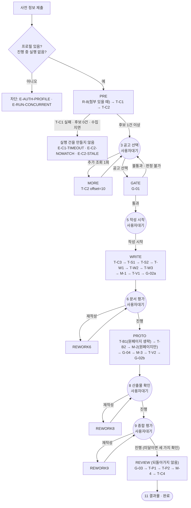
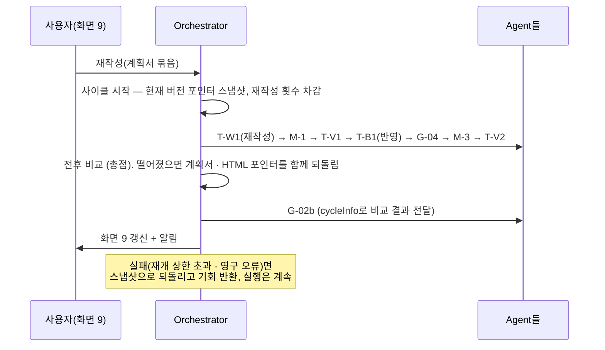

# Orchestrator 구조와 흐름

| 항목 | 내용 |
|---|---|
| 작성일 | 2026-09-26 |
| 기준 문서 | S-Brain Agent 기능정의서 v1.9 (참고: 프로젝트 기획서 v1.10) |
| 코드 | `sbrain/` |
| 테스트 | `tests/` — 44건 통과 (7개 Agent 전부 스텁) |
| 독자 | Orchestrator · 조율 Agent 구현 담당, 웹팀(명령 창구 연동) |

이 문서는 코드에서 도출했다. Task 표는 코드의 Task 등록부에서 뽑았다. Agent 연동 규격은 [Agent_연동_규격_초안.md](Agent_연동_규격_초안.md)에 따로 있다.

---

## 1. 범위

Orchestrator는 조율을 포함한 7개 Agent를 같은 방식으로 등록하고 호출하는 뼈대다. **조율은 Agent이며 Orchestrator가 아니다.**

| Orchestrator가 하는 일 | 하지 않는 일 (Agent 몫) |
|---|---|
| Agent · Task 등록부, 담당 Agent 설정을 입힌 호출 도구(tools) 제공 | 각 Task의 내용 생성 · 검사 · 확정 동작 |
| 워크플로 구동 (순서 · 카테고리 분기 · 조건 분기 · 사용자 대기) | 재작성 판정(점수 환산 · 다음 동작 · 재작성 목록) — G-02a · G-02b |
| Context: 산출물 버전 보관 · 입력 조립 · 되돌리기 | 합치기 4종의 내용(계획서 조립 등) — 조율 Agent |
| 실행 상태(R-9), 호출 실패 처리(R-11 중 재개), 재수행 루프 | 재시도 — tools가 호출 단위로 처리 |
| 재작성 사이클 구동 (다시 돌릴 단계 실행 · 전후 비교 · 되돌리기 · 기회 반환) | |
| 설정값 스냅샷, 알림 발행, 저장, 추적 기록 | |

## 2. 모듈 구성

| 경로 | 내용 |
|---|---|
| `sbrain/models/` | 시트 4 공통 타입. 확장 필드는 `ext()`로 표시 |
| `sbrain/contracts/tasks.py` | 시트 3 Task 입출력 규격 (합치기 · R-8 포함) |
| `sbrain/orchestrator/registry.py` | Agent 등록부 · Task 등록부 (`TaskSpec`: 담당 Agent, 입출력, 실행 함수, 온도 덮어쓰기, 실패 정책, 재수행 · 확정 동작 예외, LLM 사용 여부, 입력 연결) |
| `sbrain/orchestrator/tools.py` | 호출 도구 (잠정 규격): 호출 단위 재시도 · 제한 시간 · 오류 분류 · 스키마 검사 · 호출 로그 |
| `sbrain/orchestrator/settings.py` | 시트 1 설정값 · 층별 배점 · Threshold · Agent 설정. 잠정 항목 목록(`PROVISIONAL`) |
| `sbrain/orchestrator/context.py` | 산출물 버전 · 현재 버전 포인터 · 한 번에 저장할 기록 모음 |
| `sbrain/orchestrator/engine.py` | 대기열 실행, 재수행 루프, 재개 · 실패, 재작성 사이클 장치 |
| `sbrain/orchestrator/store.py` · `memory_store.py` | 저장 인터페이스와 메모리 구현 |
| `sbrain/orchestrator/trace.py` | 추적 기록 타입 |
| `sbrain/orchestrator/errors.py` | 시트 6 오류 코드, 예외 |
| `sbrain/flow/catalog.py` | S-Brain Task 등록부 (시트 2 · 3) |
| `sbrain/flow/sbrain_flow.py` | 구간 · 대기 지점 · 재작성 경로 · 알림, T-P2 병렬 실행기, 전후 비교 단계 |
| `sbrain/flow/rework_map.py` | 시트 7 재작성 매핑 (데이터) |
| `sbrain/flow/service.py` | 명령 창구 (웹 서버가 부름) |
| `sbrain/agents/stubs.py` | 스텁 Agent · 가짜 LLM 호출처 |
| `sbrain/bootstrap.py` | 구성 조립 |

범용 장치(`orchestrator/`)와 S-Brain 고유 규칙(`flow/`)을 나눴다. 복귀 화면 번호 · 알림 대상 · 재작성 경로 같은 서비스 고유 규칙은 `flow/`에만 있다.

## 3. 실행 흐름

- **사전 단계(PRE)는 실행 건이 없다.** T-C1 · T-C2는 재개하지 않으며, 후보가 1건 이상 나와야 실행 건(Run)을 만든다. 이때 사전 단계의 산출물 · 추적 기록을 동시 실행 제한 확인과 함께 한 번에 저장한다.
- **G-02b는 T-V2 직후 계산한다**(시트 2 "T-V2 종료 직후"). 화면 8은 T-V2 점검 결과를 보여주고, 사용자가 진행하면 이미 계산된 G-02b 결과로 화면 9에 들어간다.
- 각 구간이 끝나면 알림을 만든다: WRITE → '문서평가'(6), PROTO → '산출물확인'(8), REVIEW → '표현검수'(10).

## 4. 재작성 경로

사용자가 묶음을 고르면 다시 돌릴 단계를 실행 순서대로 대기열에 넣는다. **합치기는 모든 경로에 들어간다** (테스트로 확인).

| 화면 | 고른 묶음 | 다시 도는 단계 | 비교 기준 |
|---|---|---|---|
| 6 문서 평가 | 계획서 항목 | 고른 T-W1 · T-W2 · T-W3 → M-1 → T-V1 → 전후 비교 → G-02a | 문서층 |
| 8 산출물 확인 | 실행 파일 | T-B1 → G-04 → M-3 → T-V2 → 전후 비교 → G-02b | 산출물층 |
| 8 산출물 확인 | 인포그래픽 | T-B2 → (원페이지면 M-2) → G-04 → M-3 → T-V2 → 전후 비교 → G-02b | 산출물층 |
| 9 종합 평가 | 계획서 항목 포함 | 고른 T-W* → M-1 → T-V1 → T-B1(HTML 반영, 원페이지 제외) → (고른 T-B2 → M-2) → G-04 → M-3 → T-V2 → 전후 비교 → G-02b | 총점 |
| 9 종합 평가 | 프로토타입만 | 화면 8과 같음. 문서층 승계(carriedOverLayer='document') | 산출물층 |

- 재작성 횟수는 고른 묶음만 센다. 화면 9에서 계획서 재작성을 HTML에 반영하는 T-B1은 횟수를 쓰지 않는다.
- 같은 Task에 묶음 여러 개가 걸리면 한 번의 호출로 합친다.
- 다른 화면에서 이미 쓴 묶음은 고를 수 없다(E-G2-LIMIT). 원페이지에서 T-B1을 고르면 거절한다.

## 5. 실행 상태

| 항목 | 구현 |
|---|---|
| 두 축 | `step`(공고선택 … 결과물) × `progress`(실행 · 재개대기 · 사용자대기 · 실패 · 완료 · 중단) |
| 화면 상태 | `progress`에서 계산: 실행 · 재개대기 → 진행 중, 사용자대기 → 확인 필요, 실패 → 문제 발생, 완료 → 완료, 중단 → 중단됨 |
| 복귀 화면 | 단계별 번호(3 · 5 · 6 · 7 · 8 · 9 · 10 · 11). 재작성 중이면 요청한 화면 |
| 동시 실행 | 계정당 1건. 실행 · 재개대기 · 사용자대기만 센다 |
| 설정값 | 실행 시작 때 전체를 `settingsSnapshot`에 고정. Agent별 모델도 포함(잠정) |
| 중단 | 사용자 '중단'은 확인을 받은 뒤 반영. 진행 중이면 Task 사이에서 반영 |
| 알림 | 문서평가(6) · 산출물확인(8) · 표현검수(10) · 실패(실행: 대상 없음 / 재작성: 요청 화면) |
| 공고 마감 | 이어하기 화면 조회 때 선택 공고가 마감이면 E-RUN-CLOSED 안내만 붙인다 |

## 6. 호출 실패 처리

| 단계 | 누가 | 동작 |
|---|---|---|
| 재시도 | tools | 호출 한 건마다 최대 5회 다시 보낸다. 기록은 호출 로그에만 남고 새 버전을 만들지 않는다 |
| 재개 | Orchestrator | 재시도를 다 쓴 일시 오류면 `재개대기`로 두고 실패한 Task(currentTask)부터 다시 한다. 간격 15 → 30 → 60 → 120 → 240분, 최대 5번, 총 12시간. 재개할 때마다 재시도 횟수를 다시 채운다 |
| 실패 | Orchestrator | 재개 상한 초과 · 영구 오류(입력 · 운영)면 실행 실패(E-RUN-FAIL). 영구 오류는 관리자 알림 대상(`adminAlert`). 재작성 중이면 재작성 실패(E-RUN-ROLLBACK) |

- 재개하면 같은 실행 기록을 이어 쓴다(`resumeCount` 증가). 재시도는 시도를 새로 만들지 않는다는 기준 문서 원칙과 같은 방향이다.
- 재개 시각이 되면 `tick(now)`가 깨운다.

## 7. 재수행 루프

1. Task가 `check.passed=false`를 돌려주면, `ReworkInput(mode='재수행', issues=check.failures, previousResultRef, isFinalAttempt)`을 산출물로 저장하고 같은 Task를 다시 부른다.
2. 재수행 횟수(2회)까지 한다. 마지막 시도에는 `isFinalAttempt=true`를 싣는다.
3. 예외 여섯 곳에서 마지막 시도가 불통과인데 `finalAction`이 비어 있으면 규격 위반을 기록한다.
4. 재수행 하나하나는 새 실행 기록 · 새 산출물 버전이다. 피드백 전달(check@n → 다음 실행)로 연결한다.
5. 매 시도가 끝날 때마다 저장하므로, 중간에 멈춰도 몇 번째 재수행이었는지를 잃지 않는다.

## 8. 저장

| 원칙 | 구현 |
|---|---|
| 한 번에 저장 | 단계(또는 재수행 시도) 하나가 끝나면 산출물 버전 · 현재 버전 포인터 · 실행 상태 · 추적 기록을 `CommitBatch` 하나로 저장한다 |
| 실행 점유 | 같은 실행을 두 곳에서 동시에 진행하지 않도록 `acquire` · `release`로 점유한다. 저장은 점유한 쪽만 할 수 있다 |
| 제한 시간 | tools가 호출처의 HTTP timeout으로 건다 |
| 사용자 중단 | 점유 중이면 중단 요청만 남기고, 엔진이 Task 사이에서 확인한다 |
| 구현 | 지금은 메모리 구현(재시작하면 사라짐). MySQL은 같은 인터페이스로 교체한다 |

## 9. 추적 기록

기준 문서의 AttemptRef · ReworkInput · ReworkComparison을 확장했다. 확장 필드는 코드에서 `ext()`로 표시된다.

| 기록 | 담는 것 |
|---|---|
| ExecutionRecord (AttemptRef 확장) | Task, 담당 Agent, 실제 모델 · 호출처 · 온도, 시도 번호, 계기(첫실행 · 재작성 · 재수행), **입력 산출물명@버전**, **출력 산출물명@버전**, 요약 메타(check 통과 · 실패 건수 · 점수), 재작성 사이클 · 역할, 재수행 · 재개 횟수, 들어온 피드백 |
| CallLog | 호출 한 건과 시도별 결과(재시도). T-P2는 문장별(itemKey) |
| FeedbackLink | 재수행(check → 같은 Task), 재작성(reworkOrders + 사용자 선택 → 대상 Task), 재작성반영(계획서 → T-B1). 출처 실행 · 출처 산출물 · 전달 대상 실행 · 전달 수단(reworkInput@버전) |
| ReworkComparison (확장) | 전후 산출물 참조 · 점수 · 남긴 쪽, 사이클 · 화면 · 비교 기준 |
| PointerEvent | 현재 버전 포인터 이동(되돌리기) |
| TraceEvent | 규격 위반, 확정 동작 누락, 불변 산출물 변경 시도, 사이클 시작 · 종료, 재개 예약 등 |

원칙
- 기록에는 산출물 내용을 복사하지 않고 참조와 메타만 남긴다(기획서 6-7). 산출물은 산출물 저장소에만 있다.
- 규칙 단계 · 합치기도 기록한다. 사용자 명령도 `decision` 산출물로 남겨 참조한다.
- 되돌리기는 포인터만 옮기며 이전 버전과 기록을 지우지 않는다.
- T-P2는 호출 로그는 문장별, 입력 · 출력 이력은 Task 단위(`sentenceResults`)로 남긴다.

확인한 질의 (테스트)
- **화면 9 계획서 재작성 후 점수가 떨어져 되돌릴 때 되돌릴 HTML 버전:** 해당 사이클의 ReworkComparison `beforeRefs`에 `prototype@N`이 있고, PointerEvent가 `prototype`을 N으로 옮긴 기록을 남긴다.
- **최종 점수가 채점한 버전:** 현재 `docScore`를 출력한 T-V1 실행의 입력에 `planDoc@k`(합치기①이 만든 버전)가, 현재 `artifactScore`를 출력한 T-V2 실행의 입력에 `prototype@m`(합치기③이 만든 버전)이 있다.

## 10. 명령 창구 (`flow/service.py`)

| 함수 | 화면 | 동작 |
|---|---|---|
| `start_run(account_id, form)` | 2 | 프로필 · 동시 실행 확인 → 사전 단계 → 후보가 있으면 실행 건 생성 |
| `more_candidates(run_id)` | 3 | 추가 조회 1회 (최대 20건) |
| `select_announcement(run_id, id)` | 3 | 선택 공고 저장 → G-01 대기열 |
| `start_writing(run_id)` | 5 | WRITE 대기열 |
| `decide(run_id, screen, action, selected_orders, confirmed)` | 6 · 8 · 9 | '진행' 또는 '재작성'. 화면 9에서 미달 상태로 진행하면 현재 점수 · 남는 미달 항목 · 되돌릴 수 없음을 담은 확인 요청을 먼저 돌려준다 |
| `abort(run_id, confirmed)` | — | 확인 후 중단 |
| `advance(run_id)` | — | 다음 대기 지점까지 진행 |
| `tick(now)` | — | 재개 시각이 된 실행을 깨움 |
| `view(run_id)` | — | 단계 · 진행 상태 · 화면 상태 · 복귀 화면 · 진행률 · 현재 작업 한 줄 · 안내 · 알림 |

명령은 상태를 확인하고 대기열만 채운다. 실제 진행은 `advance`가 한다. 누가 `advance` · `tick`을 부를지(웹 서버 스레드 · 별도 워커 · 작업 큐)는 웹팀 연동 때 정한다.

## 11. 잠정값 · 해석 (확인 필요)

### 11.1 기준 문서가 값을 정하지 않아 둔 잠정값

| 항목 | 잠정값 |
|---|---|
| 재시도 간격 | 2초 |
| 제한 시간 (Task별) | LLM Task 120초, T-W1 · T-B1 · T-B2 300초, T-C2 30초, T-P2 60초 |
| 검수 동시 처리 수 | 4 |
| 검수 실패 비율 기준 · 판단 시점 | 30%, 모든 문장을 본 뒤 판단 |
| Agent별 모델 · 호출처 · 기본 온도 | 모델 '미정'. 조율 openai, 검수 gpu-server, 검증-1 · 검증-2 온도 0, 검수 0.2, 그 밖 0.7. 실행 시작 시점 고정 |
| 형식 오류의 오류 종류 | 일시 (재시도 소진 후 재개 대상) |
| 규칙 단계 · 합치기 오류 | 운영 오류 → 실행 실패, 재작성 중이면 재작성 실패 (G-04만 계속) |
| 재개 횟수를 세는 범위 | 실패한 지점이 성공하면 다시 센다 |
| 전후 비교 동점 | 재작성 결과('후')를 남긴다 |
| T-C2 전체 실패 | 확장 코드 X-C2-FAIL로 다시 시도 안내 |

### 11.2 기준 문서에 명시가 없어 해석한 것

1. **실행 건 생성 시점:** 공고 후보가 1건 이상 나온 뒤에 만든다(T-C1 "아직 실행 건이 없다", E2 · E6은 사전 정보 입력으로 복귀).
2. 공고 선택 대기 · 작성 시작 대기의 progress는 '사용자대기'로 둔다.
3. 재수행 횟수는 Task 호출 단위로 센다(CheckResult에 차트 · 표 단위 결과가 없음).
4. 여러 묶음을 한 번에 재작성하면 전후 비교를 요청 전체로 하고, 묶음마다 같은 비교 결과를 기록한다(묶음 · 평가 항목 매핑 미확정).
5. **전후 비교(높은 쪽 선택과 되돌리기)는 Orchestrator가 하고, G-02는 결과를 받아 scoreReport에 담는다.** 앞서 "전후 비교 판단은 G-02 몫"으로 나눴으나, 기준 문서의 G-02 입력에 재작성 전 점수가 없고 되돌리기는 버전 포인터 조작이라 이렇게 조정했다.
6. 재작성으로 검증을 다시 실행한 경우의 알림 대상 화면은 요청한 화면으로 둔다.
7. 원페이지에서 화면 9 계획서 재작성 시 T-B2(원페이지 SVG)에는 반영하지 않는다(기준 문서는 HTML 반영만 적음).
8. 안내 문서(G-04) 미충족은 재작성 목록에 올리지 않는다(미확정).

### 11.3 뼈대 단계에서 하지 않은 것

- MySQL 저장 구현 (스키마 파일을 프로젝트 안에 넣어 주시면 진행)
- 실행 로그 12개월 뒤 식별자 분리 · 통계 전환(기획서 6-7) — 저장 구현 단계
- 백그라운드 워커 방식 — 웹팀 연동 때
- 실제 Agent 구현 (조율 T-C1 · T-C3 포함)

## 12. 테스트 목록

| 파일 | 확인 내용 |
|---|---|
| `test_flow_basic.py` | 20단계 순서, 원페이지 13건 · 감싸기, 대기 지점 상태, 게이트 불통과 후 재선택, 추가 조회 1회, T-C1 실패 시 실행 건 없음, 후보 0건 · 수집 지연, 임베딩 폴백 안내, 동시 실행 · 프로필 차단, 중단(대기 중 · 진행 중), 미달 진행 확인, 실행 점유 |
| `test_tools.py` | 호출 단위 재시도 · 간격, 소진 예외와 오류 종류, 형식 오류 두 경로, 검색 감싸기 · timeout 전달, 스레드 안전 · 호출별 횟수, 로그에 내용 없음 |
| `test_redo_resume.py` | 재수행 횟수 · 마지막 시도 표시 · 피드백 연결, 확정 동작 누락 기록, 그대로 보냄, 재개 후 성공(같은 기록 이어 쓰기), 재개 간격 두 배 · 상한 실패, 영구 오류 즉시 실패, featureList 불변, G-04 오류 계속 · 합치기 오류 실패 |
| `test_rework.py` | 첫 실행과 화면 6 · 8 · 9 모든 경로의 합치기, 원페이지 경로, 화면 9 점수 하락 시 계획서 · HTML 함께 되돌림과 기록으로 HTML 버전 찾기, 최종 점수가 채점한 버전, 재작성 피드백 연결, 시연 시나리오(74 → 86, 79 → 86), 재작성 실패 되돌림 · 기회 반환, 재작성 중 재개대기 화면, 묶음 기회 소진, 잘못된 선택 거절, 재작성 중 합치기 오류 |
| `test_proofread_trace.py` | T-P2 재수행 · 조기 중단 · 원문 유지 · 채택 반영, redoHint 누적, 호출 실패 원문 유지와 비율 초과 재개, 보호 토큰 0건 생략, 규칙 단계 · 합치기 기록과 내용 비복사, 설정값 고정 |
