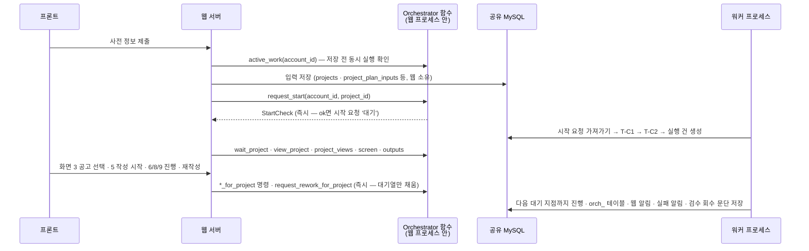

# Orchestrator 웹 연동 함수 명세 (웹팀 전달용)

| 항목 | 내용 |
|---|---|
| 작성일 | 2026-10-01 (2026-10-02 갱신 — 웹 더미 파이프라인 떼어 내기. 2026-10-03 갱신 — 공고 서버 연결. 2026-10-04 갱신 — 작업 분해(T-C3)가 고른 평가 항목. 2026-10-05 갱신 — 시각 UTC · 실행 로그 12개월 처리 · 탈퇴 함수. 2026-10-06 갱신 — 산출물층 결과 확장 필드 · 관리자 이미지 토큰 · 새 사건 종류 · Task별 모델 설정) |
| 상태 | 함수 이름 · 인자 · 결과 필드 · 오류 코드는 **구현 완료**. 화면 조회(5.1절)의 화면별 모양은 **초안** — 웹팀과 맞춰 고친다 |
| 근거 | 웹팀 합의(2026-09-30) 1~10번, 사용자 결정(2026-10-01 ~ 10-06), 웹팀 회신(2026-10-05), `워커_구동_방식_제안.md`(확정), `웹스키마_교체목록_웹팀전달.md`(두 문서 저장소 미포함) |
| 코드 | `sbrain/` — 명령 창구 `flow/service.py`(`SBrainOrchestrator`), 화면 · 결과 · 관리자 조회 `flow/reads.py`, 재작성 묶음 `flow/rework_map.py`, 조립 `bootstrap.py`, 워커 `worker.py`, 웹 테이블 쓰기 `store_sql/web_tables.py`, 시각 `models/clock.py`, 실행 로그 12개월 처리 `flow/retention.py` · 통계 줄 `flow/log_stats.py` |
| 독자 | 웹팀(백엔드) |
| 함께 볼 문서 | `docs/웹연동_변경사항_웹팀전달.md` — 웹 엔드포인트마다 어떤 함수를 부르고 응답을 어떻게 채우는지, 값 대응표, 웹 스키마 · 프론트 변경(2026-10-05 변경과 웹이 할 일은 그 문서 11절). `docs/공고연동_변경사항_웹팀전달.md` — 공고 서버 연결로 바뀐 화면 3 · 4 · 진행 상태(2026-10-03) |

### 2026-10-06 바뀐 점 (요약) — 산출물층 검증 반영 · 이미지 호출 · Task별 모델 설정

**함수 이름 · 인자 · 오류 코드는 그대로다.** 결과에 확장 필드가 늘고, 관리자 조회 값이 늘었다. 웹이 할 일과 요청은 `웹연동_변경사항_웹팀전달.md` 12절.

| 구분 | 내용 | 절 |
|---|---|---|
| 산출물층 점검 결과 | 화면 8 · 9, `outputs`, 화면 9 `score.artifactScore`의 `codeCheck`에 `gateFailures`(통과 필수 조건 중 어긴 것 — `entry` · `secret` · `sandbox`), `codeCheck.checks[]`에 `defectSources`(`prototype` · `infographic`), `featureMatch`에 `withheld` · `withheldReason` · `partialFeatures`(모두 확장) | 5.1 · 5.2 |
| "대조 불가" | `featureMatch.withheld`가 참이면 웹이 "대조 불가"로 표시한다. 보류는 0점으로 합산된다(점수는 이미 0으로 온다) | 5.1 |
| 관리자 실행 기록 · 호출 기록 | `AdminExecution`에 `imageInputTokens` · `imageOutputTokens`, `AdminCall.callType`에 `image`가 생긴다 | 8.1 · 8.2 |
| 운영 요약 | `totalImageTokens`(이미지 입력 + 출력)가 늘었다. `totalTokens`는 지금처럼 글 토큰만 | 8.6 |
| 새 추적 사건 종류 | `대조보류` · `검증2진단` · `안내문서자체검사실패` · `이미지대체` · `대체텍스트출처누락`(모두 잠정 이름). 관리자에게 어떻게 알릴지는 웹팀이 정한다 | 8.8 |
| 모델 설정 | Agent별에서 **Task별**로 바뀌었다. 설정은 지금처럼 Orchestrator 코드에 있고 웹 표 · 화면은 없다. 관리자 실행 기록의 `model`은 그 Task 설정의 글 모델이다 | 8.1 |
| 공유 DB | `orch_executions`에 칸 둘(`image_input_tokens` · `image_output_tokens`, NULL 허용). 웹 로컬 DB는 새 DDL로 다시 만든다 | `웹연동_변경사항_웹팀전달.md` 12.3 |
| 스텁 값 | 스텁 T-B1의 `prototype.entryFilePath`가 `/prototype.html`에서 `/index.html`로 바뀌었다(진입 파일명 `index.html` — 구현 · 검증-2 담당 합의). 스텁 값이라 화면에는 영향이 없다 | 5.2 |
| 웹에서 바뀌는 상태의 로그 | 워커가 운영 로그 파일을 남기기 시작했다. 웹 명령으로 바로 바뀌는 상태(대기 중 중단, 화면 8 → 9 진행 등)는 워커를 거치지 않아 그 로그에 없다 — **웹 쪽 로그로 남겨 달라는 요청** | 12 |

### 2026-10-05 바뀐 점 (요약) — 시각 UTC · 실행 로그 12개월 처리 · 탈퇴

**함수 이름 · 인자 · 결과 필드 이름은 그대로이고, 새 함수 `delete_account_data` 하나가 늘었다.** 다만 **결과의 모든 시각에 시간대(UTC) 표시가 붙는다** — 앞선 안내("기존 함수 결과 모양은 바뀌지 않음")와 다른 점이다. 웹이 할 일은 `웹연동_변경사항_웹팀전달.md` 11절.

| 구분 | 내용 | 절 |
|---|---|---|
| 시각 | 결과의 모든 시각은 시간대 있는 UTC(dataclass는 `tzinfo=UTC`, `.dump()`는 끝에 `Z`). 시간대 없는 입력(`admin_executions`의 `since` · `until`)은 UTC로 본다. "오늘"은 한국 날짜 | 2.6 |
| 새 함수 | `delete_account_data(account_id) -> AccountDeleteResult` — 탈퇴. 그 계정의 Orchestrator 데이터를 식별자 없는 통계 줄로 옮긴 뒤 모두 지운다. 오류는 `BUSY` 하나, 여러 번 불러도 안전 | 7.3 |
| 탈퇴 순서 | 프로젝트마다 `abort_project` → `delete_project_data` → 모두 끝나면 `delete_account_data` → 웹 행 삭제. `BUSY`면 웹 행을 지우지 않는다. 탈퇴 처리 중에는 그 계정으로 `request_start`를 부르지 않는다 | 7.3 |
| 관리자 조회 범위 | `admin_runs` · `admin_summary`는 마지막 활동 최근 12개월 안 실행 건만. 그보다 오래된 것은 통계 표를 DB에서 직접 조회 | 8.4 · 8.6 |
| 시작 요청 | 끝난 지 12개월이 지난 시작 요청(실패 · 취소 등)은 지워진다 — 실행 건 없이 그런 요청만 있던 프로젝트는 `start_status` · `view_project`의 시작 상태가 `None`(시작 전과 같음) | 3.2 · 4 |
| `delete_project_data` | 결과 `cleared_forms`는 아직 남은(끝나지 않은 요청의) 입력 사본만 센다 — 시작 요청의 입력 사본은 요청이 끝나면 바로 비운다 | 7.2 |
| 웹 테이블 쓰기 | `proofread_logs.created_at`을 워커가 저장 시각(UTC)으로 직접 넣는다. 웹 테이블 쓰기는 그대로 INSERT 세 가지 | 4.4 |
| 공유 DB | `orch_` 테이블 10개 → 12개(`orch_log_stats` · `orch_jobs`), 기존 표 인덱스 두 개 추가. 웹은 두 표를 읽지도 쓰지도 않는다 | 2.4 |

### 2026-10-04 바뀐 점 (요약) — 작업 분해(T-C3)

조율 Agent의 작업 분해(T-C3)를 실제로 구현했다. 작업 분해가 신청자 유형으로 양식 · 평가 항목 · 채점 기준표를 고르고, 계획서 작성 · 채점 · 검수가 그 값을 쓴다. **함수 이름 · 인자 · 오류 코드는 그대로이고, 결과 필드는 `outputs`에 하나만 늘었다.**

| 구분 | 내용 | 절 |
|---|---|---|
| `outputs` | 확장 `evaluationItems` — 작업 분해가 고른 평가 항목(`itemCode` · `itemName` · `maxScore` · `description`). 점수 항목 이름(`display_name`)은 `docScore.items[].itemCode`를 여기 `itemCode`와 맞춰 `itemName`으로 만든다 | 5.2 |
| 선택 공고 | `outputs.selectedAnnouncement`의 `formSpec` · `evaluationItems`는 **자리 표시 값**이 되었다. 웹은 이 값을 쓰지 않는다 | 5.2, 14 |
| 계획서 섹션 코드 | 작업 분해가 신청자 유형으로 고른 양식에서 온다(읽는 곳은 지금처럼 `planDoc.sections`). 지금 잠정 양식의 섹션은 웹 태그와 같은 `1-1` · `2-1` · `3-1` · `4-1`이다 | 5.2 |
| 그 밖 | 다른 함수(`screen` 등)의 결과 · 필드는 바뀌지 않는다 | — |

### 2026-10-03 바뀐 점 (요약) — 공고 서버 연결

공고 매칭(T-C2)과 자격 확인(G-01)을 공고팀 공고 서버에 연결했다. 웹이 할 일은 `docs/공고연동_변경사항_웹팀전달.md`에 화면별로 있다.

| 구분 | 내용 | 절 |
|---|---|---|
| 공고 선택 | 명령은 고른 공고 ID만 남긴다. 선택 공고 · 자격 결과 · `announcement_id`는 워커의 G-01이 끝난 뒤 바뀐다. G-01이 실패하면 X-C2-GONE · X-C2-FAIL 안내 후 고르기 전 대기 지점으로 | 6.1 |
| 새 명령 오류 | `ANNOUNCEMENT_BLOCKED` — 자격 불통과로 막힌 공고 | 6.1, 10.2 |
| 화면 3 | 새 필드 `blockedAnnouncementIds`. 카드에 `applyPeriodType` · `contentChanged` · `contentVersion` · `bonusScore` · `bonusItems`, `applyEnd` · `supportAmountMax`는 `null` 가능. 추가 조회는 첫 조회와 겹치는 공고를 빼고 첫 조회 카드를 갱신 | 5.1 |
| 추가 조회 실패 | 어떤 오류든 X-C2-FAIL, 수집 상태 비정상은 E-C2-STALE. 공고선택 대기로 돌아가고 기회를 돌려준다 | 6.1 |
| 화면 4 | `gateResult.unknownConditions`(확인 필요). 있으면 화면 4 `notices`에만 E-G1-UNPARSED. `undecidable`은 늘 거짓 | 5.1 |
| 선택 공고 | 날짜 · 금액 `null` 가능, `applyPeriodType`, `summaryEmbedding`은 빈 목록 | 5.2 |
| 안내 코드 | X-C2-GONE 새로, X-C2-FAIL 쓰임 확대, E-C2-EMBED 마감 임박순 덧붙임, E-RUN-CLOSED 조건 | 10.1 |
| 공고 ID | `announcementId` = 공고 표 `notices.notice_id`(확인 끝남) | 2.5, 12 |

### 2026-10-02 바뀐 점 (요약)

| 구분 | 내용 | 절 |
|---|---|---|
| 웹 `projects` | Orchestrator는 `projects`의 **어떤 컬럼에도 쓰지 않는다**(진행 컬럼 5개 포함). 진행 상태는 함수로 읽는다 | 4.4 |
| 웹 테이블 쓰기 | `notifications` · `generation_failure_alerts` INSERT에 더해 `proofread_logs` INSERT(학습 동의 계정의 반려된 표현 검수 시도) | 4.4 |
| 새 함수 | `active_work` · `project_views` · `wait_project` · `outputs` · `rework_result` · `request_rework_for_project` · `admin_runs` · `admin_score_history` · `admin_summary` · `admin_agent_tasks` | 1 |
| 재작성 | 묶음 이름으로 묶음마다 요청, 같은 화면에서 2초(잠정) 안의 요청은 한 번에 실행. 미달이 아닌 묶음도 받는다 | 6.3 |
| 자격 통과 뒤 다시 고르기 | 계획서작성 · 사용자대기(작성 시작 전)에서도 화면 3 조회 · 공고 추가 조회 · 공고 선택을 받는다 | 5.1, 6.1 |
| `RunView` | `retry_count` · `resume_count` · `next_resume_at` · `last_error_kind` · `rework_screen` · `collecting` · `announcement_id` 추가 | 4.1 |
| 화면 10 | 문장마다 표현 검수 시도별 기록(`attempts`) 추가 | 5.1 |
| 새 오류 코드 | `WEB_NOT_ALLOWED`(웹 조립에서 사전 단계 실행), `RUN_NOT_VIEWABLE`(실패 · 중단 실행 건의 결과 조회) | 10.2 |
| 명령 거절 | 작성 시작 · 진행도 점유 전에 상태를 본다. 워커가 단계를 도는 중 · 재작성을 모으는 중이면 `BUSY`가 아니라 `INVALID_STATE` | 6 |
| 공유 DB | `orch_runs`에 `collect_until` 컬럼 추가(재작성 요청을 모으는 시간). 웹은 쓰지 않는다 | 2.4 |

---

## 1. 한눈에 보기

웹 서버와 워커는 **별도 프로세스**이고 같은 공유 MySQL을 본다. 웹은 입력을 저장하고, 아래 함수를 부르고, 읽기만 한다. 상태를 바꾸고 단계를 진행하는 일은 전부 Orchestrator(워커)가 한다. 진행 상태의 원본은 Orchestrator이고, 웹 `projects`에는 진행 값을 쓰지 않는다.



| 함수 (`orch = app.orchestrator`) | 웹에서 부르는 때 (예) | 돌려주는 것 | 절 |
|---|---|---|---|
| `active_work(account_id)` | `POST /projects` 입력 **저장 전** 동시 실행 확인 | `ActiveWork` 또는 `None` | 3.3 |
| `request_start(account_id, project_id)` | `POST /projects` 저장 직후, 다시 시도할 수 있는 시작 실패 뒤 | `StartCheck` | 3.1 |
| `start_status(project_id)` | 사전 단계 진행 화면 | `StartStatus` 또는 `None` | 3.2 |
| `view_project(project_id)` | 프로젝트 진행 상태 · 이어하기 · 진행 화면 (폴링) | `ProjectView` | 4 |
| `project_views(project_ids)` | 프로젝트 목록 · 알림 종 (여러 건 한 번에) | `list[ProjectView]` | 4.2 |
| `wait_project(project_id, timeout_sec=60.0)` | 공고 후보 · 공고 다시 찾기 · 자격 확인처럼 한 번 요청하고 응답을 기다리는 곳 | `ProjectView` | 4.3 |
| `screen(project_id, n)` | 화면 3 · 4 · 6 · 8 · 9 · 10 · 11 | 화면별 모델 (초안) | 5.1 |
| `outputs(project_id)` | 이어하기 · 계획서 미리보기 · 내려받기 · 결과 화면 | `Outputs` | 5.2 |
| `rework_result(project_id)` | 재작성이 끝난 뒤 변경 내역 · 전후 비교 · 실패 안내 | `ReworkResult` 또는 `None` | 5.3 |
| `more_candidates_for_project(project_id)` | 화면 3 공고 추가 조회 | 없음 | 6.1 |
| `select_announcement_for_project(project_id, announcement_id)` | 화면 3 공고 선택 | 없음 | 6.1 |
| `start_writing_for_project(project_id)` | 화면 5 작성 시작 | 없음 | 6.1 |
| `decide_for_project(project_id, screen, "진행", confirmed=False)` | 화면 6 · 8 · 9 진행 | `ConfirmationNeeded` 또는 `None` | 6.2 |
| `request_rework_for_project(project_id, bundle)` | 화면 6 · 8 · 9 재작성 (묶음마다 한 번) | `ReworkAccepted` | 6.3 |
| `abort_project(project_id)` | `DELETE /projects/{id}`(보관), 중단하고 새로 시작 | `AbortResult` | 7.1 |
| `delete_project_data(project_id)` | `DELETE /projects/{id}/permanent`, 계정 삭제 | `DeleteResult` | 7.2 |
| `delete_account_data(account_id)` | `DELETE /auth/me` — 프로젝트마다 위 둘을 마친 뒤, 웹 행을 지우기 전 (2026-10-05 새로) | `AccountDeleteResult` | 7.3 |
| `admin_executions(**조건)` | 관리자 "에이전트 테스크" 탭 | `list[AdminExecution]` | 8.1 |
| `admin_calls(execution_id)` | 관리자 실행 상세 | `list[AdminCall]` | 8.2 |
| `admin_runs(...)` | 관리자 "진행 현황" 탭 | `list[AdminRun]` | 8.4 |
| `admin_score_history(project_id)` | 관리자 "이력보기" | `AdminScoreHistory` | 8.5 |
| `admin_summary()` | 관리자 "운영 현황" · "운영 지표 요약" | `AdminSummary` | 8.6 |
| `admin_agent_tasks()` | 관리자 "Task별 보기" | `list[AdminAgentTask]` | 8.7 |

- 웹은 **project_id로** 부른다. 함수가 안에서 실행 건을 찾는다(프로젝트 1건에 실행 건은 최대 1건).
- 웹은 모든 함수를 부르기 전에 **주인 확인**을 한다(관리자 함수는 관리자 확인). Orchestrator는 `request_start`만 주인을 다시 확인한다.
- 모든 함수는 금방 끝난다(`wait_project`는 정한 시간까지 기다린다). 오래 걸리는 일(사전 단계, 계획서 작성 · 프로토타입 제작 · 재작성 · 검수 구간, 재개)은 워커만 한다.
- 받을 수 없는 요청이면 `CommandError`(`.code` · `.detail`)를 올린다(10.2절).
- 결과는 기준 문서 모양이다. 웹 응답 모양으로 바꾸는 일은 웹이 한다(대응표는 `웹연동_변경사항_웹팀전달.md` 3절).
- 사용자용 결과(`view_project` · `project_views` · `wait_project` · `outputs` · `rework_result` · 화면 조회)에는 관리자용 실패 사유를 싣지 않는다. 실패는 진행 상태와 안내(E-RUN-FAIL 문구)로만 알린다.

## 2. 웹 프로세스 준비

### 2.1 설치

```bash
pip install -e <저장소>/agent-orchestration      # 개발 중 — 코드 변경이 바로 반영된다
pip install <저장소>/agent-orchestration         # 배포
```

- Python 3.12 이상. 의존성(`pydantic` · `SQLAlchemy` · `PyMySQL` · `openai` · `python-dotenv`)은 `pyproject.toml`에 고정돼 있다.

### 2.2 조립 — `build_web`

```python
from dataclasses import asdict
from sbrain.bootstrap import build_web
from sbrain.orchestrator.errors import CommandError

sbrain = build_web(DB_URL, profile_count=lambda account_id: 1 if has_profile(int(account_id)) else 0)
orch = sbrain.orchestrator          # 서버 시작 때 한 번 만들어 모든 요청 처리에서 함께 쓴다
```

| 인자 | 내용 |
|---|---|
| `db_url` | 웹과 같은 공유 MySQL 접속 URL(`mysql+pymysql://…?charset=utf8mb4`). 비우면 환경 변수 · `.env`의 `SBRAIN_DB_URL` |
| `profile_count` | **필수.** 계정의 필수 항목을 채운 프로필 수(0이면 E-AUTH-PROFILE). 웹의 `compute_has_profile`을 감싸 넘긴다(참 = 1) |

- `build_web`은 LLM 호출처가 없고 단계를 돌지 않는다. 여러 스레드에서 함께 써도 된다(상태는 DB에만 있다).
- **사전 단계 차단:** 웹 조립에서 `run_start_request`(와 동기 경로 `start_run` · `start_run_for_project`)를 부르면 시작 요청을 점유하거나 바꾸지 않고 바로 `CommandError("WEB_NOT_ALLOWED")`를 올린다. 사전 단계는 워커가 돈다.
- 웹 조립은 공고 서버를 부르지 않는다. 공고 후보 · 공고 상세 · 자격 판정은 워커가 공고 서버에서 받는다(2.3). 공고 선택 명령은 고른 공고 ID만 남긴다(6.1). (2026-10-03 바뀜)

### 2.3 워커 (참고 — 웹 프로세스와 따로 띄운다)

```bash
python -m sbrain.worker          # 또는 sbrain-worker. Ctrl+C · SIGTERM으로 멈춤 (하던 단계는 끝낸다)
```

환경 변수(또는 `agent-orchestration/.env`): `SBRAIN_DB_URL`(필수), `OPENAI_API_KEY`(필수), `SBRAIN_WORKER_POLL_SEC` · `SBRAIN_WORKER_THREADS` · `SBRAIN_WORKER_LEASE_SEC`(선택, 잠정 기본값 1초 · 4 · 120초), `SBRAIN_NOTICE_API_URL`(선택 — 공고 서버 주소. 있으면 공고 매칭 · 자격 확인이 공고 서버에 연결되고, 없으면 Orchestrator 안의 스텁 공고 · 스텁 판정을 쓴다. 공고팀 API가 준비된 뒤 Orchestrator 담당이 설정한다. 어느 쪽이든 웹이 보는 동작은 같다). 여러 대를 띄워도 같은 일을 두 번 하지 않는다(`SKIP LOCKED` + 점유). 재작성 요청을 모으는 중인 실행 건(`orch_runs.collect_until`이 지금보다 뒤)은 그 시각이 지날 때까지 가져가지 않는다.

2026-10-05부터 워커는 실행 로그 12개월 처리도 한다 — 여러 워커 중 한 대만 하루 한 번(잠정) 돌며, 마지막 활동이 12개월보다 오래된 실행 건 · 끝난 시작 요청의 기록을 식별자 없는 통계 줄로 옮기고 지운다(웹 테이블은 건드리지 않는다). 웹 조립(`build_web`)은 이 일을 하지 않는다. 워커 로그 줄 앞의 시각은 UTC다(끝에 `Z`, 예: `2026-09-26 09:00:05Z`).

### 2.4 공유 DB 준비

1. 웹 스키마(`app_schema.sql`)가 있어야 한다.
2. `sql/orchestrator_schema.sql`을 적용한다 — `orch_` 테이블 12개(2026-10-05 바뀜 — 10개에 통계 표 `orch_log_stats` · 작업 상태 표 `orch_jobs`가 늘었다), `CREATE TABLE IF NOT EXISTS`만 있다. `orch_runs.project_id`가 `projects(project_id)`를 참조한다(`ON DELETE SET NULL`). **공유 DB 적용은 사용자(Orchestrator 담당)가 한다.**
3. 2026-10-02: `orch_runs`에 `collect_until DATETIME(6) NULL` 컬럼이 늘었다(재작성 요청을 모으는 시간이 끝나는 시각). 이미 테이블을 만든 DB에는 Orchestrator 담당이 컬럼을 더한다. 웹은 `orch_` 테이블을 쓰지 않으므로 할 일이 없다.
4. 검수 회수 문단(`proofread_logs`)을 쓰려면 웹 스키마 변경이 필요하다(4.4절, `웹연동_변경사항_웹팀전달.md` 4절). 바뀌기 전에는 쓰기만 건너뛴다.
5. 2026-10-05: 새 표 두 개와 기존 표 인덱스 두 개(`ix_orch_runs_updated` ON `orch_runs (updated_at)`, `ix_orch_start_requests_status_updated` ON `orch_start_requests (status, updated_at)`)가 늘었다. `CREATE TABLE IF NOT EXISTS`는 이미 있는 표에 인덱스를 더하지 않으므로, 표를 다시 만들지 않는 DB에는 `CREATE INDEX` 문을 따로 넣는다(문장은 `웹연동_변경사항_웹팀전달.md` 11.5). **웹은 두 새 표를 읽지도 쓰지도 않는다** — 통계가 필요하면 `orch_log_stats`를 DB에서 직접 조회한다(계정 · 프로젝트 · 실행 건 ID 없음). 웹 로컬 DB의 `orch_` 데이터는 시간대가 섞여 있으니 지우고 새 DDL로 다시 만든다.
6. 공유 DB 서버 시간대(2026-10-05 확인): `@@global.time_zone`=SYSTEM, `@@session.time_zone`=SYSTEM, `@@system_time_zone`=UTC — DB 기본값으로 채워지는 시각도 UTC다. 바꾸지 않는다.

### 2.5 식별자

| 이름 | 값 |
|---|---|
| `account_id` | 웹 `users.user_id`를 문자열로 (`str(user_id)`) |
| `project_id` | 웹 `projects.project_id` (정수 또는 숫자 문자열) |
| `run_id` · `request_id` · `execution_id` · `cycle_id` | Orchestrator가 만드는 12자 문자열. 웹이 보관할 필요는 없다(관리자 상세 조회의 `execution_id`만 쓴다) |
| `announcement_id` | 공고 ID (T-C2 후보 카드의 `announcementId`). 공고 표 `notices.notice_id`와 같은 값이다 — 공고팀 추천이 그 표를 읽는다(2026-10-03 확인 끝남) |

### 2.6 시각 (2026-10-05 새로)

**모든 시각은 UTC이고 시간대가 붙는다. 화면 표시는 한국 시간으로 바꾼다. 웹 코드가 우리 값과 자기 값(`utcnow`, 시간대 없음)을 비교 · 저장할 때는 시간대를 맞춘다.**

| 구분 | 규칙 |
|---|---|
| 돌려주는 시각 | 모든 함수 결과의 시각은 시간대 있는 UTC다. dataclass(`RunView` · `ReworkAccepted` · `StartStatus` 등)의 `datetime`은 `tzinfo=UTC`(`isoformat()`이면 `+00:00`), pydantic `.dump()`의 시각 문자열은 끝에 `Z`. 필드 이름 · 자리는 그대로다. 대상 예: `next_resume_at` · 알림 `created_at` · `read_at` · 안내 `at` · `collect_until` · 재작성 결과 `startedAt` · `endedAt` · 관리자 조회 `updatedAt` · `startedAt` · `endedAt` · `scoredAt` |
| 받는 시각 | 시간대 없는 값(`admin_executions`의 `since` · `until`)은 UTC로 본다 |
| DB 칸 | `orch_` 표와 워커가 INSERT하는 웹 표 셋의 `DATETIME` 칸에는 시간대 없는 UTC를 넣는다 — 웹 `utcnow()`와 같은 기준. 웹 표에서 읽은 시각(예: 알림 `read_at`)에는 UTC를 붙여 돌려준다 |
| "오늘" | 자격 확인 기준일 · 마감 안내(E-RUN-CLOSED)의 "오늘"은 한국 날짜(UTC+9) |

- 시간대 있는 값과 시간대 없는 값(`datetime.datetime.utcnow()`)은 파이썬에서 빼거나 비교할 수 없다(`TypeError`). 웹이 우리 결과와 자기 값을 함께 계산하는 곳은 한쪽으로 맞춘다. 웹 코드에서 확인할 곳은 `웹연동_변경사항_웹팀전달.md` 11.1.

## 3. 시작 — 사전 정보 제출 → 공고 후보

### 3.1 `request_start(account_id, project_id) -> StartCheck`

입력을 저장한 직후 부른다. 웹이 저장한 사전 정보를 DB에서 읽어 아래 순서로 확인하고, 통과하면 시작 요청을 '대기'로 넣는다. 사전 단계(R-8 → T-C1 → T-C2)는 워커가 돈다.

| 순서 | 확인 | 걸리면 |
|---|---|---|
| ① | 프로젝트가 있고(보관 처리 안 됨) `account_id`가 주인인가 | `CommandError("PROJECT_NOT_FOUND")` |
| — | 이미 실행 건이 있는 프로젝트인가(끝난 것 포함) | `CommandError("PROJECT_ALREADY_STARTED")` — 새로 시작은 새 프로젝트로 |
| ② | 필수 항목 | `StartCheck(ok=False, code="E-C1-REQUIRED", missing=[누락 항목 이름])` — T-C1을 실행하지 않는다 |
| ③ | 프로필 (`profile_count`) | `code="E-AUTH-PROFILE"` |
| ④ | 계정 잠금 안에서 진행 중 실행 건 **또는** 대기 · 처리중 시작 요청이 있는가 | `code="E-RUN-CONCURRENT"`, `active=ActiveWork(…)` |

- ② ~ ④에서 걸리면 시작 요청을 넣지 않는다. 같은 프로젝트로 다시 부를 수 있다.
- **다시 시도:** 마지막 시작 요청이 다시 시도할 수 있는 실패(`E-C1-TIMEOUT` · `X-C2-FAIL` · `E-C2-STALE`)로 끝났으면 웹이 같은 프로젝트로 `request_start`를 다시 부른다. `E-C2-NOMATCH`(신청 가능한 공고 없음)는 다시 넣지 않는다(입력 확인 안내).

`StartCheck` (dataclass)

| 필드 | 내용 |
|---|---|
| `ok` | 요청을 넣었으면 참 |
| `request_id` | 넣은 시작 요청 ID |
| `code` · `message` | 실패 코드와 안내 문구(시트 6, 10.1절) |
| `missing` | E-C1-REQUIRED — 누락 항목 이름 목록 (예: `["수익모델 단가", "성별"]`) |
| `active` | E-RUN-CONCURRENT — 진행 중인 작업 `ActiveWork`. **웹의 기존 409 응답 `blocked` 정보(`active_project_id` · `active_stage` · `active_screen` · `active_display_status`)를 대신한다** |

`ActiveWork` (dataclass)

| 필드 | 내용 |
|---|---|
| `project_id` | 진행 중인 프로젝트 |
| `run_id` · `step` · `resume_step` · `screen_status` | 실행 건이 있을 때: 단계명 · 이어하기 복귀 화면 번호 · 화면 상태(진행 중 · 확인 필요) |
| `request_id` | 사전 단계 요청이 아직 처리 중일 때(실행 건 없음). 이때 `screen_status`는 '진행 중' |

"중단하고 새로 시작"을 고르면 웹은 `abort_project(active.project_id)`(7.1)를 부르고 새 프로젝트로 다시 시작한다.

### 3.2 `start_status(project_id) -> StartStatus | None`

그 프로젝트의 **마지막** 시작 요청 상태. 요청이 없으면 `None`.

- 2026-10-05부터 끝난 지(마지막 갱신) 12개월이 지난 시작 요청(완료 · 실패 · 취소)은 워커가 통계 줄로 옮기고 지운다. 그래서 실행 건 없이 실패 · 취소 요청만 있던 프로젝트는 12개월 뒤 `None`(시작 전과 같음)으로 보인다.

| `status` | 뜻 | 웹 화면 |
|---|---|---|
| 대기 · 처리중 | 워커가 가져가기 전 · 사전 단계 진행 중 | 진행 중 |
| 완료 | 실행 건을 만들었다(`run_id`) | 화면 3 공고 후보 (`screen(project_id, 3)`) |
| 실패 | `code`: E-C1-TIMEOUT · X-C2-FAIL(다시 시도 안내), E-C2-STALE(공고 갱신 중), E-C2-NOMATCH(후보 없음 → 입력 확인), E-RUN-CONCURRENT(`active` 포함) | `message`를 보여 준다. E-C1-TIMEOUT · X-C2-FAIL · E-C2-STALE이면 웹이 `request_start`를 다시 부른다(3.1) |
| 취소 | 중단(7.1)으로 취소됨 | — |

`StartStatus` (dataclass): `request_id` · `status` · `code` · `message` · `notices`(안내 목록, 예: E-C2-EMBED 추천 정확도 안내) · `run_id` · `active`.

### 3.3 `active_work(account_id) -> ActiveWork | None` (2026-10-02 새로)

웹이 사전 정보를 **저장하기 전에** 동시 실행을 확인한다(기존 409 응답 유지용). 진행 중인 작업이 없으면 `None`.

- 세는 기준은 `request_start` ④와 같다 — 진행 중 · 확인 필요 실행 건(실행 · 재개대기 · 사용자대기)을 먼저, 그다음 대기 · 처리중 시작 요청.
- 계정 잠금 없이 읽는다. 최종 확인은 `request_start`가 계정 잠금 안에서 다시 한다(그 사이에 생긴 작업은 `E-RUN-CONCURRENT`).

## 4. 진행 상태 — `view_project(project_id) -> ProjectView`

| 필드 | 내용 |
|---|---|
| `project_id` | |
| `run` | 실행 건이 있으면 `RunView` |
| `start` | 실행 건이 없으면 마지막 시작 요청 `StartStatus` (요청도 없으면 `run` · `start` 모두 `None`). 끝난 지 12개월이 지난 시작 요청은 지워지므로, 실행 건 없이 그런 요청만 있던 프로젝트도 `None`이다(2026-10-05, 3.2) |

### 4.1 `RunView` (dataclass, 사용자용 — 실패 사유 없음)

| 필드 | 내용 |
|---|---|
| `run_id` | |
| `step` | 단계명 (공고선택 · 자격확인 · 계획서작성 · 문서평가 · 프로토타입제작 · 산출물확인 · 종합평가 · 표현검수 · 결과물) |
| `progress` | 실행 · 재개대기 · 사용자대기 · 실패 · 완료 · 중단 |
| `screen_status` | 진행 중 · 확인 필요 · 문제 발생 · 완료 · 중단됨 |
| `resume_step` | 이어하기 복귀 화면 번호 (재작성 중이면 요청한 화면) |
| `percent` | 진행률(%) — 진행 중(실행 · 재개대기)이면 지금 구간에서 끝난 단계 비율, 완료 100, 그 밖 0 |
| `current_label` | 지금 하는 단계 한 줄 (예: "요구사항 분석") |
| `notices` | 안내 목록 `Notice(code, message, at)` — 실행 건의 안내를 계속 쌓는다. 진행 중 · 대기 중이고 선택 공고의 `applyEnd`가 오늘(한국 날짜, 2026-10-05)보다 앞이거나(`null`이면 보지 않음) `status`가 '마감'이면 E-RUN-CLOSED가 붙는다(2026-10-03 바뀜 — 모집 상태 모름은 마감이 아니다) |
| `notifications` | 작업 알림 목록 `Notification` — 웹 `notifications` 테이블의 행. `notificationId`는 그 행의 ID |
| `retry_count` · `resume_count` | 재시도 · 재개 횟수 (실행 건 값 그대로) — **새로** |
| `next_resume_at` | 다음 재개 예정 시각 (재개대기일 때) — **새로**. 시간대 있는 UTC(2.6) |
| `last_error_kind` | 마지막 오류 종류 (일시 · 입력 · 운영) — **새로** |
| `rework_screen` | 재작성 중인 화면 (6 · 8 · 9, 재작성 중이 아니면 `None`) — **새로** |
| `collecting` | 재작성 요청을 모으는 중이면 참 (6.3) — **새로** |
| `announcement_id` | 선택 공고 ID (고르기 전이면 `None`) — **새로**. 자격 확인(G-01)이 끝났을 때 그 공고 ID로 바뀐다(불통과여도). 공고 선택 명령 직후에는 아직 이전 값이고, G-01이 실패하면 고르기 전 값 그대로다(2026-10-03) |

- 재작성을 요청한 화면을 다시 열었을 때: `rework_screen`이 그 화면이고 `progress`가 실행 · 재개대기면 '진행 중'으로 보인다(모으는 중도 실행).
- 실행 건이 실패로 끝나면 `progress="실패"`, `screen_status="문제 발생"`, `notices`에 E-RUN-FAIL(새 작업으로 시작 안내). 관리자용 실패 사유는 관리자 조회(8.4)에만 있다.

### 4.2 `project_views(project_ids) -> list[ProjectView]` (2026-10-02 새로)

여러 프로젝트의 `view_project`를 한 번 호출로 준다(프로젝트 목록 · 알림 종). 넘긴 순서대로 돌려주고, 실행 건 · 마지막 시작 요청은 한 번씩 모아 읽는다. 내용은 `view_project`와 같다.

### 4.3 `wait_project(project_id, timeout_sec=60.0) -> ProjectView` (2026-10-02 새로)

공고 후보 · 공고 다시 찾기 · 자격 확인처럼 화면이 한 번 요청하고 응답을 기다리는 곳에서 쓴다.

- 마지막 시작 요청이 대기 · 처리중이 아니고, 실행 건이 '실행'(재작성 요청을 모으는 중 포함)이 아닐 때까지 기다린 뒤 `view_project` 결과를 준다.
- 재개대기 · 사용자대기 · 끝난 상태면 기다리지 않고 바로 준다.
- 제한 시간(잠정 기본 60초)을 넘기면 그때의 `ProjectView`를 그대로 준다(**오류 아님**). DB는 잠정 0.5초마다 다시 읽는다.
- 계획서 작성 · 프로토타입 제작 · 재작성 · 검수처럼 오래 걸리는 구간은 이 함수로 붙잡고 기다리지 않는다. 재개대기(15분~)가 웹 요청 제한 시간을 넘기 때문이다. 프론트가 진행 상태를 주기적으로 확인한다.

### 4.4 웹 테이블 — Orchestrator가 쓰는 것과 쓰지 않는 것 (2026-10-02 바뀜)

**Orchestrator는 웹 `projects`의 어떤 컬럼에도 쓰지 않는다.** 2026-10-01판의 "목록 화면은 `projects` 요약 컬럼(`status` · `stage` · `progress_percent` · `notice_id` · `failure_reason`)을 읽어도 된다"는 없어졌다. 목록은 `project_views`, 상세는 `view_project`로 읽는다. 이 컬럼들과 옛 진행 컬럼은 웹 정리 대상이다(`웹연동_변경사항_웹팀전달.md` 4절).

웹 테이블 쓰기는 정확히 아래 세 가지 INSERT뿐이고, 모두 단계 저장과 **같은 트랜잭션**이다. 실행 건에 `project_id`가 있을 때만 쓴다.

| 웹 테이블 | 언제 | 웹이 하는 일 |
|---|---|---|
| `notifications` | 알림을 만들 때 INSERT — 문서평가(6) · 산출물확인(8) · 표현검수(10) · 실패(실행 실패는 `target_step` 없음, 재작성 실패는 요청한 화면). 재작성이 끝나도 요청한 화면으로 문서평가 · 산출물확인 알림 | 목록 조회, 사용자가 읽으면 `read_at`만 갱신 |
| `generation_failure_alerts` | 실행이 실패로 바뀔 때 한 행(`stage`: 기준 문서 단계, `last_error_kind`: 일시 = 재개 상한 초과, 입력 · 운영 = 영구 오류, `failure_reason`: 관리자용 실패 사유). 재작성 실패(되돌림)는 실행 실패가 아니라 쌓지 않는다 | 관리자 확인 때 `acknowledged_at`만 갱신 |
| `proofread_logs` | 표현 검수(T-P2) 단계 저장 때, 프로젝트 주인이 학습 데이터 편입에 동의(`users.ai_training_agreed`)했으면 **반려된 시도**마다 한 행 | '검수 회수 문단' 탭 조회 · 라벨링 |

읽기만 하는 웹 테이블: 사전 정보 입력 5개(`companies` · `projects` 입력 컬럼 · `team_members` · `pricing_items` · `project_plan_inputs` · `project_attachments`), `verification_policies`(실행 시작 때 읽어 고정), 학습 동의 확인용 `projects.company_id → companies.user_id → users.ai_training_agreed`, `notifications`(진행 상태의 알림 목록). `notices`는 읽지 않는다.

**`proofread_logs` 쓰기 (검수 회수 문단)**

| 항목 | 내용 |
|---|---|
| 대상 | **반려된 시도** = 보호 토큰 검사를 통과하지 못한 T-P2 시도. 채택하지 않았어도 토큰 검사를 통과한 시도는 반려가 아니다 |
| 시도 | T-P2 함수가 결과를 돌려준 호출 하나. 호출 실패(재시도를 다 써서 원문 유지)는 시도가 아니다. 재개되어 같은 문장을 다시 처리해도 시도 번호를 이어서 센다 |
| 조건 | 저장하는 순간 그 프로젝트 주인의 `users.ai_training_agreed`가 참일 때만. 미동의 계정은 쓰지 않는다(시도별 기록은 산출물에는 남는다) |
| 채우는 컬럼 | `project_id` · `original_text`(원문 문장) · `corrected_text`(반려된 시도 문장) · `reason`(위반 요약, 예: "보호 토큰 검사 불통과 (빠짐 1건)") · `attempt_no` · `passed`(FALSE) · `violation_type` · `violation_note`(위반 토큰 목록 전체, 예: "빠짐: 1억원 / 섞임: A, B") · `recovery_status`('pending') · `model_version`(그 시도를 만든 T-P2 실행의 모델) · `created_at`(단계 저장 시각, 시간대 없는 UTC — 2026-10-05부터 DB 기본값 대신 직접 넣는다). 나머지 컬럼은 웹 기본값. `reason` · `violation_note` 표기는 잠정 |
| 남기는 행 (2026-10-05) | 학습에 반영된 행(`recovery_status='trained'`, 웹이 학습 데이터로 내보낼 때 표시)만 완전 삭제 · 탈퇴 뒤에도 남고 `project_id`가 끊긴다(웹 스키마 `project_id` NULL 허용 + `ON DELETE SET NULL`). `pending` · `labeled` · `excluded` 행은 웹이 프로젝트 행을 지우기 전에 지운다. 워커는 `pending`으로만 쓴다 — `웹연동_변경사항_웹팀전달.md` 11.7 |
| `violation_type` | 웹 표기 `날짜` · `수치·금액` · `고유명사` · `기능명` 중 하나. 위반 토큰을 보호 토큰 목록과 값으로 맞춰 정하고, 여러 종류면 빠진 → 바뀐 → 섞인 순서로 처음 맞는 것. 못 맞추면 비운다 |
| 중복 | 같은 시도를 두 번 쓰지 않는다. T-P2가 재개되면 다시 처리한 문장의 새 시도만 쓴다 |
| 웹 스키마가 아직 안 바뀌었을 때 | 위 컬럼이 없거나, 우리가 채우지 않는 NOT NULL · 기본값 없는 컬럼(예: 지금의 `plan_id`)이 남아 있으면 **쓰기만 건너뛴다**. 실행 건마다 한 번 추적 사건 '검수회수기록생략'(이유만)을 남기고 T-P2 단계 저장과 검수는 정상으로 끝낸다. 맞지 않는 구조는 기억하지 않아 웹 스키마가 바뀌면 다음 저장부터 쓴다. 지난 시도를 나중에 채우지는 않는다 |
| 쓰기 오류 | INSERT의 DB 오류는 단계 저장 전체를 되돌린다(오류 메시지에는 문장 내용 없이 오류 종류 · 코드만) |
| 내용 규칙 | 이 행에는 문장 내용이 들어간다. '산출물 내용을 기록 · 관리자 조회에 남기지 않는다'는 규칙의 **유일한 예외**다(기획서 4-7 · 6-6). 다른 기록 · 로그 · 관리자 조회(8절)에는 내용을 싣지 않는다 |

## 5. 조회 — 화면 · 지금까지 결과 · 재작성 결과

### 5.1 화면 조회 — `screen(project_id, n)` (모양은 초안)

대기 지점에서만 연다. 아니면 `CommandError("SCREEN_NOT_READY")`. 결과는 pydantic 모델이고 `.dump()`가 기준 문서 이름(camelCase) JSON을 준다. 모든 화면에 공통 필드 `screen` · `projectId` · `runId` · `step` · `progress` · `notices`가 있다.

| 화면 | 여는 때 | 내용 (필드) |
|---|---|---|
| 3 공고 후보 | 공고선택 · 사용자대기, **계획서작성 · 사용자대기(자격 통과 뒤 작성 시작 전, 2026-10-02 확장)** | `candidates`(첫 조회 — 추가 조회에 다시 나온 카드는 새 내용) · `moreCandidates`(추가 조회 — 첫 조회와 겹친 공고 없음) · `moreAvailable`(추가 조회 가능 — 1회, 합계 최대 20건) · `collectionStatus` · `filteredCount` · `fallbackUsed` · `fallbackMode` · **`blockedAnnouncementIds`**(막힌 공고 ID, 2026-10-03 확장) |
| 4 자격 확인 | 공고선택 · 계획서작성 사용자대기, 자격 확인 결과가 있을 때 | `announcementId` · `gateResult`(통과 · 불통과 조건 `failedConditions` · 누락 입력 `missingInputs` · **확인 필요 조건 `unknownConditions`**(2026-10-03 확장) · `undecidable`(늘 거짓)) · `businessAgeYears` · `canStartWriting`(통과해 화면 5로 갈 수 있음). 확인 필요 조건이 있으면 `notices`에 E-G1-UNPARSED |
| 6 문서 평가 | 문서평가 · 사용자대기 | `planDoc`(계획서) · `score`(환산 점수 등) · `failedTaskIds` · `reworkOptions`(재작성 목록) · `nextAction`(진행가능 · 재작성권유 · 상한도달) |
| 8 산출물 확인 | 산출물확인 · 사용자대기 | `prototype` · `infographic` · `codeCheck` · `featureMatch` · `reworkOptions`(산출물층만) |
| 9 종합 평가 | 종합평가 · 사용자대기 | `score`(종합 점수 · 층별 내역 `docScore` · `artifactScore` · 전후 비교 `comparisons`) · `reworkOptions` · `nextAction` · `reworkDiff`(변경 내역) |
| 10 검수 전후 | 결과물 · 완료 | `formatFindings`(형식 지적) · `sentences`(문장별 `sentenceId` · `before` · `after` · `adopted` · `keptReason` · **`attempts`**) · `proofreadLog` |
| 11 결과물 | 결과물 · 완료 | `deliverable` · `userMessage` · `planDoc` · `prototype` · `infographic` |

- 화면 3은 작성을 시작한 뒤(계획서작성 · 실행 이후)에는 `CommandError("INVALID_STATE")`다(공고 다시 고르기 · 추가 조회와 같은 거절). 그 밖에 맞지 않는 상태는 `SCREEN_NOT_READY`.
- **화면 3 카드(`AnnouncementCard`, 2026-10-03 바뀜)** — `announcementId` · `title` · `agency` · `applyEnd`(`null` 가능 — 마감일 없는 공고) · `supportAmountMax`(`null` 가능 — 추천 결과에는 금액이 없어 지금은 늘 `null`) · `fitScore` · `rank` · `displayType` · `matchReason` · `sourceNotice` · `originalUrl`, 확장 `applyPeriodType`(모집 형태 표기) · `contentChanged`(내용 바뀜) · `contentVersion`(웹은 쓰지 않음) · `bonusScore`(가산점 합계, `null` = 계산 못 함, `0` = 해당 없음) · `bonusItems`(`name` · `points`) — **2026-10-07부터 늘 `null` · `[]`**(공고팀 가산점 시험 단계, 화면에 쓰지 않음 — 키는 그대로). `originalUrl`은 `""`일 수 있다. 순서는 `rank` 그대로이며 웹이 다시 정렬하지 않는다. 자세한 뜻과 표시는 `공고연동_변경사항_웹팀전달.md` 1절.
- **화면 3 추가 조회 반영** — 성공한 추가 조회가 있으면 `candidates`는 첫 조회 카드 중 다시 나온 것을 새 내용으로 바꾼 목록(자리 · `rank` · `displayType` 그대로, 내용이 바뀌었으면 `contentChanged` 참)이고, `moreCandidates`는 첫 조회와 겹친 공고를 뺀 목록이다(0건일 수 있다). 실패한 추가 조회는 없던 것으로 본다 — 후보 · `collectionStatus` · `filteredCount` · `fallbackUsed` · `fallbackMode`가 조회 전 그대로다.
- **`blockedAnnouncementIds`** — 자격 불통과(E-G1-REJECT)가 나온 공고 ID. 그 실행 건에서 고를 수 없다(`ANNOUNCEMENT_BLOCKED`, 6.1). 추가 조회에서 그 공고 카드가 `contentChanged` 참이 되면 빠진다. 공고 없음 · 오류 · 설립일 없음은 들어가지 않는다. 카드에는 자격 정보를 싣지 않는다.
- **화면 4 확인 필요** — `gateResult.unknownConditions`(`지원대상 유형` · `업력`)가 있으면 `notices`에 E-G1-UNPARSED가 하나 붙는다. 진행을 막지 않고(`canStartWriting` 참), 실행 건 안내 목록에는 쌓지 않아 `view_project`의 `notices`에는 나오지 않는다. 화면 4를 열 때마다 지금 자격 결과로 다시 만든다.
- 없는 화면 번호는 `INVALID_SCREEN`, 실행 건이 없으면 `RUN_NOT_FOUND`.
- `score`(`ScoreView`): `displayScore`(환산 점수) · `total` · `threshold` · `passed` · `phase` · `docScore` · `artifactScore` · `carriedOverLayer` · `comparisons` · `notices`. 판정에 쓴 실행 설정 스냅샷은 싣지 않는다.
- `reworkOptions`(`ReworkOption`): `order`(판정 G-02a · G-02b의 재작성 지시를 그대로) · `bundles`(그 지시의 기회를 세는 **묶음 이름**, 6.3) · `remaining`(남은 기회) · `selectable`(고를 수 있음).
  - 산출물층 지시 → 그 Task의 묶음(`실행 파일` · `인포그래픽`).
  - 문서층 지시 → 문서층 묶음 4개 전부(`문제인식` · `실현가능성` · `성장전략` · `팀 구성`). `remaining`은 4개 중 가장 많이 남은 값, `selectable`은 그 값이 0보다 클 때(잠정 — 문서층 임시 처리에서는 어느 이름으로 요청해도 계획서 전체를 다시 만든다).
  - 원페이지의 `실행 파일`은 고를 수 없다.
  - 기회 계산은 `outputs`의 `reworkUsage`(5.2)와 같은 기준이다. 재작성 요청은 이 목록이 아니라 묶음 이름으로 한다(6.3). 미달이 아닌 묶음도 요청할 수 있다.
- 화면 10 `attempts`(`ProofreadAttempt`, 확장): 시도마다 `attemptNo`(1부터) · `text`(시도한 문장) · `adopted` · `tokenCheck`(`passed` · `missingTokens` · `alteredTokens` · `contaminatedTokens`) · `violationType`. **학습 동의와 관계없이 모든 계정에 준다**(웹 화면의 '1차 반려 → 2차 통과' 표시용).
- 화면 5(작성 시작)와 7(프로토타입 제작 중)은 따로 조회할 내용이 없다 — `view_project`로 단계 · 진행률을 본다.
- **산출물층 점검 결과의 확장 필드 (2026-10-06)** — 화면 8의 `codeCheck` · `featureMatch`, 화면 9 `score.artifactScore`(`codeCheck` · `featureMatch`), `outputs`의 `codeCheck` · `featureMatch`에 같은 필드가 붙는다(모두 확장, 없으면 기본값).

| 필드 (JSON) | 위치 | 뜻 |
|---|---|---|
| `gateFailures` | `codeCheck` | 통과 필수 조건 중 어긴 것(`entry` 진입 파일 · `secret` 비밀값 · `sandbox` 스크립트 제한). 비어 있지 않으면 산출물층은 0점이다. 기본 빈 목록 |
| `defectSources` | `codeCheck.checks[]` | 그 칸의 미충족 결함이 있는 산출물(`prototype` · `infographic`). 웹개발 · AI API의 2번(대체 텍스트)만 채운다. 기본 빈 목록 |
| `withheld` | `featureMatch` | 계획서 대조 판정 보류. 참이면 대조 점수는 0으로 합산되어 있다(재정규화하지 않음). **웹이 "대조 불가"로 표시한다.** 기본 거짓 |
| `withheldReason` | `featureMatch` | 보류 사유 오류코드(예: `E-V2-NOFEATURE`). 사용자 노출 문구는 기준 문서 개정 · 웹팀 결정 전이라 비어 있다. 기본 `null` |
| `partialFeatures` | `featureMatch` | 부분 인정(0.5) 기능 이름. 미충족 기능은 지금처럼 `missingFeatures`. 기본 빈 목록 — 검증-2 담당이 채우기 전에는 비어 있을 수 있다 |

- 이 필드들은 화면 표시에 쓸 수 있는 결과 값이다. 재작성 판정은 Orchestrator가 이미 이 값으로 했다(`reworkOptions`).

### 5.2 `outputs(project_id) -> Outputs` (2026-10-02 새로)

진행 중 · 대기 중 · 재개대기 · 완료 상태에서 지금까지 만든 결과를 현재 버전으로 읽는다(이어하기, 계획서 미리보기 · 내려받기, 화면 9의 산출물 파일, 화면 10 · 11). pydantic이며 `.dump()`는 camelCase JSON. 아직 없는 것은 `None` · 빈 목록이다.

| 필드 (JSON) | 내용 |
|---|---|
| `projectId` · `runId` · `step` · `progress` | |
| `candidates` · `moreCandidates` | 공고 후보(첫 조회 · 추가 조회) `AnnouncementCard` 목록 — 화면 3과 같다(추가 조회 반영 · 실패한 추가 조회 무시, 5.1) |
| `selectedAnnouncement` | 선택 공고 `Announcement` 전체(양식 `formSpec` 포함). **2026-10-04부터 `formSpec` · `evaluationItems`는 자리 표시 값(기본 양식 `1-1` · `2-1` · `3-3`)이라 쓰지 않는다** — 평가 항목은 아래 `evaluationItems`, 섹션 코드 · 제목은 `planDoc.sections`에서 읽는다. 2026-10-03부터: `applyStart` · `applyEnd` · `supportAmountMax` · `supportAmountText`는 `null`일 수 있고, 확장 `applyPeriodType`(모집 형태 표기)이 있으며, `summaryEmbedding`은 늘 빈 목록이다. `status`가 '모집중'이어도 공고 서버가 모집 상태를 몰랐을 수 있다. 워커의 G-01이 성공할 때만 바뀐다 |
| `gateResult` · `businessAgeYears` | 자격 확인 결과 · 업력 |
| `category` | 원페이지 · 웹개발 · AI_API |
| `planDoc` · `docScore` | 계획서(섹션 · 문장 · 차트 · 표 · 보호 토큰) · 문서층 점수 |
| `documentScoreReport` · `overallScoreReport` | 문서 · 종합 점수 보고서(`ScoreView`, 설정 스냅샷 없음) |
| `prototype` · `infographic` · `codeCheck` · `featureMatch` | 산출물과 산출물층 점검 결과 |
| `formatFindings` · `sentenceResults` · `proofreadLog` | 형식 지적 · 문장별 결과(시도별 기록 `attempts` 포함) · 검수 기록 |
| `deliverable` · `userMessage` | 결과물 · 안내 문구 |
| `reworkUsage` | 묶음 이름 6개(문서층 4 · 산출물층 2, 원페이지는 `실행 파일` 제외)마다 `BundleUsage`(`bundleId` · `layer` · `usedCount` · `remaining`). 쓴 적 없는 묶음은 상한 그대로 |
| `reworkLimit` | 실행 시작 때 고정한 묶음마다의 재작성 상한(`rework.perBundle`) |
| `evaluationItems` | **확장(2026-10-04).** 작업 분해(T-C3)가 신청자 유형으로 고른 평가 항목 `EvalItem` 목록(현재 버전) — 항목마다 `itemCode` · `itemName` · `maxScore` · `description`. 작업 분해 전이면 빈 목록. 점수 항목 이름은 `docScore.items[].itemCode`를 이 목록의 `itemCode`와 맞춰 `itemName`으로 만든다. 지금 값은 잠정이다(`문제인식` 20 · `실현가능성` 20 · `성장전략` 15 · `팀구성` 15) |

- 실행 건이 실패 · 중단이면 `CommandError("RUN_NOT_VIEWABLE")`(기준 문서 E-RUN-FAIL — 결과를 볼 수 없음. 공고 마감 안내 `E-RUN-CLOSED`와 다른 코드). 실행 건이 없으면 `RUN_NOT_FOUND`.
- 프로토타입 · 인포그래픽 파일을 어디에 둘지는 구현 Agent를 연동할 때 정한다. 그 전까지 `prototype.entryFilePath` · `infographic.imagePath`는 스텁 값이다(2026-10-06부터 스텁 진입 파일은 `/index.html`).
- `codeCheck` · `featureMatch`의 확장 필드(`gateFailures` · `defectSources` · `withheld` · `withheldReason` · `partialFeatures`)는 5.1 표와 같다(2026-10-06).

### 5.3 `rework_result(project_id) -> ReworkResult | None` (2026-10-02 새로)

**마지막 재작성 한 건**의 결과. 재작성한 적이 없으면 `None`. 실행 건이 실패 · 중단이면 `RUN_NOT_VIEWABLE`, 없으면 `RUN_NOT_FOUND`. pydantic(camelCase JSON).

| 필드 (JSON) | 언제 | 내용 |
|---|---|---|
| `projectId` · `runId` · `cycleId` · `screen` · `bundles` · `status` · `startedAt` · `endedAt` | 항상 | 모은 묶음(요청 순서), 요청한 화면, 결과 상태(`진행중` · `완료` · `실패`) |
| `kept` · `basis` · `beforeScore` · `afterScore` | 완료 | 남긴 쪽(`전` · `후`), 비교 기준(document · artifact · total), 전후 점수 |
| `beforeRefs` · `afterRefs` | 완료 | 바뀐 산출물의 재작성 전 · 후 '이름@버전' |
| `planBefore` · `planAfter` | 완료, 계획서가 바뀌었을 때 | 전후 섹션 본문(`PlanSection` 목록) |
| `files` | 완료, 산출물이 바뀌었을 때 | `ReworkFileChange(artifact, beforePath, afterPath)` — `prototype`(진입 파일) · `infographic`(이미지) |
| `rolledBack` · `refundedBundles` · `noticeCode` | 실패 | 되돌렸다는 사실, 돌려준 묶음, 안내 코드(`E-RUN-ROLLBACK`). 전후 내용은 주지 않는다(산출물이 요청 전 그대로이기 때문) |

- 이전에 성공한 재작성의 결과를 마지막 결과처럼 돌려주지 않는다. 실패한 재작성도 '마지막 재작성'이다. 진행 중이면 `status="진행중"`과 공통 필드만 있다.
- 실패 원인(관리자용)은 싣지 않는다.

## 6. 명령 — 화면 3 · 5 · 6 · 8 · 9

명령은 상태를 확인하고 **대기열만 채운다**(금방 끝남). 실제 진행은 워커가 한다. 웹은 `view_project`로 진행을 확인하고, 다음 대기 지점(`progress`가 사용자대기)이 되면 `screen` · `outputs`를 연다. 명령은 점유를 잡기 전에 상태를 본다. 받을 수 없는 상태면 기다리지 않고 바로 `INVALID_STATE`다(웹은 `view_project`로 지금 상태를 돌려주면 된다). 워커가 단계를 도는 중, 그리고 재작성 요청이 아닌 명령(공고 선택 · 추가 조회 · 작성 시작 · 진행)이면 재작성을 모으는 중도 받을 수 없는 상태다. 재작성 요청은 같은 화면에서 모으는 중이면 받는다(6.3). `BUSY`는 받을 수 있는 상태에서 점유가 겹칠 때만 난다(다른 명령, 또는 대기 지점에 막 저장하고 아직 점유를 풀지 않은 워커 — 다시 부르면 된다). (2026-10-02 바뀜)

### 6.1 화면 3 · 5

| 함수 | 받는 때 | 하는 일 · 오류 |
|---|---|---|
| `more_candidates_for_project(project_id)` | 공고선택 · 사용자대기, **계획서작성 · 사용자대기(자격 통과 뒤 작성 시작 전)** | 공고 추가 조회 (1회, 합계 최대 20건). 넘으면 `MORE_LIMIT`. 성공 · 실패 모두 끝나면 공고선택 · 사용자대기로 돌아간다. 한도는 성공한 추가 조회만 센다 |
| `select_announcement_for_project(project_id, announcement_id)` | 위와 같음 | 후보(첫 조회 · 성공한 추가 조회) 중 하나를 고른다 → 고른 공고 ID와 고르기 전 대기 지점만 남기고 자격 확인(G-01)을 대기열에 넣는다 → 워커가 공고 상세 · 자격 판정을 받아 결과에 따라 대기. 후보에 없으면 `INVALID_ANNOUNCEMENT`, 그다음 막힌 공고면 `ANNOUNCEMENT_BLOCKED` (2026-10-03 바뀜) |
| `start_writing_for_project(project_id)` | 계획서작성 · 사용자대기 | 계획서 작성 구간 시작 |

- 자격 확인 화면의 '매칭 결과로 돌아가기'로 돌아온 화면이 지금처럼 동작하도록, 자격 통과 뒤에도 작성을 시작하기 전이면 화면 3 조회 · 추가 조회 · 다른 공고 선택을 받는다(확장).
- 작성을 시작한 뒤(계획서작성 · 실행 이후)에는 셋 다 `INVALID_STATE`다. 이 거절은 점유를 잡기 전에 하므로 워커가 점유 중이어도 `BUSY`가 아니라 `INVALID_STATE`다.
- 오류: `INVALID_ANNOUNCEMENT` · `ANNOUNCEMENT_BLOCKED` · `MORE_LIMIT` · `INVALID_STATE` · `BUSY` · `RUN_NOT_FOUND`. 거절하면 실행 건은 바뀌지 않는다.

**공고 선택 뒤 (2026-10-03 바뀜)**
- 명령은 선택 공고를 만들지 않고 `announcement_id`도 바꾸지 않는다. 워커의 G-01이 공고 상세(선택 공고) · 자격 결과 · 업력을 한 번에 저장할 때 `RunView.announcement_id`와 `outputs.selectedAnnouncement`가 바뀐다. 웹은 지금처럼 `wait_project`로 기다린 뒤 화면 4를 연다.
- G-01 결과에 따라: 통과(확인 필요 포함) → 계획서작성 · 사용자대기. 불통과 → 공고선택 · 사용자대기 + E-G1-REJECT, 그 공고는 `blockedAnnouncementIds`에 들어간다. 설립일 없음 → 공고선택 · 사용자대기 + E-G1-MISSING(막지 않음).
- **G-01 실패**(공고 서버 오류 · 응답 형식 오류 · 코드 오류 등 어떤 오류든, 또는 공고 없음)는 실행을 실패시키지 않는다. 공고 없음이면 X-C2-GONE, 그 밖은 X-C2-FAIL 안내를 `notices`에 남기고 **고르기 전 대기 지점**(공고선택 또는 계획서작성 · 사용자대기 — 명령을 받을 때의 단계)으로 돌아간다. 선택 공고 · 자격 결과 · 업력 · `announcement_id`는 고르기 전 그대로라 화면 4는 이전 공고의 결과다(없으면 `SCREEN_NOT_READY`).
- 공고 없음 · 오류였던 공고는 막지 않는다. 작성 시작 전이면 언제든 다시 고를 수 있고, 고를 때마다 공고 서버에 새로 묻는다.

**추가 조회 실패 (2026-10-03 바뀜)**
- 추가 조회의 공고 매칭이 어떤 오류로 끝나면 X-C2-FAIL, 수집 상태가 정상이 아니어서 매칭하지 않았으면 E-C2-STALE을 `notices`에 남긴다. 실행을 실패시키지 않고 공고선택 · 사용자대기로 돌아간다.
- 추가 조회 기회를 돌려준다(`moreAvailable` 다시 참). 화면 3의 나머지 값은 추가 조회 전 그대로이고, 실패한 추가 조회의 카드는 보이지도 고를 수도 없으며 20건 한도에 세지 않는다.

### 6.2 진행 — `decide_for_project(project_id, screen, "진행", confirmed=False)`

| 화면 | 받는 때 | 하는 일 | 프론트 |
|---|---|---|---|
| 6 | 문서평가 · 사용자대기 | 프로토타입 제작 구간 시작 | 문서 평가 화면의 진행 |
| 8 | 산출물확인 · 사용자대기 | 실행할 단계 없이 바로 종합평가 · 사용자대기 → `screen(project_id, 9)`를 바로 열 수 있다 | 산출물 화면 '종합 평가 확인하기' 버튼이 **부른다**(지금은 서버 호출 없이 화면만 넘어감) |
| 9 | 종합평가 · 사용자대기 | 표현 검수 구간 시작 → 결과물 · 완료 | 종합 평가 화면의 검수 진행 버튼이 **부른다** |

- **화면 9에서 미달 상태(판정 G-02b의 다음 동작이 진행가능이 아님)로 '진행'**하면 진행하지 않고 `ConfirmationNeeded(reason, items)`를 돌려준다. `items`: 현재 점수 · 기준 · 남는 미달 항목 · 되돌릴 수 없음 안내(기획서 4-7). 사용자가 확인하면 `confirmed=True`로 다시 부른다.
- 상태에 맞지 않으면 `INVALID_STATE`(워커가 단계를 도는 중 · 재작성 요청을 모으는 중 포함 — 점유를 기다리지 않는다), 없는 화면 번호면 `INVALID_SCREEN`, `action`이 '진행' · '재작성'이 아니면 `INVALID_ACTION`.

### 6.3 재작성 — `request_rework_for_project(project_id, bundle) -> ReworkAccepted` (2026-10-02 새로)

웹은 고른 **묶음마다 따로** 부른다. 받기만 하고 바로 돌아온다(접수). 결과는 `view_project`(진행 상태)와 `rework_result`(5.3)로 본다.

**묶음 이름과 대상**

| 층 | 묶음 이름 (`bundle`) | 받는 화면 | 다시 돌릴 것 |
|---|---|---|---|
| 문서층 | `문제인식` · `실현가능성` · `성장전략` · `팀 구성` | 6, 9 | 임시 처리 — 계획서 전체(T-W1 · T-W2 · T-W3)를 다시 만든다 (잠정, 아래) |
| 산출물층 | `실행 파일` | 8, 9 (원페이지는 없음) | T-B1 → G-04 → M-3 → T-V2 (시트 7) |
| 산출물층 | `인포그래픽` | 8, 9 | T-B2(원페이지면 M-2 포함) → G-04 → M-3 → T-V2 (시트 7) |

**화면과 상태**
- 화면은 실행 건의 지금 상태로 정한다: 문서평가 · 사용자대기 → 6, 산출물확인 · 사용자대기 → 8, 종합평가 · 사용자대기 → 9. 같은 화면에서 모으는 중이면 그 화면으로 받는다.
- 그 밖의 상태(진행 중 · 재개대기 · 모으는 시간 끝남 · 재작성 진행 중)는 `INVALID_STATE`. 상태 확인은 점유를 잡기 전에 하므로 워커가 진행하며 점유하고 있어도 기다리지 않고 바로 `INVALID_STATE`다. 같은 화면에서 재작성이 도는 동안 프론트는 버튼을 막는다.
- 화면 8에서 문서층 묶음, 화면 6에서 산출물층 묶음, 원페이지에서 `실행 파일`, 표에 없는 이름은 `INVALID_ORDER`.

**모으기 (같은 화면의 요청을 한 번에)**
- 같은 실행 건 · 같은 화면에서 첫 요청을 받은 때부터 **모으는 시간(잠정 2초)** 안에 들어온 요청은 재작성 한 번으로 합친다. 다시 돌릴 Task는 묶음들의 합집합이고, 실행 순서는 기준 문서 순서다(시트 7 R24). 전후 비교 · 되돌리기 · 실패 시 기회 반환은 이 한 번 단위다.
- 모으는 동안 실행 건은 '실행'(화면 '진행 중')이고 워커는 가져가지 않는다. 시간이 지나면 워커가 가져가 진행한다. 모으는 동안 '진행' 명령은 `INVALID_STATE`, 중단(`abort_project`)하면 모은 재작성은 실행하지 않고 끝낸다.
- 동시에 들어온 요청이 서로 막히지 않도록 요청 함수는 점유를 짧게(잠정 최대 5초) 다시 시도한다. 그래도 못 잡으면 `BUSY`.
- 이미 모으는 중인 같은 묶음을 또 요청하면 거절하지 않고 한 번으로 친다(`duplicate=True`, 기회를 더 쓰지 않음).
- 프론트는 지금처럼 고른 묶음마다 동시에 보내면 된다.

**횟수**
- 재작성 횟수는 묶음마다 센다. 화면 6 · 8 · 9가 같은 횟수를 함께 쓰고, 문서층 묶음과 산출물층 묶음은 따로 센다. 상한은 실행을 시작할 때 고정한 `rework.perBundle`(웹 `verification_policies.rework_cap`, 기본 1)이다. 그래서 화면 8에서 쓴 묶음은 화면 9에서 고를 수 없다(기본 1회일 때).
- 요청을 받는 순간 그 묶음의 기회를 쓴다. 남은 기회가 없으면 `E-G2-LIMIT`.
- 재작성이 실패하면(재개 상한 초과 · 영구 오류) 요청 전 결과로 되돌리고 모은 묶음 모두의 기회를 돌려준다(E-RUN-ROLLBACK, 실행 실패 아님). 알림 `실패`(재작성 범위)가 요청한 화면으로 간다.
- 첫 실행은 세지 않는다. 화면 9 문서층 재작성 때 함께 도는 T-B1은 `실행 파일` 기회를 쓰지 않는다.

**미달이 아닌 묶음 (확장)** — 판정이나 산출물 점검이 미달로 짚지 않은 묶음도 받아 다시 만들고 다시 채점한다. 판정의 다음 동작이 진행가능(통과)이어도 받는다.

**문서층 임시 처리 (잠정)** — 문서층 묶음 이름 하나를 요청하면 그 이름으로 기회를 세고 계획서 전체를 다시 만든다. 문서층 담당자의 묶음 구성 문서가 오면 바꾼다.
- 화면 6: T-W1 → T-W2 → T-W3 → M-1 → T-V1 → 전후 비교 → G-02a
- 화면 9: T-W1 → T-W2 → T-W3 → M-1 → T-V1 → (원페이지가 아니면 T-B1, HTML 반영) → G-04 → M-3 → T-V2 → 전후 비교 → G-02b. 두 층을 모두 다시 채점한다. 같이 고른 산출물층 묶음이 있으면 그 Task가 같은 줄에 기존 순서대로 들어간다.

**Agent에 주는 재작성 지시** — 그 묶음에 해당하는 판정 지시(사유 · 보완 지시)가 있으면 그것을, 문서층 임시 처리에서는 판정이 낸 문서층 지시를 모두 합쳐 쓴다. 해당 지시가 없으면 사유 · 보완 지시 모두 고정 문구 '사용자가 이 묶음의 재작성을 요청했습니다.'(잠정).

`ReworkAccepted` (dataclass)

| 필드 | 내용 |
|---|---|
| `project_id` · `run_id` | |
| `cycle_id` | 모으는 재작성 ID. 같은 화면에서 `collect_until` 전에 들어온 요청은 같은 `cycle_id`로 합쳐진다 |
| `screen` | 받은 화면 (6 · 8 · 9) |
| `bundles` | 지금까지 모인 묶음 (요청 순서) |
| `collect_until` | 모으는 시간이 끝나는 시각 |
| `duplicate` | 이미 모은 묶음이라 한 번으로 쳤다 |

오류: `INVALID_STATE` · `INVALID_ORDER` · `E-G2-LIMIT` · `BUSY` · `RUN_NOT_FOUND`.

**기존 `decide_for_project(project_id, screen, "재작성", selected_orders)`** — 같은 기준으로 맞췄다. 산출물층 지시는 그 Task의 묶음 이름 요청으로 바꿔 같은 경로로 처리하고(2초 모으기 포함), 문서층 지시는 `INVALID_ORDER`(문서층은 묶음 이름으로 요청), 선택이 비면 `NO_SELECTION`. **웹은 이 경로를 쓰지 않는다** — `request_rework_for_project`를 쓴다.

## 7. 중단 · 완전 삭제 · 계정 삭제

프로젝트 행을 지우거나 숨기는 **모든 경로**(휴지통 · 완전 삭제 · 계정 삭제)에서 웹은 먼저 아래 함수를 부른다. 빠뜨리면 진행 중 실행 건이 주인 없이 남아 그 계정이 새 작업을 시작하지 못한다(`active_work` · `request_start`가 그 실행 건을 센다).

### 7.1 `abort_project(project_id) -> AbortResult`

`DELETE /projects/{id}`(보관)와 "중단하고 새로 시작"에서 부른다. 사용자 확인은 웹이 이미 받았다고 본다. 그 뒤 웹이 보관 처리한다.

| 대상 | 처리 |
|---|---|
| 대기 중 시작 요청 | 취소 (`cancelled_requests`) |
| 처리 중 시작 요청 | 취소 요청 — 워커가 실행 건을 만들기 직전에 확인하고 만들지 않는다 (`cancel_requested`) |
| 진행 중 실행 건 | 중단 (`run_action="중단"`). 워커가 단계를 도는 중이면 중단 요청으로 남고 단계 사이에 반영된다 (`"중단요청"`). 재작성 요청을 모으는 중이면 모은 재작성은 실행하지 않는다 |
| 끝난 실행 건 | 그대로 (`"이미끝남"`) |

`AbortResult` (dataclass): `project_id` · `cancelled_requests` · `cancel_requested` · `run_id` · `run_action`(중단 · 중단요청 · 이미끝남 · None).

### 7.2 `delete_project_data(project_id) -> DeleteResult`

`DELETE /projects/{id}/permanent`에서 **웹이 프로젝트 행을 지우기 전에** 부른다. 진행 중이면 먼저 중단한다(7.1).

| 지운다 | 남긴다 (실행 로그, 기획서 6-7 — 12개월 보관) |
|---|---|
| 산출물 내용(버전 · 현재 버전 포인터): 입력 사본, 첨부 추출 텍스트, 계획서, 프로토타입 등 | 실행 건 상태, 실행 기록, 호출 기록, 추적 사건 |
| 시작 요청의 입력 사본 | 시작 요청의 상태 · 코드 |

- **워커가 그 실행 건의 단계를 도는 중이면** 중단 요청만 남기고 지우지 않은 채 `CommandError("BUSY")`를 올린다. 그 단계가 끝나며 저장하는 산출물이 지운 뒤에 남지 않게 하기 위해서다. 단계가 끝나면 워커가 곧 중단하므로 **잠시 뒤 다시 부르면 지워진다**(웹은 몇 초 간격으로 다시 부르거나 사용자에게 잠시 뒤 다시 시도하라고 안내).
- `DeleteResult` (dataclass): `project_id` · `abort`(AbortResult) · `run_id` · `deleted_artifacts` · `cleared_forms`(입력 사본을 지운 시작 요청 수).
- **`cleared_forms` (2026-10-05 바뀜):** 시작 요청의 입력 사본(`form_json`)은 이제 요청이 끝나면(완료 · 실패 · 취소) 그 상태를 바꾸는 같은 저장에서 비운다. 그래서 `cleared_forms`는 아직 남은 사본, 곧 끝나지 않은 요청의 사본만 센다. 대기 요청은 이 함수가 먼저 하는 중단(7.1)에서 취소되며 그때 비워지므로 실제로는 처리중 요청만 세는 일이 많고, 0이어도 정상이다. 결과 모양 · 이름은 그대로다.
- 웹이 `projects` 행을 지우면 `orch_runs.project_id`는 NULL이 되고(외래 키 `ON DELETE SET NULL`) 실행 로그는 남는다. 관리자 실행 기록의 `project_id`는 옛 번호로 남는다. ~~실행 로그 식별자 분리는 12개월 보관 정책과 함께 정할 일~~ → 2026-10-05 정함: 마지막 활동 12개월 뒤 워커가 실행 로그를 식별자 없는 통계 줄로 옮기고 남은 실행 건 줄까지 지운다. 탈퇴하면 바로 지운다(7.3).
- 웹 `proofread_logs`의 행은 웹 테이블이라 이 함수가 지우지 않는다. ~~완전 삭제 때 어떻게 할지는 웹팀 확인 사항이다~~ → 2026-10-05 정함: 학습에 반영된 `trained` 행만 남기고 나머지는 웹이 프로젝트 행을 지우기 전에 지운다(4.4, `웹연동_변경사항_웹팀전달.md` 11.7).

### 7.3 계정 삭제(탈퇴) — `delete_account_data(account_id) -> AccountDeleteResult` (2026-10-05 바뀜)

기획서 6-7 "계정 식별자와 마이페이지 프로필, 모든 실행 건을 삭제한다. 진행 중인 실행이 있으면 중단한 뒤 삭제". 웹은 아래 순서로 부른다.

1. 그 계정의 **프로젝트마다** `abort_project(project_id)` → `delete_project_data(project_id)` — `BUSY`면 잠시 뒤 다시
2. 모두 끝나면 `delete_account_data(account_id)` (확장, 2026-10-05 새로) — `account_id`는 `str(user_id)`
3. 웹이 프로젝트 · 계정 행을 지운다 — **2가 `BUSY`면 지우지 않는다**(잠시 뒤 다시)

- **탈퇴 처리 중에는 그 계정으로 `request_start`를 부르지 않는다.** 함수가 도는 동안 그 계정의 시작 요청 넣기는 계정 잠금을 기다리고, 함수가 끝난 뒤 들어간 요청은 지워지지 않고 남는다.

`delete_account_data`가 하는 일 (계정 잠금을 잡은 채 끝까지):

| 순서 | 처리 |
|---|---|
| ① | 대기 시작 요청은 취소, 처리중 요청에는 취소 요청을 남긴다 |
| ② | 진행 중(실행 · 재개대기 · 사용자대기) 실행 건은 중단한다. 워커가 단계를 도는 중이면 중단 요청만 남는다 |
| ③ | ① · ②에서 처리중 요청이나 단계를 도는 실행 건이 있으면 **아무것도 지우지 않고** `CommandError("BUSY")` — 중단 · 취소 요청은 남는다 |
| ④ | 그 계정의 모든 실행 건(끝난 것 · 완전 삭제한 것 포함)마다 점유를 잡고 한 트랜잭션으로: 옮길 실행 로그가 있으면 식별자 없는 통계 줄(까닭 '탈퇴')을 쓰고, 산출물 · 현재 버전 포인터 · 실행 로그 · 실행 건 줄을 지운다(완전 삭제를 빠뜨려 남은 산출물도). 점유를 못 잡으면 `BUSY` — 이미 지운 실행 건은 지운 채로 두고, 다시 부르면 남은 것부터 한다 |
| ⑤ | 모든 실행 건을 처리한 뒤, 끝난 시작 요청 전부를 통계 줄로 세고 같은 트랜잭션에서 지운다 |

- **여러 번 불러도 안전하다.** 남은 것이 없으면(다시 부름 · 없는 계정) 목록은 비고 개수는 모두 0이다. 다른 곳이 그 사이 지운 실행 건은 세지 않고 건너뛴다.
- 오류는 `BUSY` 하나다(기존 코드, 10.2). 계정 잠금을 제한 시간(잠정 10초) 안에 못 잡아도 `BUSY`. 메시지에 식별자를 싣지 않는다.
- 주인 확인은 하지 않는다 — 웹이 로그인 계정을 확인한 뒤 부른다. 웹 테이블은 건드리지 않고, 단계를 돌지 않는다. 웹 조립(`build_web`)에서 부른다.
- 같은 사람이 다시 가입해도 이전 기록과 연결되지 않는다.

`AccountDeleteResult` (dataclass, 확장)

| 필드 | 내용 |
|---|---|
| `account_id` | 넘긴 계정 ID |
| `cancelled_requests` | 대기 → 취소한 시작 요청 ID 목록 |
| `aborted_runs` | 바로 중단한 실행 건 ID 목록 |
| `deleted_runs` | 지운 실행 건 줄 수 |
| `deleted_requests` | 지운 시작 요청 줄 수 |
| `stats_rows` | 쓴 통계 줄 수 (실행 + 시작요청) |

## 8. 관리자 조회 — 메타데이터 · 점수 · 개수만 (산출물 · 입력 · 문장 내용 없음)

관리자 조회 결과는 pydantic이고 `.dump()`는 camelCase JSON이다. 시각은 끝에 `Z`가 붙은 UTC다(2.6).

**범위 (2026-10-05 새로):** `admin_runs`(8.4) · `admin_summary`(8.6)는 **최근 12개월 기준** — 마지막 활동(실행 건의 마지막 갱신 시각)이 지금에서 12개월 전 이후인 실행 건만 본다. **그보다 오래된 것은 통계 표(`orch_log_stats`)를 DB에서 직접 조회한다**(조회 함수는 두지 않는다. 계정 · 프로젝트 · 실행 건 ID 없음). 나머지 관리자 조회(8.1 · 8.2 · 8.5 · 8.7)는 범위를 두지 않고 남은 기록을 보여 준다 — 워커가 마지막 활동 12개월이 지난 실행 건의 실행 로그를 통계 줄로 옮기고 지우므로, 그 몫은 어느 관리자 조회에도 없다. 12개월 처리 뒤 다시 움직인 실행 건은 8.4 · 8.6 범위에 다시 들어오지만 옮긴 기록 몫의 점수 이력 · 시도 수는 없다.

### 8.1 `admin_executions(...) -> list[AdminExecution]` — "에이전트 테스크" 탭

| 조건 (모두 선택) | 내용 |
|---|---|
| `project_id` · `task_id` · `status` · `agent` | 같은 값만 (`status`: 실행 · 성공 · 실패 · 재개대기 · 생략) |
| `since` · `until` | 시작 시각 `since` 이상 `until` 미만 (`datetime`. 시간대가 없으면 UTC로 본다 — 2026-10-05) |
| `limit` · `offset` | 기본 50 · 0 |
| `order` | `"desc"`(최근 순, 기본) · `"asc"` |

`AdminExecution` 필드: `projectId` · `runId` · `executionId` · `taskId` · `agent`(담당 Agent) · `attempt`(시도 번호) · `trigger`(이유: 첫실행 · 재작성 · 재수행) · `redoCount` · `status` · `model` · `reasoningEffort` · `temperature` · `errorKind` · `error`(오류 사유) · `startedAt` · `endedAt` · `durationSec`(걸린 시간) · `tokens` · **`imageInputTokens` · `imageOutputTokens`**(확장, 2026-10-06 — 그 실행의 이미지 호출 토큰 합계. `tokens`(글 토큰)에 더하지 않고 따로 준다. 이미지 호출이 없으면 `null`).

- `model` · `reasoningEffort` · `temperature`는 그 Task 설정의 글 모델 값이다. 2026-10-06부터 모델 설정이 Agent별에서 **Task별**로 바뀌어, 같은 Agent의 Task라도 모델이 다를 수 있다(예: 구현 T-B2는 글 모델과 이미지 모델을 함께 쓴다). 설정은 Orchestrator 코드에 있고 웹 표 · 화면은 없다.

### 8.2 `admin_calls(execution_id) -> list[AdminCall]` — 실행 상세

`AdminCall` 필드: `callId` · `purpose`(목적) · `itemKey`(문장 ID 등) · `callType`(llm · search · **image** — 이미지 호출, 2026-10-06) · `provider` · `model` · `finalOutcome`(성공 · 소진) · `error` · `errorKind` · `tries`(시도별 `no` · `outcome` · `errorKind` · `detail` · 시각 · `tokens`) · `tokens`(시도 합계).

### 8.3 토큰 (`tokens`)

| 필드 | 뜻 |
|---|---|
| `inputTokens` | 입력 — 캐시 입력을 **포함한** 전체 |
| `cachedInputTokens` | 캐시 입력 — 입력의 일부 |
| `outputTokens` | 출력 — 추론을 **포함한** 전체 |
| `reasoningTokens` | 추론 — 출력의 일부 |

- 시도마다 남긴다(형식 오류로 버린 응답 포함). 호출 · 실행은 그 합계다. 사용량을 주지 않는 호출(검색 등)은 비어 있다.
- 이미지 호출(`callType=image`)의 호출 기록 `tokens`에는 그 호출의 이미지 토큰이 같은 칸(`inputTokens` · `outputTokens`)에 나온다. 실행 기록(8.1)의 `tokens`에는 더하지 않고 `imageInputTokens` · `imageOutputTokens`에 따로 더한다 — 단가가 달라 합치면 토큰 수로 비용을 가늠할 수 없기 때문이다(2026-10-06).
- 비용(원 · 달러)은 계산하지 않는다.

### 8.4 `admin_runs(*, progress=None, step=None, limit=50, offset=0) -> list[AdminRun]` — "진행 현황" 탭 (2026-10-02 새로)

여러 프로젝트의 실행 건 목록. 마지막 갱신 시각(`updatedAt`) 최근 순. `progress`(진행 상태) · `step`(단계명)으로 거르고 `limit` · `offset`으로 나눈다. 실행 건이 없는 프로젝트는 나오지 않는다. **마지막 갱신이 최근 12개월 안인 실행 건만 나온다**(2026-10-05, 8절 범위).

| 필드 (JSON) | 내용 |
|---|---|
| `projectId` · `runId` · `step` · `progress` | |
| `currentTask` | 지금 Task — 대기열 맨 앞(도는 중 · 다음에 돌 단계, 재개대기면 재개할 단계), 대기열이 비었으면 마지막으로 돈 단계 |
| `agent` | 그 Task의 담당 Agent (내부 단계는 `None`) |
| `attempt` | 가장 나중에 기록된 실행의 시도 번호 |
| `updatedAt` | 실행 건의 마지막 갱신 시각 |
| `docScore` · `artifactScore` · `totalScore` | 현재 버전(되돌리기 반영) 점수 — 문서층 `docScore.total`, 산출물층 `artifactScore.total`, 총점 `scoreReport.overall.total`. 없으면 `None` |
| `resumeCount` · `lastErrorKind` | 재개 횟수 · 마지막 오류 종류 |
| `failureReason` | 관리자용 실패 사유 `"<Task>: <재개상한초과 · 영구오류> — <오류 요약>"`. **관리자 화면에만** 보인다 |

### 8.5 `admin_score_history(project_id) -> AdminScoreHistory` — "이력보기" (2026-10-02 새로)

층별 채점 이력(최근 순): `projectId` · `runId` · `docScore`(문서층 T-V1 `docScore.total`) · `codeCheck`(코드 점검 T-V2 `codeCheck.total`) · `featureMatch`(계획서 대조 T-V2 `featureMatch.score`). 각 항목은 `ScoreEntry`(`scoredAt` · `score` · `afterRework`(재작성 사이클 안의 채점) · `executionId`). 되돌린 채점도 남는다(채점 기록이다). 실행 건이 없으면 `RUN_NOT_FOUND`(웹은 지금 빈 목록을 돌려준다 — 웹이 받아 빈 목록으로 바꾼다). 12개월 처리로 실행 로그를 옮긴 실행 건은 채점 이력이 빈 목록이다(2026-10-05).

### 8.6 `admin_summary() -> AdminSummary` — "운영 현황" · "운영 지표 요약" (2026-10-02 새로)

~~모든 실행 건 · 실행 기록에서 센다~~ → 2026-10-05 바뀜: **마지막 갱신이 최근 12개월 안인 실행 건과 그 실행 건들의 실행 기록에서 센다**(8절 범위). 아래 모든 필드가 같은 범위다. 비율은 분모가 0이면 `None`, 백분율 소수 1자리. 평균은 소수 1자리.

| 필드 (JSON) | 정의 |
|---|---|
| `statusCounts` | 진행 상태 6개(실행 · 재개대기 · 사용자대기 · 실패 · 완료 · 중단)별 실행 건 수 |
| `docAvg` · `docCount` | 현재 문서층 점수(`docScore.total`)의 평균 · 건수 |
| `totalAvg` · `totalCount` | 현재 총점(`scoreReport.overall.total`)의 평균 · 건수 |
| `passCount` · `passRate` · `passThreshold` | 총점 ≥ 기준 점수(지금 설정) 건수, 통과 수 / 총점이 있는 실행 건 수 × 100, 지금 기준 점수 |
| `reworkedRuns` · `runsWithExecutions` · `reworkRate` | 재작성 실행 기록이 있는 실행 건 수, 실행 기록이 하나라도 있는 실행 건 수, 앞 / 뒤 × 100 |
| `scoreBuckets` | 총점 구간 `90~100점` · `80~89점` · `70~79점` · `60~69점` · `60점 미만`별 건수(`label` · `count`). 정수 경계 양 끝 포함(lo ≤ 총점 ≤ hi) — 웹 지금 계산과 같다 |
| `layerChanges` | 층별(`docScore` · `codeCheck` · `featureMatch`) `LayerChange`(`layer` · `firstAvg` · `afterAvg` · `delta` · `count`) — 실행 건마다 그 층의 첫 채점과 마지막 재작성 사이클 안의 마지막 채점(되돌린 사이클 포함)이 둘 다 있는 것만. `delta` = 반올림한 평균끼리의 차이 |
| `triggers` | 시도 계기(첫실행 · 재작성 · 재수행)별 `TriggerStat`(`trigger` · `count` · `avgTokens`) — 평균 토큰 = (입력 + 출력) 합 / 그 계기의 실행 기록 수(토큰 기록이 없는 실행은 0) |
| `totalTokens` | 모든 실행 기록의 입력 + 출력 토큰(글 토큰만) |
| `totalImageTokens` | 모든 실행 기록의 이미지 입력 + 출력 토큰(확장, 2026-10-06). `totalTokens`와 따로 센다 |
| `proofreadAttempts` · `proofreadRejected` · `proofreadRejectRate` | 실행 건마다 현재 `sentenceResults`의 시도 수 · 보호 토큰 검사 불통과 시도 수, 반려 / 시도 × 100. 개수만 센다 |

- 우리 기록으로 셀 수 없어 뺀 것: 실행 건이 없는 프로젝트(웹의 '공고 매칭 전'), 웹 상태 문구('판단 대기' 등). 완전 삭제한 실행 건은 현재 점수 · 표현 검수 시도를 셀 수 없어 그 항목에서 빠진다(채점 이력 · 실행 기록 수 · 토큰은 남는다 — 마지막 활동 12개월까지).
- 웹 지금 계산과 다른 점은 `웹연동_변경사항_웹팀전달.md` 3.9절 표에 있다. 웹의 옛 익명화 스크립트(줄은 남기고 식별자만 비움)와 달리 12개월이 지난 실행은 이 숫자에서 빠진다.
- 실행 기록 전체를 읽고 범위 안 실행 건의 것만 센다. 규모가 커지면 다시 본다.

### 8.7 `admin_agent_tasks() -> list[AdminAgentTask]` — "Task별 보기" (2026-10-02 새로)

Agent별(기준 문서 Agent 순서) 한 줄: `agent` · `taskCount`(등록된 단계 수 — 규칙 · 합치기 단계 포함, 예: 조율 13개) · `taskIds` · `executionCount`(실행 기록 수 — 남은 기록만, 12개월 처리로 옮긴 몫은 빠진다) · `recentProjectId` · `recentStatus`(가장 최근 시작 실행의 프로젝트 · 상태).

### 8.8 추적 사건의 새 종류 (2026-10-06)

Orchestrator는 실행 건마다 추적 사건(`orch_trace_events`, 종류 칸 `kind`)을 남긴다. 아래 다섯 종류가 새로 생겼다. **모두 잠정 이름**이다. 설명에는 산출물 내용 · 지시문이 없다.

| 종류 | 언제 | 설명 예 |
|---|---|---|
| `대조보류` | 검증-2가 계획서 대조 판정을 보류했다(`featureMatch.withheld`) — 0점 합산 | "T-V2 대조 판정 보류 (E-V2-NOFEATURE) — 0점 합산" |
| `검증2진단` | 검증-2의 진단 한 줄마다 하나 — 관리자 진단 전용 | 검증-2 담당이 쓴 진단 문장 |
| `안내문서자체검사실패` | 실행 안내 문서(G-04) 자체 검사가 다시 만들기를 다 쓰고도 통과하지 못했다 — 기록만 하고 계속 | "G-04 자체 검사 불통과 n건 — 재수행 횟수를 다 써 그대로 계속" |
| `이미지대체` | 인포그래픽 제작(T-B2)의 이미지 호출이 끝내 실패해 기본 아이콘으로 계속했다 — 사용자 화면에는 알리지 않는다 | "T-B2 이미지 호출 실패 — 기본 아이콘으로 계속" |
| `대체텍스트출처누락` | 검증-2의 대체 텍스트 칸이 미충족인데 결함 출처(`defectSources`)가 비었다 — 대비용 | "HTML 2번 미충족인데 defect_sources가 비어 있음 — T-B2로 보냄" |

- **관리자에게 어떻게 알릴지(알림 · 목록 · 표시 방식)는 웹팀이 정한다.** 지금 웹이 부르는 관리자 조회 함수(8.1 ~ 8.7)에는 추적 사건 목록이 없다. 함수로 받아야 하면 필요한 모양을 알려 주면 맞춘다.
- 사용자용 결과(화면 · `outputs`)에는 이 사건이 실리지 않는다.

## 9. 돌려주는 모양 정리

| 종류 | 타입 | JSON으로 |
|---|---|---|
| `StartCheck` · `ActiveWork` · `StartStatus` · `ProjectView` · `RunView` · `ConfirmationNeeded` · `ReworkAccepted` · `AbortResult` · `DeleteResult` · `AccountDeleteResult` | dataclass (파이썬 이름 snake_case) | `dataclasses.asdict()` — 안의 `Notice` · `Notification`은 pydantic이라 `model_dump(mode="json")`이 필요하면 웹 직렬화에서 처리. `datetime`은 시간대 있는 UTC(2.6) |
| 화면 모델(5.1) · `Outputs` · `ReworkResult` · `AdminExecution` · `AdminCall` · `AdminRun` · `AdminScoreHistory` · `AdminSummary` · `AdminAgentTask` | pydantic | `.dump()` — 기준 문서 이름(camelCase), 시각은 시간대 표시가 붙은 ISO 문자열(끝에 `Z`, 2026-10-05 바뀜 — 2.6) |

## 10. 오류 · 안내 코드

### 10.1 결과 코드 (기능정의서 시트 6 — `message`에 문구가 담겨 온다)

| 코드 | 어디서 | 뜻 |
|---|---|---|
| E-C1-REQUIRED | `request_start` | 필수 항목 누락 — `missing`에 이름 |
| E-AUTH-PROFILE | `request_start` | 프로필 없음 |
| E-RUN-CONCURRENT | `request_start` · `start_status` | 진행 중인 작업 있음 — `active` |
| E-C1-TIMEOUT | `start_status` | 요구사항 해석 실패 — 다시 시도 (워커가 여러 번 멈춘 요청도 이 코드). 웹이 `request_start`를 다시 부른다 |
| X-C2-FAIL | `start_status` · `notices`(추가 조회 실패 · 자격 확인 실패) | 공고 매칭 · 자격 확인 실패 — 다시 시도 (확장, 잠정). 사전 단계면 웹이 `request_start`를 다시 부른다. 2026-10-03부터: 추가 조회의 모든 오류(기회 반환), G-01의 공고 없음이 아닌 모든 오류(고르기 전 대기 지점으로) |
| X-C2-GONE | `notices`(자격 확인 실패) | **2026-10-03 새로** (확장, 잠정). "선택하신 공고를 더 이상 확인할 수 없습니다. 다른 공고를 선택해주세요." — 고른 공고가 공고 서버에 없음. 고르기 전 대기 지점으로 돌아가며, 그 공고는 막지 않는다 |
| E-C2-STALE · E-C2-NOMATCH | `start_status`, E-C2-STALE은 `notices`(추가 조회)에도 | 공고 수집 갱신 중(사전 단계면 웹이 `request_start`를 다시 부른다. 추가 조회면 기회를 돌려준다) · 신청 가능한 공고 없음(다시 부르지 않음) |
| E-C2-EMBED · E-C1-DOC | `notices` · `start_status.notices` | 추천 정확도 낮음(대체 경로가 마감 임박순이면 문구 끝에 " 마감 임박순으로 보여드립니다.") · 첨부 문서를 읽지 못함 |
| E-G1-MISSING · E-G1-REJECT | `notices` | 자격 확인 판정 보류 · 불통과 |
| E-G1-UNPARSED | **화면 4 결과의 `notices`에만** | 확인 필요 조건이 있음 — 진행을 막지 않는 안내(2026-10-03 바뀜). 실행 건 안내 목록 · `view_project`에는 없다 |
| E-RUN-FAIL · E-RUN-ROLLBACK · E-RUN-CLOSED · E-W1-REMOVED | `notices` | 실행 실패(새 작업으로 시작) · 재작성 실패 되돌림 · 공고 마감(조건은 4.1) · 입력에 없는 경력 등 삭제 |

### 10.2 `CommandError.code`

| 코드 | 뜻 |
|---|---|
| PROJECT_NOT_FOUND | 프로젝트가 없거나 보관됐거나 다른 계정 것 |
| PROJECT_ALREADY_STARTED | 실행 건이 이미 있는 프로젝트 — 새 프로젝트로 시작 (확장) |
| RUN_NOT_FOUND | 실행 건이 없는 프로젝트에 명령 · 조회 (확장) |
| RUN_NOT_VIEWABLE | 실패 · 중단된 실행 건 — `outputs` · `rework_result`가 결과를 보여 주지 않음. 공고 마감 안내 E-RUN-CLOSED와 다르다 (확장, **2026-10-02 새로**) |
| WEB_NOT_ALLOWED | 웹 조립(`build_web`)에서 부를 수 없는 함수 — 사전 단계 실행(`run_start_request` · `start_run` · `start_run_for_project`)은 워커가 한다. 시작 요청은 그대로 (확장, **2026-10-02 새로**) |
| SCREEN_NOT_READY · INVALID_SCREEN | 대기 지점이 아님 · 없는 화면 번호 (확장) |
| INVALID_STATE | 지금 단계 · 진행 상태에서 받을 수 없는 명령 — 점유를 기다리지 않는다 (재작성: 대기 지점이 아님 · 모으는 시간 끝남 · 진행 중, 공고 다시 고르기 · 추가 조회 · 화면 3: 작성 시작 뒤, 작성 시작 · 진행: 워커가 단계를 도는 중 · 재작성을 모으는 중) |
| BUSY | 받을 수 있는 상태에서 다른 명령과 점유가 겹침(재작성 요청은 5초 다시 시도한 뒤), 완전 삭제는 워커가 단계를 도는 중(7.2), 탈퇴(`delete_account_data`)는 단계를 도는 실행 건 · 처리중 시작 요청이 있거나 계정 잠금 · 점유를 못 잡음(7.3, 2026-10-05) — 잠시 뒤 다시. 탈퇴에서 `BUSY`면 웹 행을 지우지 않는다 |
| MORE_LIMIT · INVALID_ANNOUNCEMENT | 추가 조회 한도(1회 · 합계 20건) · 후보에 없는 공고 |
| ANNOUNCEMENT_BLOCKED | 자격 불통과로 막힌 공고 — 그 실행 건에서 다시 고를 수 없음(추가 조회에서 내용이 바뀌면 풀림). `INVALID_ANNOUNCEMENT` 확인 뒤에 본다. 문구는 웹이 정한다(예: "신청 자격에 맞지 않는 공고예요. 다른 공고를 선택해 주세요.") (확장, **2026-10-03 새로**) |
| NO_SELECTION · INVALID_ORDER · INVALID_ACTION · E-G2-LIMIT | 재작성 선택 없음 · 목록에 없는 지시 · 묶음 이름이 아님 · 화면에 맞지 않는 층 · 원페이지 실행 파일 · 잘못된 동작 · 기회 소진 |
| NO_PROJECT_SOURCE | 조립 오류 (웹 DB 입력 공급처 없음) — `build_web`으로 조립하면 생기지 않는다 |

## 11. 웹이 하지 않는 것

- `run_start_request` · `advance` · `tick` · `resume`을 부르지 않는다(워커 몫). `build_web` 조립은 단계를 돌지 않고, `run_start_request`는 `WEB_NOT_ALLOWED`로 거절한다.
- `orch_` 테이블을 직접 쓰지 않는다(합의 2). 웹 `projects`의 진행 컬럼은 이제 누구도 쓰지 않으므로 읽지 않고 함수 결과를 쓴다(정리 대상).
- `notifications.read_at` · `generation_failure_alerts.acknowledged_at` · `proofread_logs` 라벨링(`recovery_status` · `recovery_label`) 갱신만 웹이 한다. 2026-10-05부터 `proofread_logs`의 `trained` 표시와 반영 전 행 지우기(완전 삭제 · 탈퇴 · 동의 철회)도 웹이 한다(`웹연동_변경사항_웹팀전달.md` 11.7). `notifications` · `generation_failure_alerts`의 살아 있는 프로젝트 행을 12개월 뒤 어떻게 할지도 웹팀이 정한다(완전 삭제 · 탈퇴 때는 웹이 이미 지운다).
- 실행 로그 12개월 처리(통계 줄로 옮기고 지우기)는 하지 않는다 — 워커가 한다. 통계 표 `orch_log_stats` · 작업 상태 표 `orch_jobs`는 읽지도 쓰지도 않는다(통계가 필요하면 DB에서 직접 조회).
- 탈퇴 처리 중에는 그 계정으로 `request_start`를 부르지 않는다(7.3).
- 옛 가짜 파이프라인 · 클레임 · 복구 루프, "처음부터 다시 생성", 단계 사이 거꾸로 가기(8→6, 9→8)는 없앤다(`웹연동_변경사항_웹팀전달.md` 5 · 6절).
- 오래 걸리는 재작성 · 검수를 웹 요청 안에서 끝날 때까지 붙잡고 기다리지 않는다. 접수 뒤 프론트가 진행 상태를 주기적으로 확인한다.

## 12. 함께 맞출 것

| 사항 | 지금 |
|---|---|
| 화면별 모양(5.1) | 초안. 필요한 필드 · 이름을 알려 주면 맞춘다 |
| `RunView.percent` | 대기 · 실패 · 중단은 0. 웹 응답(`progress_percent`)에서 해당 없는 단계를 NULL로 둘지는 웹이 정한다 |
| 공고 ID = `notices.notice_id` | **확인 끝남(2026-10-03).** 같은 값이다 — 공고팀 추천이 공고 표를 읽는다 |
| 공고 화면 표시 | "내용 바뀜" 문구, 가산점 `null` 표시, 화면 4 확인 필요 표시 — `공고연동_변경사항_웹팀전달.md` 9절 |
| `generation_failure_alerts` | 모든 실패를 쌓고 `last_error_kind`로 구분 (잠정) |
| 완전 삭제 때 `proofread_logs` | **정함(2026-10-05).** 학습에 반영된 `trained` 행만 남기고 `project_id`를 끊는다(NULL 허용 + `ON DELETE SET NULL`), 반영 전 행은 웹이 지운다 — 4.4, `웹연동_변경사항_웹팀전달.md` 11.7 |
| `notifications` · `generation_failure_alerts`의 12개월 처리 | 웹팀이 정한다(2026-10-05) — `웹연동_변경사항_웹팀전달.md` 11.8 |
| 완전 삭제 중 `BUSY` | 웹이 다시 부르는 방식. 기다리게 하는 쪽이 낫다면 알려 달라 |
| 오래 걸리는 웹 요청 제한 시간 | `wait_project` 기본 60초(잠정). 웹 서버 · 프록시 제한 시간에 맞춰 `timeout_sec`를 넘긴다 |
| 프로토타입 · 인포그래픽 파일 위치 | 구현 Agent 연동 때 정한다. 그 전까지 화면은 예시 파일 |
| 진행 상황 알림 방식 | 폴링 전제. 서버가 밀어 주는 방식(SSE · WebSocket)은 따로 정한다 |
| 새 추적 사건의 관리자 알림(2026-10-06) | `대조보류` · `검증2진단` · `안내문서자체검사실패` · `이미지대체` · `대체텍스트출처누락`을 관리자에게 어떻게 보일지 웹팀이 정한다. 조회 함수가 필요하면 알려 달라(8.8) |
| "대조 불가" 문구(2026-10-06) | `featureMatch.withheld`가 참일 때의 화면 문구는 웹팀이 정한다(기준 문서 개정 전 잠정 표현 "대조 불가") |
| 웹에서 바뀌는 실행 상태의 로그(2026-10-06 요청) | 워커 운영 로그에는 워커가 처리한 것만 있다. 웹 명령 처리로 바로 바뀌는 상태(대기 중 중단 `abort_project`, 화면 8 → 9 진행 `decide_for_project` 등)는 웹 쪽 로그로 남겨 달라 — `웹연동_변경사항_웹팀전달.md` 12.4 |

## 13. 이번 변경의 잠정 · 확장 값 (2026-10-02)

| 항목 | 값 · 내용 | 표시 |
|---|---|---|
| 재작성 모으는 시간 | 2초 | 잠정(조정값) |
| 재작성 요청의 점유 재시도 | 최대 5초 | 잠정(조정값) |
| `wait_project` 기본 제한 시간 · 다시 읽는 간격 | 60초 · 0.5초 | 잠정(조정값) |
| 판정 지시 없는 묶음의 재작성 문구 | '사용자가 이 묶음의 재작성을 요청했습니다.' | 잠정 |
| 문서층 묶음 4개와 계획서 전체 재생성 | 6.3 | 잠정 |
| 문서층 지시의 `reworkOptions` 기회 표시 | 4개 중 가장 많이 남은 값 | 잠정 |
| `proofread_logs`의 `reason` · `violation_note` 표기 | 4.4 | 잠정 |
| 미달이 아닌 묶음 재작성 | 6.3 | 확장 |
| 자격 통과 뒤 공고 다시 고르기 · 화면 3 · 추가 조회 | 5.1 · 6.1 | 확장 |
| T-P2 시도별 기록(`attempts`) | 5.1 | 확장 |
| 새 함수 · 오류 코드 | 1절 표, `WEB_NOT_ALLOWED` · `RUN_NOT_VIEWABLE` | 확장 |

## 14. 공고 서버 연결의 잠정 · 확장 값 (2026-10-03)

| 항목 | 값 · 내용 | 표시 |
|---|---|---|
| X-C2-GONE 문구 | "선택하신 공고를 더 이상 확인할 수 없습니다. 다른 공고를 선택해주세요." | 확장 · 잠정 |
| 자격 확인(G-01) 제한 시간 | 30초 (공고 상세 · 자격 판정 호출, 공고 매칭과 같음) | 잠정 |
| 모집 상태 모름 | 선택 공고 `status`를 '모집중'으로 둔다 — 마감 안내가 붙지 않는다 | 잠정 |
| 선택 공고의 양식 · 평가 항목 | 기본 양식(`formSpec` · `evaluationItems`) — **2026-10-04부터 자리 표시 값이며 쓰지 않는다.** 양식 · 평가 항목은 작업 분해가 신청자 유형으로 고르고(값 잠정 — 예비창업자 `예비창업패키지(잠정)`, 개인사업자 · 법인 `초기창업패키지-일반형(잠정)`, 섹션 `1-1` · `2-1` · `3-1` · `4-1`), 평가 항목은 `outputs.evaluationItems`(확장)로 준다. 실제 값은 담당자 회신 뒤 정한다 | 잠정 |
| 추천 이유(`matchReason`) | 공고 서버의 적합 구간 · 지역 일치로 정한 문장(AI 없음) | 잠정 |
| 공고 서버 호출 | 워커 프로세스 안에서 한 번에 하나씩, 운영 워커 1대(공고팀이 동시 호출 안전성을 확인하기 전까지) | 잠정 |
| 카드 확장 필드 | `applyPeriodType` · `contentChanged` · `contentVersion` · `bonusScore` · `bonusItems`(`BonusItem`) | 확장 |
| 선택 공고 확장 필드 | `applyPeriodType` | 확장 |
| 자격 결과 확장 필드 | `gateResult.unknownConditions` | 확장 |
| 화면 3 · 실행 건 | `blockedAnnouncementIds`(실행 건의 막힌 공고 목록) | 확장 |
| 명령 오류 | `ANNOUNCEMENT_BLOCKED` | 확장 |

## 15. 시각 UTC · 실행 로그 12개월 · 탈퇴의 잠정 · 확장 값 (2026-10-05)

| 항목 | 값 · 내용 | 표시 |
|---|---|---|
| 탈퇴 함수 | `delete_account_data(account_id) -> AccountDeleteResult` (7.3) | 확장 |
| 통계 표 · 작업 상태 표 | `orch_log_stats` · `orch_jobs` (2.4) — 웹은 읽지도 쓰지도 않는다 | 확장 |
| 관리자 조회 범위 | `admin_runs` · `admin_summary` — 마지막 활동 최근 12개월(달력 기준, 실행 로그 12개월 처리와 같은 기준 시각) (8절) | 확장 |
| 계정 잠금 대기 | 10초 — `delete_account_data`는 넘기면 `BUSY` | 잠정(조정값) |
| 실행 로그 12개월 처리 주기 · 묶음 | 하루 한 번(마지막으로 끝까지 마친 뒤 24시간), 워커가 10분마다 때가 됐는지 확인, 한 번에 100건, 작업 점유 120초(워커 점유와 같음) — 워커 값이라 웹에는 영향이 없다 | 잠정(조정값) |

## 16. 산출물층 검증 반영 · 이미지 호출 · Task별 모델 설정의 잠정 · 확장 값 (2026-10-06)

| 항목 | 값 · 내용 | 표시 |
|---|---|---|
| 산출물층 점검 결과 필드 | `codeCheck.gateFailures` · `codeCheck.checks[].defectSources` · `featureMatch.withheld` · `withheldReason` · `partialFeatures` (5.1) | 확장 |
| 대조 보류 | 0점 합산, 화면 "대조 불가"(웹), 관리자 사건 `대조보류` | 사용자 결정(2026-09-30) · 문구 잠정 |
| 관리자 실행 기록 · 운영 요약 | `imageInputTokens` · `imageOutputTokens` · `totalImageTokens`, `callType=image` (8.1 · 8.2 · 8.6) | 확장 |
| 추적 사건 종류 | `대조보류` · `검증2진단` · `안내문서자체검사실패` · `이미지대체` · `대체텍스트출처누락` (8.8) | 잠정 |
| `orch_executions` 칸 | `image_input_tokens` · `image_output_tokens` (`BIGINT UNSIGNED`, NULL 허용) | 확장 |
| Task별 모델 설정 | 모델 · 호출처 · 온도 · 추론 강도 · 이미지 설정을 Task마다 둔다(코드 기본값, 웹 표 없음). T-B2 이미지 모델 `gpt-image-2.5-flare` | 잠정 |
| 스텁 진입 파일 | `/index.html` | 스텁 |

## 17. 공고팀 답변 반영의 잠정 값 (2026-10-07)

| 항목 | 값 · 내용 | 표시 |
|---|---|---|
| 가산점 스위치 | 공고팀 가산점이 시험 단계라 꺼 둔다. 꺼져 있으면 화면 3 · `outputs`의 모든 카드가 `bonusScore: null` · `bonusItems: []`(이전에 만든 프로젝트 포함, 키는 그대로). 공고팀이 정리를 알리면 켜고 웹팀에 알린다 (`orchestrator/settings.py` `BONUS_ENABLED`) | 잠정 |
| 그 밖의 공고팀 답변 | 함수 · 필드는 그대로. 화면 표시에 영향 있는 값(`bonusInfo` 사용 가능, `supportAmountText` 늘 `null`, `originalUrl` `""`, 사업자 신청자의 확인 필요, 업력 상한 `null`의 뜻)은 `공고연동_변경사항_웹팀전달.md` 0.1절 | — |
