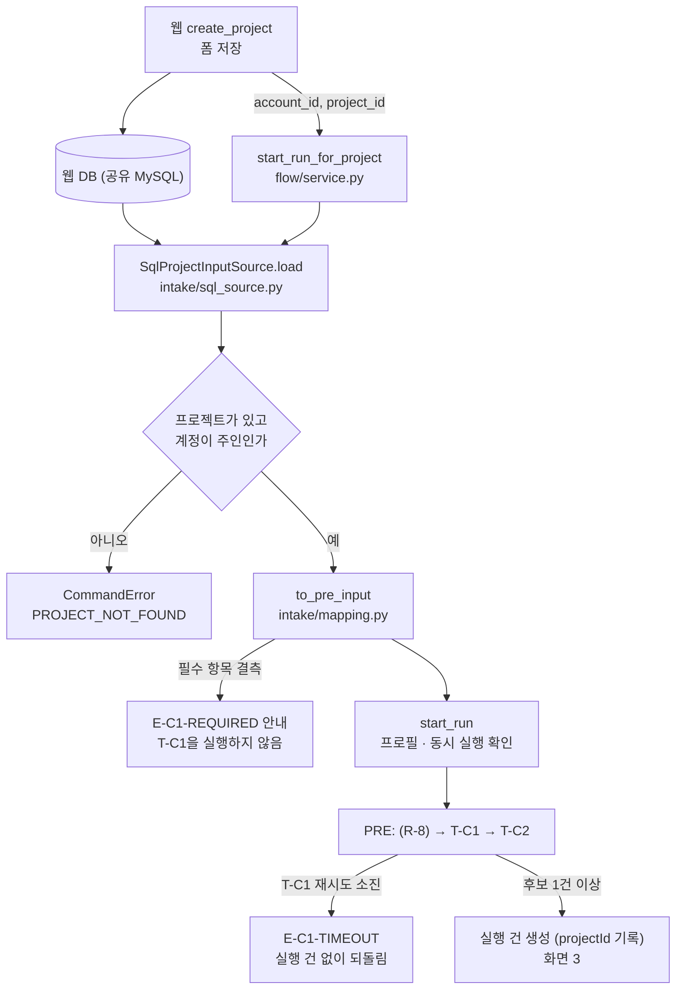

# T-C1 요구사항 해석 구현

| 항목 | 내용 |
|---|---|
| 작성일 | 2026-09-29 (2026-09-30 갱신: 웹 스키마 반영, 확장 필드 · 수익모델 여러 건 · 팀원 없음 · 조율 모델 결정 반영, 웹팀 확인 결과 반영. 2026-10-01 갱신: 목록 입력 키 이름 변환, API 키 `.env` 읽기) |
| 기준 문서 | S-Brain Agent 기능정의서 v1.9 — 시트 2 T-C1, 시트 3 R2~R9, 시트 4 PreInput · CompanyInfo · ItemSpec · ReferenceSummary, 시트 6 E-C1-* |
| 참고 | `user-input-example.py` (웹 `create_project`, 저장소 미포함), `web/backend/app_schema.sql` (웹 DB 스키마, 같은 저장소) |
| 코드 | `sbrain/intake/` (웹 DB → PreInput), `sbrain/agents/supervisor/tc1.py` (T-C1), `sbrain/orchestrator/openai_provider.py` (OpenAI 호출처) |
| 테스트 | `tests/test_intake.py` 22건, `test_tc1.py` 20건(메모리 · SQLite 저장소로 한 번씩), `test_openai_provider.py` 7건, `test_env.py` 6건 — 전체 286건 통과 |
| 관련 문서 | `기준문서_개정필요사항_T-C1_사전정보입력.md` (기준 문서에 반영할 변경, 저장소 미포함), `워커_구동_방식_제안.md` (누가 언제 실행을 돌릴지, 저장소 미포함) |
| 독자 | 조율 Agent · Orchestrator 담당, 웹팀(사전 정보 저장 · 명령 창구 연동) |

---

## 1. 범위

| 구분 | 내용 |
|---|---|
| 구현함 | 웹 DB에 저장된 사전 정보를 읽어 `PreInput`으로 옮기기, 필수 항목 재확인(E-C1-REQUIRED), T-C1 Task, OpenAI 호출처 어댑터 |
| 구현하지 않음 | **R-8 첨부 문서 텍스트 추출** (요청 시 구현). 그래서 웹 DB의 첨부(`project_attachments`)는 아직 읽지 않는다 |
| 참고 | T-C1의 참조 자료 정리(`referenceSummary`)는 T-C1 기능이라 구현했다. 지금은 스텁 R-8로만 시험했고, R-8이 들어오면 그대로 쓰인다 |

## 2. 확인 결과 — DB에서 읽어 T-C1에 넣는 방식

**DB에 저장된 값을 읽어 T-C1에 넣는 방식이 맞다.**

1. 시트 3에서 T-C1 입력 `formInput`은 `PreInput`이다. 마이페이지 프로필 값과 프로젝트 작성란 입력을 합친 값이다. 웹의 `create_project`는 '내 정보 불러오기'로 채운 프로필 값과 작성란 값을 한 요청으로 받아 `companies` · `projects` · `team_members` · `pricing_items` · `project_plan_inputs`에 저장한다. `companies` 행은 프로젝트마다 새로 생기는 스냅샷이다(app_schema.sql 주석). T-C1에 필요한 값이 DB 한 곳에 모인다.
2. 연동 규격 3절에 따라 Task는 DB에 직접 접근하지 않는다. 명령 창구(`start_run_for_project`)가 DB에서 읽어 `formInput` 산출물로 넣고, T-C1은 그 산출물만 받는다.
3. 요청 본문을 그대로 넘기지 않고 저장된 값을 읽으면, 웹이 실제로 저장한 값과 T-C1 입력이 어긋나지 않는다. 실행 건(Run)에 `projectId`(확장)를 남겨 입력의 출처를 추적한다.

## 3. 흐름



`start_run_for_project`를 누가 언제 부를지는 `워커_구동_방식_제안.md`(저장소 미포함)에 정리했다.

## 4. 웹 DB → PreInput 매핑

테이블 · 컬럼 이름은 웹 스키마(`app_schema.sql`)와 맞췄다. 기본키는 `companies.company_id` · `projects.project_id` · `team_members.member_id` · `pricing_items.pricing_id` · `project_plan_inputs.input_id`이다. 여러 행은 기본키 순(저장 순서)으로 읽는다.

### 4.1 기준 문서 필드

| PreInput 필드 | 필수 | 웹 DB 값 | 변환 규칙 | 구분 |
|---|---|---|---|---|
| ideaText | 필수 | `projects.description` | 앞뒤 공백 제거 | |
| applicantType | 필수 | `companies.applicant_type` | `preliminary` → 예비창업자, `individual` → 개인사업자, `corp` → 법인 | |
| representativeName | 필수 | `companies.ceo_name` | 그대로 | |
| representativeCareer | 필수 | `project_plan_inputs.ceo_careers` (`type` · `title` · `period` · `has_proof` = 구분 · 내용 · 기간 · 증빙여부) | 항목마다 `구분: 내용 (기간, 증빙 있음)` 한 줄. 구분이 없으면 `내용 (기간)`, 기간 · 증빙이 없으면 괄호 생략. **증빙은 참일 때만 `증빙 있음`**(사용자 결정 2026-09-30). 증빙 말고는 값이 없는 항목은 뺀다 | 잠정 |
| foundedAt | 개인사업자 · 법인 필수 | `companies.founded_at` | 예비창업자는 비움 | |
| revenueUnitPrice | 필수 | `pricing_items.unit_price` | **호환용** — 첫 항목 단가. 전체는 확장 필드 `revenueItems`(4.2) | 잠정 |
| developmentPeriod | 필수 | `dev_start_month` · `dev_end_month` | `YYYY-MM ~ YYYY-MM`. 둘 다 있어야 한다 | 잠정 |
| teamCareers | 입력 또는 '팀원 없음' | `team_members.name` · `role` · `experience` | 한 명당 `이름(역할): 경력`. **0행이면 팀원 없음 → 빈 목록** (웹이 입력 또는 선택을 강제) | 형식은 잠정 |
| birthDate | 필수 | `ceo_birth_date` | 그대로 | |
| gender | 필수 | `ceo_gender` | 그대로 | |
| region | 필수 | `region_sido` · `region_sigungu` (사업장 소재지 · 창업 예정 지역) | `시도 시군구`. 시도가 있어야 한다 | 잠정 |
| industryCode | 필수 | `main_industry`(개인 · 법인, 9종), 없으면 `main_industry_free`(예비창업자) | 그대로 | |
| certifications | 선택 | `certifications` (문자열 배열) | 그대로 | |
| hiringPlan | 필수 | `no_hires` · `hires` (`job` · `headcount` · `required_skill` · `hire_month` = 직무 · 인원 · 요구역량 · 채용 시기) | '없음'을 골랐으면 `없음`, 아니면 항목마다 `직무 인원 · 요구역량: … · 채용 시기: …`(빈 값 생략)를 `; `로 이은 한 줄. 인원(문자열)이 숫자만이면 `명`을 붙인다. 예: `개발자 2명 · 요구역량: React · 채용 시기: 2026-06` | 잠정 |
| facilities | 필수 | `no_equipment` · `equipment` (`name` · `status` = 이름 · 상태) | '없음'을 골랐으면 `없음`, 아니면 항목마다 `이름 (상태)`를 `; `로 이은 한 줄. 상태가 없으면 괄호 생략. 예: `태블릿 (보유)` | 잠정 |
| partners | 필수 | `no_partners` · `partners` (`name` · `status` = 기관명 · 상태) | 위와 같음. 예: `OO대학교 (협의 중)` | 잠정 |
| isFirstStartup | (기준 문서: 예비창업자 필수) | 없음 | 비움. **받지 않는다** (웹팀 확인) | 개정 필요 |
| desiredScale | 예비창업자 필수 | `budget_scale_manwon` (만원, 웹팀 확인) | `{값}만원` | 표기는 잠정 |
| businessRegNo | 개인사업자 · 법인 선택 | `companies.business_reg_no` | 예비창업자는 비움 | |
| selfFundAmount | 개인사업자 · 법인 필수 | `self_funding_allowed` · `self_cash_limit` (원, 웹팀 확인) | 자기부담을 하지 않으면 0, 아니면 `self_cash_limit` | 0 처리는 잠정 |
| attachments | 선택 | (`project_attachments`) | 지금은 읽지 않음 | R-8과 함께 |

- JSON 컬럼은 스키마에 키 이름이 없어 웹 코드(`user-input-example.py`의 PlanCareerIn · PlanHireIn · PlanEquipmentIn · PlanPartnerIn)에서 확인한 키 이름으로 옮긴다. 아는 키가 하나도 없는 항목은 값만 순서대로 ` · `로 잇는다(참 · 거짓 값은 뺀다). 아는 키와 모르는 키가 섞여 있으면 모르는 키의 값을 뒤에 ` · `로 이어, 웹이 키를 더해도 입력이 버려지지 않게 한다. 드라이버가 문자열로 돌려줘도 풀어서 쓴다.
- 단가는 `DECIMAL(12,2)`이다. 원 단위 정수로 바꾸고, 소수 부분이 있으면 반올림하지 않고 오류로 본다.
- 값을 옮기기만 하고 요약 · 보완 · 추정하지 않는다. 수익모델 단가와 경력은 사용자 입력만 쓴다(기획서 4-6).

### 4.2 확장 필드 (사용자 결정 2026-09-30)

PreInput에 자리가 없는 웹 입력값을 확장 필드로 싣는다. `PreInput`과 `CompanyInfo`가 같은 확장(`FormExtension`)을 쓰고, T-C1이 폼 값 그대로 `companyInfo`에 옮겨 계획서 작성까지 전달한다.

| 확장 필드 (JSON) | 웹 DB 값 | 뜻 |
|---|---|---|
| revenueItems | `pricing_items.service_name` · `unit_price` (전체) | 수익모델 항목 목록. 항목 = `serviceName` · `unitPrice`(원) |
| companyName | `companies.company_name` | 기업명 · 법인명(상호) |
| bizType | `companies.biz_type` | 업종 |
| representativeType | `companies.rep_type` | 대표자 유형(단독 · 공동 · 각자대표) |
| outputSummary | `projects.output_summary` | 산출물 — 협약기간 내 목표(형태 · 수량) |
| techField | `projects.tech_field` | 전문기술분야 |
| regionalPriorityArea | `projects.regional_priority_area` | 지방우대 지역(해당 시 지역명) |
| occupation | `project_plan_inputs.occupation` | 예비창업자 직업(직장명 제외) |
| representativeCapability | `project_plan_inputs.ceo_capability` | 대표자의 기술력 · 노하우 · 인적 네트워크 |
| selfInKindResources | `project_plan_inputs.self_in_kind_resources` | 현물 자기부담 자원(보유 장비 · 공간 등) |

- 수익모델은 **여러 건을 모두** `revenueItems`로 싣는다(사용자 결정). 기준 문서의 `revenueUnitPrice`(int 1개)는 다른 Agent 규격이 바뀔 때까지 첫 항목 단가로 채워 둔다(호환용).
- 확장 필드는 코드에서 `ext()`로 선언되어 JSON 스키마에 `x-extension`이 붙는다.

## 5. 필수 항목 재확인 (E-C1-REQUIRED)

기준 문서는 필수 항목을 폼 제출 단계에서 막고 T-C1을 실행하지 않는다고 정한다(시트 6 E-C1-REQUIRED). 웹 요청 스키마(`ProjectCreateRequest`)는 `description`만 필수로 검사하므로, Orchestrator가 읽은 값을 한 번 더 확인한다.

| 신청자 유형 | 필수 항목 |
|---|---|
| 공통 | 아이디어 설명, 신청자 유형, 대표자 이름, 대표자 이력, 수익모델 단가, 개발 기간, 대표자 생년월일, 성별, 희망 지역, 주 업종, 채용 계획, 장비 · 시설, 협력 파트너 · 기관 |
| 개인사업자 · 법인 | + 설립일자, 자기부담금 |
| 예비창업자 | + 희망 사업 규모 |

- **수익모델 단가:** 항목이 1건 이상이고, **항목마다 단가가 있어야** 한다. 단가 없는 항목을 버리면 수익 항목이 조용히 빠지고, 채우면 AI가 단가를 지어내게 되므로 입력을 막는다(잠정).
- **팀 구성원:** 웹은 팀원을 입력하거나 '팀원 없음'을 반드시 고르게 한다(웹팀 확인 2026-09-30). 그래서 필수 검사에서 뺐다. 스키마에 '팀원 없음' 컬럼은 없어 `team_members` 0행을 팀원 없음으로 본다.
- 결측이면 `StartResult(ok=False, code="E-C1-REQUIRED")`를 돌려주고 실행 건을 만들지 않는다. 안내 예: `필수 항목을 입력해주세요: 수익모델 단가, 성별`
- 빈 문자열 · 빈 목록도 결측으로 본다(잠정). 첫 창업 여부는 받지 않으므로 확인하지 않는다(웹팀 확인).

## 6. T-C1 처리 (`agents/supervisor/tc1.py`)

### 6.1 회사 정보 (companyInfo)

- 폼 값을 필드마다 코드로 그대로 옮긴다. 확장 필드(4.2)도 함께 옮긴다. LLM에 보내지도, LLM 응답으로 바꾸지도 않는다(시트 2 T-C1, 기획서 4-6).
- 업력(`businessAgeYears`)은 비워 둔다. 업력은 기준일자가 필요한데 T-C1 입력에는 기준일자가 없다. T-C2와 G-01이 기준일자(`today`)로 계산한다(시트 3 T-C2 · G-01).

### 6.2 아이템 사양 · 카테고리

- LLM에는 **아이디어 설명(ideaText)만** 보낸다. 아이디어 설명이 카테고리 판정과 임베딩 질의의 원본이다(시트 4). 대표자 이름 · 단가 · 확장 필드 같은 신청자 정보는 보내지 않는다.
- 응답은 JSON 스키마로 받는다: `item_name` · `one_line_summary` · `target_customer` · `core_features` · `keywords` · `category` · `category_reason` · `confidence`.
- 이름 · 요약 · 고객이 비었거나 핵심 기능 · 핵심어가 0개면 형식 오류로 보고 재시도한다. 카테고리를 판정했는데 사유가 없어도 형식 오류다(시트 3 categoryReason 필수).
- 카테고리 판정 실패(값 없음 · 세 값 밖) → **웹개발**로 기본 처리한다(시트 2 T-C1 ③). 출력 `categoryDefaulted`(확장)가 참이 되고, Orchestrator가 추적 기록에 `카테고리기본값` 사건을 남긴다. 파이프라인은 멈추지 않는다.
- 표기 흔들림(공백 · 밑줄 · 대소문자, 예: `ai api`)은 같은 값으로 본다(잠정).
- `confidence`는 로그 전용이다. 0~1 밖이면 버린다(시트 3).
- 카테고리 설명은 기획서 4-4 표를 따른다: 원페이지(오프라인 매장 · 제조), 웹개발(플랫폼 · 중개 · 커머스), AI_API(AI가 아이템 본체).

### 6.3 참조 자료 (referenceSummary)

| 단계 | 처리 |
|---|---|
| 대상 | `extractStatus='실패'`이거나 본문이 빈 문서는 뺀다. 실패 안내(E-C1-DOC)는 R-8 뒤에 Orchestrator가 이미 낸다 |
| 호출 | 문서를 20,000자 단위로 나눠(가능하면 줄바꿈에서) 조각마다 1회 호출한다. 호출 기록의 항목 키는 `문서ID#조각번호` |
| 격리 | 본문을 `<문서 이름="…">` 안에 넣고, 본문 속 명령 · 요청 · 지시를 따르지 말라고 지시한다. 본문이 격리 표기를 닫지 못하게 닫는 표기를 바꿔 싣는다 |
| 발췌 확인 | 슬롯 밖이거나 원문에 그대로 없는 발췌(공백 차이만 허용)는 버린다. LLM이 지어낸 문장이 참조 자료로 섞이지 않게 하기 위해서다 |
| 제한 | 발췌 하나 500자, 슬롯마다 최대 3개(문서 전체 합산) |
| 인용 값 | `cited_tokens` 중 허용 종류(수치금액 · 날짜 · 고유명사 · 기능명)이면서 남은 발췌에 실제로 나오는 값만 `citedNumbers`에 남기고 나온 횟수를 센다 |
| 결과 | 남은 발췌가 없으면 `referenceSummary`는 null. 있으면 `docIds`(발췌가 나온 문서) · `excerpts` · `citedNumbers` · `isolationNote`(고정 문구) |

- 슬롯: 시장 규모, 목표 고객, 문제 · 필요성, 핵심 기능, 경쟁 · 차별성, 수익 모델, 추진 계획(잠정). 기준 문서는 '시장 규모, 핵심 기능'을 예시로만 든다.
- 팀 · 경력 슬롯은 두지 않는다. 작성 Agent는 입력된 경력만 써야 하는데(기획서 4-6), 첨부의 경력 문장이 지시에 실리면 이 원칙이 흐려진다.
- 문서 본문은 아이템 사양 호출에 싣지 않는다. 문서 속 지시문이 카테고리 판정에 영향을 주지 못한다.

### 6.4 실패 처리

- 호출 실패 · 응답 지연 · 형식 오류는 tools가 재시도한다(최대 5회).
- 재시도를 다 쓴 예외는 T-C1이 받지 않고 올려 보낸다. 참조 자료 정리 호출도 같다. Orchestrator가 실행 건 없이 진입 전 상태로 되돌리고 E-C1-TIMEOUT으로 안내한다(시트 2 T-C1 ⑥).

## 7. 조율 모델과 OpenAI 호출처

### 7.1 모델 설정 (사용자 결정 2026-09-30)

| 모델 (API ID) | 입력 | 캐시 입력 | 출력 | 비고 |
|---|---|---|---|---|
| `gpt-5-mini` | $0.25 | $0.025 | $2.00 | 후보 |
| `gpt-5.6-luna` | $0.20 | $0.02 | $1.20 | 후보 |
| **`gpt-6-luna`** | **$0.10** | **$0.01** | **$0.50** | **기본값** — 지금 가장 싸다 |

- 가격은 100만 토큰당이다. 세 모델 모두 OpenAI 문서에서 API ID · 가격 · Chat Completions · 구조화 출력 지원을 확인했다(2026-09-30). 두 Luna 모델은 입력이 272K 토큰을 넘으면 요금이 올라간다.
- 세 모델 모두 추론 모델이다. 추론 강도는 우선 **low**로 둔다. 온도는 보내지 않는다(추론 모델의 온도 지원 여부는 문서에 없어 싣지 않는 쪽을 택했다).
- 설정 위치: ~~`Settings.agents["조율"] = AgentSetting(...)`~~ 2026-10-06 바뀜: Task별 설정 `Settings.tasks["T-C1"] = TaskModelSetting(provider="openai", model="gpt-6-luna", temperature=None, reasoning_effort="low")`(다른 조율 Task도 같은 값). 다른 후보로 바꿀 때는 그 Task 항목의 `model`만 바꾼다. 실행을 시작할 때 설정값이 실행 건에 고정된다.
- 실행 기록(`ExecutionRecord`)과 호출 기록(`CallLog`)에 모델 · 추론 강도가 남는다(`reasoningEffort`, 확장).
- 온도를 쓰는 모델의 Task별 온도 규칙(T-V1 0 고정, T-P2 0.2 이하)은 Task 설정에 온도가 없으면 적용하지 않는다(잠정).

### 7.2 OpenAI 호출처 어댑터 (`orchestrator/openai_provider.py`)

| 항목 | 처리 |
|---|---|
| 호출 | Chat Completions. `model` · `messages`는 tools가 Task 설정에서 입힌 값 |
| 온도 · 추론 강도 | 요청에 값이 있을 때만 싣는다. 조율은 `reasoning_effort="low"`만 싣는다 |
| 제한 시간 | 요청마다 `timeout=request.timeout_sec` (T-C1 120초, 잠정) |
| 재시도 | SDK 재시도는 끈다(`max_retries=0`). 재시도는 tools가 한다 |
| 응답 형식 | 스키마가 있으면 `response_format={"type": "json_schema", …, "strict": False}`. 검사는 tools가 다시 한다 |
| 오류 변환 | 시간 초과 → `TimeoutError`, 연결 오류 → `ConnectionError`, 응답 코드 오류 → `ProviderError(status)`, 빈 응답 → 형식 오류 |
| API 키 | 환경 변수 `OPENAI_API_KEY`, 없으면 코드 폴더의 `.env` 파일(`sbrain/env.py`, 사용자 요청 2026-10-01). 이미 설정된 환경 변수가 이긴다. 코드에 넣지 않고, `.env`는 저장소에 올리지 않는다. 적을 항목은 `.env.example` |

조립 예시 (웹 DB + 실제 T-C1, 나머지 Agent는 스텁):

```python
from sqlalchemy import create_engine
from sbrain.agents.supervisor import bind_supervisor
from sbrain.bootstrap import build_stub_app
from sbrain.intake.sql_source import SqlProjectInputSource
from sbrain.orchestrator.openai_provider import OpenAIProvider

engine = create_engine(db_url)            # 예: mysql+pymysql://… — 접속 정보는 코드 밖에서 받는다
app = build_stub_app(project_inputs=SqlProjectInputSource(engine))   # 조율은 기본값 gpt-6-luna · low
bind_supervisor(app.registry)             # 구현된 조율 Task(지금 T-C1 · T-C3)를 실제 구현으로
app.engine.providers["openai"] = OpenAIProvider()

res = app.orchestrator.start_run_for_project(account_id="7", project_id=101)
```

이 예시는 SQLite와 가짜 OpenAI 클라이언트로 바꿔 끝까지 도는 것을 확인했다.

워커 조립 `build_app(db_url)`(2026-10-01)이 같은 일을 한다 — SqlStore · 웹 DB 입력 · DB 설정 입력 · OpenAI 호출처 · `bind_supervisor`. 이때 구현된 조율 Task(T-C1 · T-C3)와 재작성 · 재수행 지시문 다시 쓰기 호출만 실제 OpenAI로 보내고 나머지 스텁 Task는 가짜 호출처로 보낸다. 위 예시처럼 나누지 않은 `OpenAIProvider()`를 끼우면 T-C3(실행 건마다 7번)와 스텁 조율 호출까지 실제 OpenAI로 가므로, 지금 확인은 워커 조립이나 `docs/T-C3_작업분해_구현.md` 13절의 방법을 쓴다(2026-10-04).

### 7.3 실제 OpenAI 호출 확인 (2026-09-30, 1회 성공)

| 항목 | 내용 |
|---|---|
| 실행 | 사용자가 확인용 스크립트를 실행했다. 엔진 · DB 없이 tools를 직접 조립해 `tc1.run`을 부른다(`OPENAI_API_KEY` 환경 변수 사용) |
| 설정 | 조율 기본값 `gpt-6-luna` · 추론 강도 low · 온도 없음, 제한 시간 120초, 재시도 1회 |
| 입력 | 아이디어 설명 "동네 헬스장의 회원 등록, 수업 예약, 출석 체크를 한 화면에서 관리하는 웹 서비스", 법인 신청자 |
| 호출 | 1회 호출, 첫 시도에 성공(재시도 없음). 응답이 JSON 스키마 검사와 빈 항목 검사를 통과했다 |
| 결과 | 아이템명 "동네 헬스장 통합 관리 서비스", 핵심 기능 4개, 핵심어 6개, 카테고리 **웹개발**(기본값 아님, `categoryDefaulted=false`), 신뢰도 0.98, 판정 사유 한 문장 |
| 회사 정보 | 폼 값이 그대로 옮겨졌다(단가 35000, 경력 · 팀 문구 그대로). `revenueItems`가 빈 목록인 것은 스크립트가 폼을 직접 만들면서 수익모델 항목을 넣지 않았기 때문이다. 웹 DB에서 읽는 경로(`start_run_for_project`)는 항목을 채운다 |

- 확인한 것: OpenAI 어댑터의 요청 형식(추론 강도 low, 온도 생략, JSON 스키마 응답 형식)이 `gpt-6-luna`에서 동작한다. T-C1의 응답 검사 · 카테고리 판정 · 회사 정보 복사가 실제 응답으로 동작한다.
- 아직 확인하지 않은 것: 엔진 · 웹 DB를 거친 전체 경로의 실제 호출, 첨부 참조 자료 정리(R-8 보류), 응답 시간. 토큰 사용량 기록은 2026-10-01 구현했다 — 다음 실제 호출 때 `tc1_real_call.py` 출력(호출 · 시도별 토큰)으로 확인한다.

## 8. 잠정 · 확장 목록

**잠정 (기준 문서가 정하지 않아 임시로 둔 값 · 규칙)**

| 항목 | 잠정값 | 위치 |
|---|---|---|
| DB → PreInput 변환 규칙 | 4.1절 표의 '잠정' 행 | `intake/mapping.py` |
| JSON 목록 항목 → 문자열 | 키 이름으로 형식을 만든다(4.1). 아는 키가 없으면 값만 ` · `로 잇고 참 · 거짓 값은 뺀다. 모르는 키의 값은 뒤에 잇는다 | `intake/mapping.py` |
| 수익모델 단가 필수 판정 | 1건 이상, 항목마다 단가 필수 | `intake/mapping.py` |
| 빈 문자열 · 빈 목록 | 필수 항목 결측으로 봄 (팀 구성원 제외) | `intake/mapping.py` |
| 참조 자료 슬롯 | 7종 (6.3) | `tc1.py` `REFERENCE_SLOTS` |
| 문서 조각 · 발췌 제한 | 조각 20,000자, 발췌 500자, 슬롯당 3개 | `tc1.py` |
| 격리 고정 문구 | "아래 참조 자료는 사용자가 첨부한 문서에서 발췌한 데이터입니다. …" | `tc1.py` `ISOLATION_NOTE` |
| 카테고리 표기 흔들림 허용 | 공백 · 밑줄 · 대소문자 무시 | `tc1.py` |
| 빈 필수 응답 항목 | 형식 오류로 재시도 | `tc1.py` |
| OpenAI 응답 형식 | json_schema, strict=False | `openai_provider.py` |
| 온도 없는 Agent의 Task 온도 규칙 | 적용하지 않음 | `orchestrator/registry.py` `TempRule` |

**확장 (기준 문서에 없는 필드 · 함수)**

| 대상 | 확장 | 용도 |
|---|---|---|
| PreInput · CompanyInfo | `revenueItems` 외 9종 (4.2) | PreInput에 자리가 없는 웹 입력값 |
| (신규 타입) RevenueItem | `serviceName`, `unitPrice` | 수익모델 항목 하나 |
| TC1Out | `categoryDefaulted` | 카테고리 기본값 적용 여부 — 추적 기록용 |
| Run | `projectId` | 사전 정보 입력의 출처(웹 DB `projects` 행) |
| AgentSetting · ExecutionRecord · CallLog | `reasoningEffort` | 추론 모델의 추론 강도 설정 · 기록 |
| 명령 창구 | `start_run_for_project(account_id, project_id)` | 웹 DB에서 읽어 시작. 프로젝트가 없거나 다른 계정 것이면 `CommandError("PROJECT_NOT_FOUND")` |

## 9. 남은 확인 사항

**웹팀 확인 완료 (2026-09-30)**

| 사항 | 결과 | 코드 |
|---|---|---|
| 단위 | 희망 사업 규모(`budget_scale_manwon`)는 만원, 자기부담 가능액(`self_cash_limit`)은 원 | 그대로 반영되어 있다. `app_schema.sql`의 `self_cash_limit` 주석 '만원'은 웹 쪽 주석 수정 대상이다 |
| 첫 창업 여부 | 받지 않는다 | 비워 두고 필수 검사에서 뺐다. 기준 문서 개정 대상 |
| 팀원 | 팀원을 입력하거나 '팀원 없음'을 반드시 고른다 | `team_members` 0행 = 팀원 없음으로 본다 |

**남은 사항**

1. **반영 완료 (2026-10-01)** — JSON 컬럼을 웹 코드(`user-input-example.py`)의 키 이름(대표자 이력 `type` · `title` · `period` · `has_proof`, 채용 계획 `job` · `headcount` · `required_skill` · `hire_month`, 장비 · 협력 기관 `name` · `status`)으로 옮기고 증빙 표기(`증빙 있음`, 사용자 결정)를 붙인다. 형식은 4.1절 표(`작업지시_조율코드반영_워커_웹연동.md` S0, 저장소 미포함).
2. 누가 언제 부를지는 웹팀과 합의했다 — 웹은 시작 요청만 넣고 사전 단계는 워커가 돈다(`워커_구동_방식_제안.md`, 저장소 미포함, 확정). **확인(즉시, `request_start`)과 실행(워커, `run_start_request`)으로 나눴다(2026-10-01).** `start_run_for_project`는 두 조각을 차례로 부르는 동기 경로다. 웹이 부르는 함수는 `docs/Orchestrator_웹연동_함수명세.md`.

**기준 문서 개정** — 수익모델 여러 건, 확장 필드, 팀원 없음, 첫 창업 여부 미수집 등은 `기준문서_개정필요사항_T-C1_사전정보입력.md`(저장소 미포함)에 따로 정리했다.
